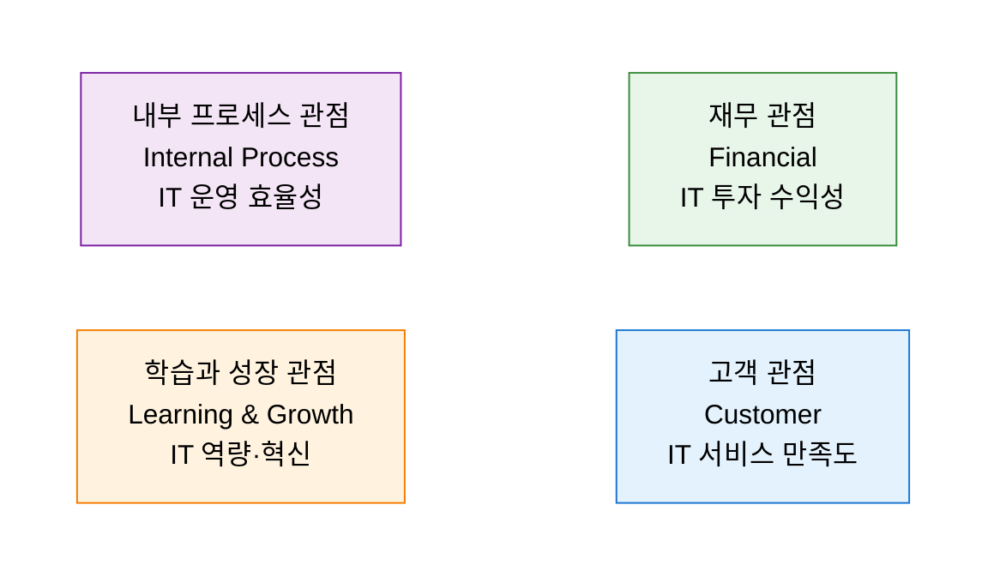
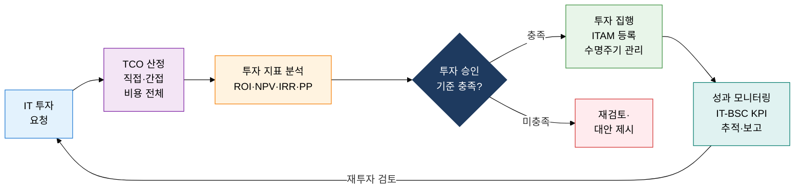

## 1. 재무 지표만으론 보이지 않는 IT 가치를 4관점으로 균형 측정, IT-BSC의 개요

**정의**: 재무·고객·내부 프로세스·학습과 성장의 4관점으로 IT 전략 목표를 균형 있게 측정·관리하는 성과 관리 프레임워크.
- Kaplan·Norton의 BSC를 IT 조직에 적용하여 IT-BSC로 특화한 전략 성과 관리 도구
- ROI·NPV·IRR·PP 재무 지표와 TCO 분석을 결합하여 IT 투자 타당성을 다각도로 평가
- ITAM(IT Asset Management)으로 하드웨어·소프트웨어·클라우드 자산의 전체 수명주기 관리

**특징**:
- **균형 성과 측정**: 단기 재무 성과와 장기 역량 지표를 동시에 추적하여 IT 가치의 전체 그림 제공
- **인과관계 연결**: 학습과 성장 → 내부 프로세스 → 고객 → 재무 순서로 전략적 인과관계 가시화
- **투자 최적화**: TCO 기반 전체 비용 분석과 ITAM을 결합하여 불필요한 IT 지출 식별·제거

---

## 2. IT-BSC·투자 평가·TCO·ITAM의 핵심 구성 체계

### 가. BSC 4대 관점과 IT-BSC 적용

| BSC 관점 | IT-BSC 전략 목표 | 핵심 성과 지표(KPI) | 측정 방법 |
|---|---|---|---|
| **재무 관점** | IT 투자 비용 절감, ROI 향상 | IT 예산 집행률, ROI, TCO 절감액, NPV | 재무제표, IT 원가 분석 |
| **고객 관점** | IT 서비스 품질 및 사용자 만족도 향상 | 서비스 가용성, SLA 준수율, 사용자 만족도 | SLA 보고서, 사용자 설문 |
| **내부 프로세스** | IT 운영 효율화 및 보안·컴플라이언스 강화 | 인시던트 해결 시간, 변경 성공률, 보안 사고 건수 | ITSM 도구, 보안 로그 분석 |
| **학습과 성장** | IT 인력 역량 강화 및 기술 혁신 문화 정착 | IT 직원 교육 시간, 자격증 보유율, 혁신 제안 건수 | HR 시스템, 교육 이수 기록 |

---

### 나. IT 투자 타당성 분석: ROI·NPV·IRR·PP 지표와 TCO·ITAM

| 지표 | 공식 / 구성 | 판단 기준 | 활용 시나리오 |
|---|---|---|---|
| **ROI** (투자수익률) | (순이익 / 투자비용) × 100% | 0% 초과 시 투자 타당 | IT 프로젝트 사후 수익성 평가 |
| **NPV** (순현재가치) | 미래 현금흐름 현재가치 합계 - 초기 투자 | 0 초과 시 투자 타당 | 장기 IT 인프라 투자 의사결정 |
| **IRR** (내부수익률) | NPV = 0이 되는 할인율 | 자본비용 초과 시 타당 | 복수 IT 투자안 우선순위 결정 |
| **PP** (회수기간) | 초기 투자 / 연간 순현금흐름 | 목표 기간 이내 | 단기 회수가 중요한 IT 프로젝트 |
| **TCO** (총소유비용) | 취득비용 + 운영비용 + 폐기비용 (전체 수명주기) | 대안 대비 최소화 | 클라우드 vs 온프레미스 비교 분석 |
| **ITAM** (IT 자산 관리) | 하드웨어·소프트웨어·클라우드 자산 인벤토리 + 수명주기 관리 | 라이선스 컴플라이언스 100% | 소프트웨어 감사 대응, 자산 최적화 |

---

## 3. IT-BSC·투자 평가·TCO·ITAM 도입의 기대효과 및 활용 방안

| 구분 | 주요 기대효과 | 활용 및 실무 적용 방안 |
|---|---|---|
| **전략적** | IT 투자와 비즈니스 전략의 인과관계 가시화로 경영진 IT 가치 인식 제고 | IT-BSC 전략 맵 작성, 분기별 4관점 KPI 경영진 보고 체계 구축 |
| **재무적** | ROI·NPV·TCO 분석으로 IT 투자 타당성 객관화 및 예산 낭비 방지 | 신규 IT 프로젝트 승인 프로세스에 NPV·IRR 기준 의무화, TCO 비교 템플릿 운영 |
| **운영적** | ITAM 기반 IT 자산 인벤토리 완전성 확보로 감사 리스크 제거 | ServiceNow·Flexera 등 ITAM 도구 도입, 소프트웨어 라이선스 컴플라이언스 자동화 |
| **지속 개선** | 학습과 성장 관점 KPI 추적으로 IT 인력 역량 및 혁신 문화 지속 강화 | IT 직원 역량 개발 로드맵 수립, 혁신 제안 포인트 제도와 BSC 연계 운영 |
