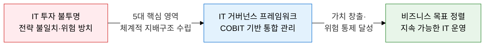
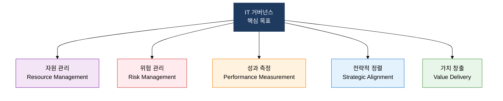
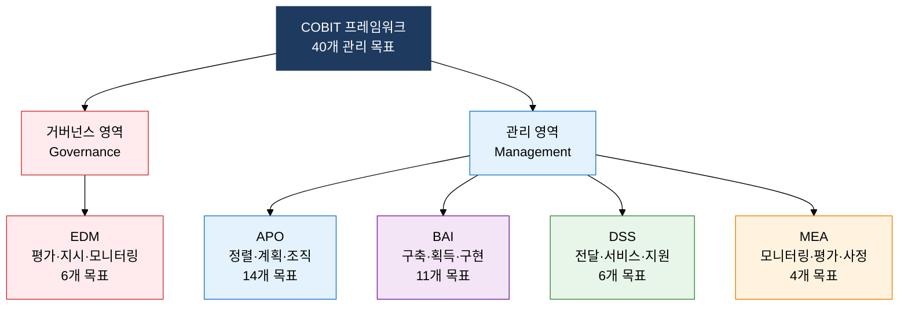

## 1. IT 전략과 비즈니스를 정렬하는 통합 관리 체계, IT 거버넌스의 개요

**정의**: IT 자원·프로세스·성과를 조직 전략에 정렬시켜 가치를 창출하고 위험을 통제하는 경영 지배구조 프레임워크.
- IT 거버넌스는 이사회·경영진이 책임지는 기업 거버넌스의 핵심 구성 요소
- ISO/IEC 38500, COBIT 등 국제 표준을 기반으로 5대 핵심 영역으로 구조화
- IT 투자 의사결정, 위험 허용 기준, 성과 측정 지표를 통합적으로 관리

**특징**:
- **전략적 정렬**: 비즈니스 목표와 IT 목표를 연계하여 IT가 실질적 사업 가치를 창출하도록 유도
- **책임 명확화**: 이사회·CIO·IT 관리자 간 역할과 책임을 명확히 구분하여 의사결정 지연 방지
- **지속적 개선**: 성과 측정 메커니즘을 통해 IT 거버넌스 수준을 지속적으로 향상

---

## 2. IT 거버넌스 및 COBIT의 핵심 구성 체계

### 가. IT 거버넌스 5대 핵심 영역

| 핵심 영역 | 정의 | 주요 활동 | 핵심 질문 |
|---|---|---|---|
| **전략적 정렬** | IT 계획을 비즈니스 전략과 일치시키는 활동 | IT 전략 계획 수립, 비즈니스-IT 연계 로드맵 | "IT가 사업 목표를 지원하는가?" |
| **가치 창출** | IT 투자가 약속한 가치를 적시에 전달 | 포트폴리오 관리, 프로젝트 ROI 추적 | "IT가 실질적 가치를 제공하는가?" |
| **자원 관리** | IT 인프라·인력·지식·응용시스템 최적 활용 | 역량 계획, 아웃소싱 관리, 클라우드 전략 | "IT 자원이 효율적으로 관리되는가?" |
| **위험 관리** | IT 관련 위험을 식별·평가·처리하는 프로세스 | 위험 레지스터 운영, 보안 통제, BCP/DR | "IT 위험이 허용 수준 내에서 관리되는가?" |
| **성과 측정** | IT 거버넌스 목표 달성 여부를 측정·보고 | KPI/KGI 설정, BSC 적용, 경영진 보고 | "IT 거버넌스가 효과적으로 작동하는가?" |

---

### 나. COBIT 프레임워크: 거버넌스 vs 관리 영역 도메인 체계

| 도메인 | 구분 | 핵심 관리 목표 | 목표 수 |
|---|---|---|---|
| **EDM** (Evaluate, Direct, Monitor) | 거버넌스 | EDM01 거버넌스 프레임워크 보장, EDM02 이익 창출 보장, EDM03 위험 최적화, EDM04 자원 최적화 | 6개 |
| **APO** (Align, Plan, Organize) | 관리 | APO01 관리 프레임워크 관리, APO04 혁신 관리, APO07 인적 자원 관리, APO12 위험 관리 | 14개 |
| **BAI** (Build, Acquire, Implement) | 관리 | BAI01 프로그램 관리, BAI03 솔루션 식별·구축, BAI06 IT 변경 관리, BAI10 구성 관리 | 11개 |
| **DSS** (Deliver, Service, Support) | 관리 | DSS01 운영 관리, DSS02 서비스 요청·인시던트 관리, DSS05 보안 서비스 관리 | 6개 |
| **MEA** (Monitor, Evaluate, Assess) | 관리 | MEA01 성과·준수 모니터링, MEA02 내부 통제 시스템 평가, MEA03 외부 요건 준수 | 4개 |

---

## 3. IT 거버넌스 및 COBIT 도입의 기대효과 및 활용 방안

| 구분 | 주요 기대효과 | 활용 및 실무 적용 방안 |
|---|---|---|
| **전략적** | 비즈니스 목표와 IT 투자의 정렬로 IT 가치 가시화 | COBIT APO02 기반 IT 전략 계획 수립, 이사회 IT 거버넌스 보고 체계 구축 |
| **운영적** | 40개 관리 목표 적용으로 IT 프로세스 성숙도 향상 | COBIT 성숙도 모델(CMM)로 현행 수준 진단 후 단계별 개선 로드맵 수행 |
| **기술적** | ISO/IEC 38500·ITIL·ISO 27001 등 타 표준과 통합 운영 | COBIT 도메인과 ISO 27001 통제 항목 매핑으로 중복 감사 제거 |
| **규제 대응** | EDM03·MEA03 도메인 적용으로 법적·규제 준수 체계 확보 | 금융권 IT 감독 규정·개인정보보호법 요건과 COBIT 목표 매핑 관리 |
