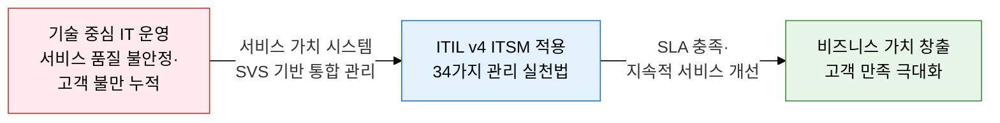
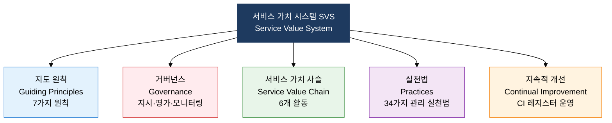
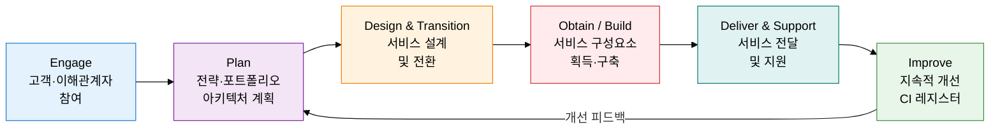

## 1. 서비스를 제품이 아닌 가치 공동 창출로 재정의한 체계, ITIL v4의 개요

**정의**: IT 서비스를 체계적으로 계획·설계·전환·운영·개선하여 비즈니스 가치를 공동 창출하는 서비스 관리 프레임워크.
- ITSM(IT Service Management)은 People·Process·Technology·Partner 4대 요소로 구성
- ITIL v4는 서비스 가치 시스템(SVS) 아래 서비스 가치 사슬(SVC) 6개 활동과 34가지 실천법을 통합
- ISO/IEC 20000 국제 표준과 연계하여 IT 서비스 인증 체계로 활용

**특징**:
- **가치 공동 창출**: 서비스 제공자와 소비자가 함께 가치를 창출하는 서비스 지배 논리(SDL) 채택
- **전체론적 사고**: 조직·정보·파트너·가치 흐름을 4차원(4 Dimensions)으로 통합 관리
- **유연한 적용**: 규범적 절차 대신 실천법(Practice) 중심으로 조직 상황에 맞게 선택 적용 가능

---

## 2. ITIL v4의 핵심 구성 체계

### 가. ITIL v4 서비스 가치 시스템(SVS) 구조

| SVS 구성 요소 | 정의 | 핵심 내용 |
|---|---|---|
| **지도 원칙** | 조직의 모든 상황에 적용되는 보편적 권고 사항 | 가치 집중, 현황에서 출발, 피드백 반영, 협업·가시성 증진, 전체론적 사고, 단순화·실용화, 최적화·자동화 |
| **거버넌스** | 조직의 방향을 평가·지시·모니터링하는 체계 | 이사회·경영진의 IT 서비스 지배구조 확립, COBIT과 연계 적용 |
| **서비스 가치 사슬** | 서비스 가치를 창출하는 6개 핵심 활동의 운영 모델 | Engage·Plan·Design&Transition·Obtain/Build·Deliver&Support·Improve |
| **실천법** | 특정 목적 달성을 위한 조직의 역량과 자원 집합체 | 일반 관리 14개·서비스 관리 17개·기술 관리 3개, 총 34가지 |
| **지속적 개선** | 모든 수준에서 서비스와 실천법을 지속적으로 향상 | CI 레지스터로 개선 기회를 추적·우선순위화·실행 |

---

### 나. 서비스 가치 사슬(SVC) 6개 활동, 34가지 실천법 및 SLA/SLM

| 분류 | 주요 실천법 | 핵심 설명 |
|---|---|---|
| **일반 관리 (14개)** | 지식 관리, 측정·보고, 포트폴리오 관리, 프로젝트 관리, 위험 관리, 전략 관리 | 조직 전반에 적용되는 비IT 영역 포함 관리 실천법 |
| **서비스 관리 (17개)** | 인시던트 관리, 문제 관리, 변경 활성화, 서비스 데스크, SLM, 가용성 관리, IT 자산 관리 | IT 서비스 제공에 특화된 핵심 실천법으로 SLA 이행 직결 |
| **기술 관리 (3개)** | 배포 관리, 인프라·플랫폼 관리, 소프트웨어 개발·관리 | 기술 특화 실천법으로 DevOps·CI/CD 파이프라인과 통합 |
| **SLA/SLM** | 서비스 수준 협약(SLA)·서비스 수준 관리(SLM) | SLA: 제공자-고객 간 서비스 목표 합의 문서(가용성·응답시간·복구시간 명시), SLM: SLA 이행 모니터링·보고·개선 활동 |

---

## 3. ITSM 및 ITIL v4 도입의 기대효과 및 활용 방안

| 구분 | 주요 기대효과 | 활용 및 실무 적용 방안 |
|---|---|---|
| **전략적** | IT 서비스를 비즈니스 가치 창출 수단으로 전환하여 경영진 인식 제고 | SVS 기반 IT 서비스 포트폴리오 관리, CIO 보고용 서비스 가치 대시보드 구축 |
| **운영적** | 인시던트·문제·변경 관리 실천법 적용으로 서비스 중단 시간 단축 | ITSM 도구(ServiceNow·Jira Service Management) 연동, SLA 준수율 KPI 추적 |
| **기술적** | DevOps·애자일과 ITIL v4 실천법 통합으로 배포 속도와 안정성 동시 향상 | 변경 활성화·배포 관리 실천법으로 CI/CD 파이프라인 거버넌스 적용 |
| **고객 만족** | SLM 기반 서비스 수준 가시화로 내외부 고객 신뢰 확보 | 서비스 카탈로그 구축, OLA(운영 수준 협약)·UC(기본 계약) 연계 SLA 체계 운영 |
