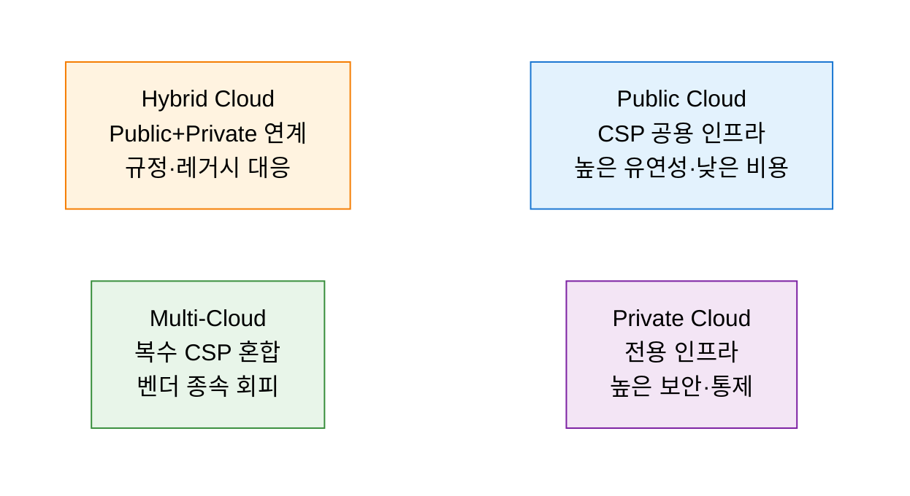
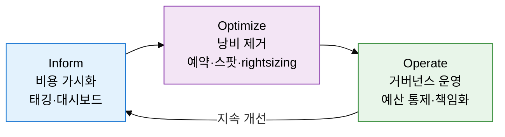

## 1. 클라우드 비용을 재무 책임으로 전환하는 FinOps, 클라우드 소싱 전략의 개요

**정의**: 클라우드 소싱 유형(Public·Private·Hybrid·Multi)을 전략적으로 선택하고 FinOps 프레임워크로 클라우드 비용을 재무 책임 단위로 최적화·거버넌스하는 운영 체계.
- 단일 CSP 의존에서 벗어나 워크로드 특성에 따라 최적 클라우드 환경을 혼합 배치
- FinOps(Financial Operations)는 엔지니어링·재무·비즈니스가 협력하여 클라우드 지출을 공동 책임
- 태깅 전략·예약 인스턴스·스팟 활용 등 기술적 최적화와 조직적 거버넌스를 결합

**특징**:
- **유형 최적화**: 워크로드 보안성·비용·유연성 요건에 따라 Public·Private·Hybrid·Multi 중 최적 배치
- **재무 가시성**: 클라우드 지출을 팀·서비스·프로젝트 단위로 가시화하여 낭비 자원 식별·제거
- **문화적 전환**: FinOps는 도구가 아닌 Inform→Optimize→Operate 사이클의 조직 문화 변화 주도

---

## 2. 클라우드 소싱 및 FinOps의 핵심 구성 체계

### 가. Multi-Cloud·Hybrid Cloud 도입 전략 및 유형 비교

| 유형 | 비용 | 보안 | 유연성 | 거버넌스 복잡도 | 적합 상황 |
|---|---|---|---|---|---|
| **Public Cloud** | 낮음(종량제) | CSP 공동 책임 | 최고 | 단순 | 스타트업·개발·테스트 환경 |
| **Private Cloud** | 높음(자본비) | 완전 통제 | 낮음 | 단순 | 금융·의료·국방 규제 환경 |
| **Hybrid Cloud** | 중간 | 영역별 차등 | 높음 | 중간 | 레거시 연계, 규정 준수 필요 |
| **Multi-Cloud** | 최적화 가능 | CSP별 차등 | 최고 | 복잡 | 벤더 종속 회피, 최적 서비스 조합 |

---

### 나. FinOps 프레임워크 및 클라우드 비용 최적화

| 최적화 기법 | 내용 | 절감 효과 | 적용 조건 |
|---|---|---|---|
| **예약 인스턴스(RI)** | 1~3년 약정으로 온디맨드 대비 할인 구매 | 최대 72% 절감 | 안정적 베이스라인 워크로드 |
| **스팟 인스턴스** | 여유 CSP 자원을 경매 방식으로 저가 구매 | 최대 90% 절감 | 중단 허용 배치·CI/CD 워크로드 |
| **Rightsizing** | 실제 사용률 분석 후 인스턴스 크기 조정 | 20~30% 절감 | CPU·메모리 30% 미만 활용 자원 |
| **태깅 전략** | 팀·서비스·환경별 태그로 비용 책임 단위 분리 | 낭비 가시화 | 클라우드 도입 초기부터 표준화 |
| **Auto Scaling** | 부하 기반 자동 증감으로 과잉 프로비저닝 제거 | 15~25% 절감 | 트래픽 변동성 큰 웹·API 서비스 |

---

## 3. 클라우드 소싱 및 FinOps 도입의 기대효과 및 활용 방안

| 구분 | 주요 기대효과 | 활용 및 실무 적용 방안 |
|---|---|---|
| **비용 최적화** | 예약·스팟·rightsizing 조합으로 클라우드 지출 30~50% 절감 | FinOps 팀 구성, 월간 비용 리뷰 사이클, CSP 비용 분석 도구(Cost Explorer·Cloud Billing) 운용 |
| **전략적 유연성** | Multi-Cloud로 벤더 종속 탈피, 워크로드별 최적 CSP 선택 | 컨테이너·쿠버네티스 기반 이식성 확보, CSP 중립 API 설계, 데이터 이동 비용 최소화 아키텍처 |
| **거버넌스 강화** | 팀·프로젝트 단위 비용 책임 명확화, 예산 초과 사전 경보 | 태깅 정책 표준화, 클라우드 정책 엔진(OPA·SCP) 도입, 이상 지출 알림 자동화 |
| **규정 준수** | Hybrid Cloud로 데이터 주권·개인정보 보호 법규 동시 충족 | 민감 데이터 Private·규제 워크로드 On-Premise 배치, 클라우드 보안 컴플라이언스 자동 점검 |
