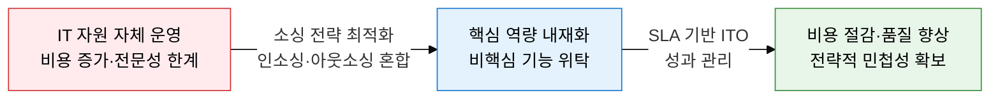
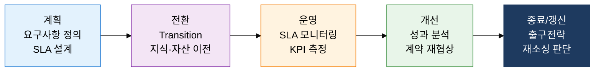

## 1. 핵심 역량 집중과 전문성 활용을 균형화하는 IT 소싱 전략의 개요

**정의**: 조직의 IT 기능을 핵심 역량 여부·비용·리스크 기준으로 내부 수행(인소싱) 또는 외부 위탁(아웃소싱)으로 최적 배분하는 전략적 의사결정 체계.
- 단순 비용 절감을 넘어 전략적 유연성·기술 접근성·리스크 분산을 동시에 추구
- ITO(IT Outsourcing)는 SLA 기반 계약으로 서비스 수준을 정량적으로 측정·관리
- 오프쇼어링·온쇼어링·니어쇼어링 등 지리적 전략과 아웃소싱 유형을 조합하여 설계

**특징**:
- **전략적 정렬**: 핵심 역량은 내재화하고 비핵심 기능은 전문 벤더에 위탁하여 경쟁 우위 집중
- **유형 다양성**: 코소싱·토탈·선택적 아웃소싱 등 조직 상황에 맞는 복수 모델 선택 가능
- **성과 기반 운영**: SLA·KPI 계약으로 품질을 수치화하여 벤더 성과를 객관적으로 평가·통제

---

## 2. IT 소싱 전략의 핵심 구성 체계

### 가. 인소싱·아웃소싱 유형 및 지리적 전략 비교

| 소싱 유형 | 통제 수준 | 비용 | 주요 리스크 | 적합 상황 |
|---|---|---|---|---|
| **인소싱** | 최고 | 높음 | 내부 전문성 부족 | 핵심 역량·보안 민감 기능 |
| **코소싱** | 높음 | 중간 | 지식 이전 실패 | 역량 구축 과도기, 대형 프로젝트 |
| **선택적 아웃소싱** | 중간 | 중간 | 복수 벤더 조율 복잡 | 기능별 전문성 요구, 리스크 분산 |
| **토탈 아웃소싱** | 낮음 | 낮음 | 벤더 종속·지식 유출 | 비핵심 IT 전체, 비용 압박 극심 |
| **오프쇼어링** | 낮음 | 최저 | 품질·문화 차이 | 대량 반복 업무, 비용 최소화 |
| **니어쇼어링** | 중간 | 낮음 | 시간대 차이 최소 | 시간대·언어 유사 인접국 활용 |
| **리쇼어링** | 높음 | 높음 | 비용 재상승 | 공급망 리스크, 데이터 주권 요구 |

---

### 나. IT 아웃소싱(ITO) 관리 체계 및 위험 관리

| 위험 유형 | 내용 | 대응 전략 |
|---|---|---|
| **벤더 종속(Lock-in)** | 특정 벤더 기술·계약에 고착되어 전환 비용 급증 | 멀티소싱 전략, 표준 API 계약, 출구전략 명문화 |
| **지식 유출** | 핵심 IT 노하우가 벤더로 이전되어 내재화 역량 소멸 | 지식 관리 계획 수립, 핵심 기술 인소싱 유지 |
| **품질 저하** | SLA 미달, 커뮤니케이션 단절로 서비스 품질 하락 | SLA 페널티 조항, 정기 성과 리뷰, 에스컬레이션 절차 |
| **이행 실패** | Transition 단계 지식 이전 불완전으로 서비스 중단 | 이행 계획서 수립, 병행 운영(Parallel Run) 기간 확보 |

---

## 3. IT 소싱 전략 도입의 기대효과 및 활용 방안

| 구분 | 주요 기대효과 | 활용 및 실무 적용 방안 |
|---|---|---|
| **비용 최적화** | 비핵심 기능 위탁으로 IT 운영 비용 20~40% 절감, 자본비용의 운영비 전환 | TCO 분석 기반 인소싱·아웃소싱 의사결정, 토탈코스트 비교 모델 적용 |
| **전략적 집중** | 핵심 역량에 내부 자원 집중 배치, 기술 혁신 속도 향상 | 비즈니스 임팩트 매트릭스로 핵심·비핵심 기능 분류, 선택적 소싱 설계 |
| **리스크 관리** | 벤더 종속 방지, 멀티소싱으로 공급 리스크 분산 | SLA 페널티·출구전략 계약 명문화, 2개 이상 벤더 병행 운영 |
| **운영 품질** | SLA 기반 정량적 성과 관리로 서비스 수준 일관성 확보 | 월간 KPI 리뷰, ITIL 기반 서비스 관리 프로세스 벤더 적용 |
