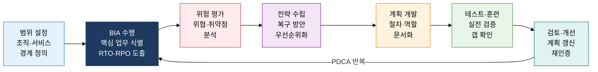

## 1. 재해 발생 후에도 핵심 업무를 지속하는 체계, BCP·DRS의 개요

**정의**: 재해·장애 발생 시 핵심 업무의 연속성을 보장하기 위해 사전 계획·절차·복구 시스템을 체계화한 경영 프레임워크.
- ISO 22301(비즈니스 연속성 관리 시스템) 국제 표준을 기반으로 수립
- BIA(비즈니스 영향 분석)를 통해 핵심 업무 우선순위와 복구 목표(RTO·RPO)를 수치화
- 재해복구시스템(DRS)은 Mirror·Hot·Warm·Cold Site 4가지 형태로 구현

**특징**:
- **사전 예방성**: 재해 발생 전 복구 절차·역할·연락 체계를 문서화하여 혼란 최소화
- **정량적 목표**: RTO(목표 복구 시간)와 RPO(목표 복구 시점)로 복구 목표를 측정 가능하게 설정
- **지속적 개선**: 정기 테스트·훈련·검토를 통해 계획의 유효성을 유지·갱신

---

## 2. BCP·DRS의 핵심 구성 체계

### 가. BCP 수립 절차(ISO 22301) 및 BIA 핵심 업무 식별

| BIA 분석 항목 | 내용 | 산출물 |
|---|---|---|
| **핵심 업무 식별** | 중단 시 조직에 심각한 영향을 미치는 프로세스·서비스 목록화 | 핵심 업무 우선순위 목록 |
| **최대 허용 중단 시간(MAO)** | 업무 중단이 허용되는 최대 시간(초과 시 회복 불가 피해 발생) | MAO 임계값 정의서 |
| **RTO(목표 복구 시간)** | 재해 발생 후 업무를 재개해야 하는 목표 시간(MAO 이내 설정) | RTO 목표값 (단위: 시간) |
| **RPO(목표 복구 시점)** | 데이터 복구 시 허용되는 최대 데이터 손실 시점(백업 주기 기준) | RPO 목표값 (단위: 시간) |
| **업무 의존성 분석** | 핵심 업무에 필요한 IT 시스템·인력·공급망 의존 관계 매핑 | 의존성 매트릭스 |
| **재무적 영향 산정** | 업무 중단 시간당 재무 손실·규제 위반 비용 정량화 | 시간당 손실 비용 산출서 |

---

### 나. DRS 4대 운영 형태 비교 및 RTO·RPO 개념

| 구분 | Mirror Site | Hot Site | Warm Site | Cold Site |
|---|---|---|---|---|
| **RTO** | 즉시(수 초) | 수 시간 이내 | 수 시간~수일 | 수일~수 주 |
| **RPO** | 0(무손실) | 수 분~수 시간 | 수 시간~수일 | 수일 이상 |
| **데이터 동기화** | 실시간 미러링(양방향) | 실시간~준실시간 복제 | 주기적 백업 복제 | 테이프·스냅샷 수동 복원 |
| **설비 가동 상태** | 100% 상시 운영(Active-Active) | 시스템 상시 가동(Active-Standby) | 핵심 장비만 대기 | 공간·전력만 확보 |
| **비용** | 최고(운영비 2배) | 높음 | 중간 | 낮음 |
| **적용 대상** | 금융 거래·항공 예약 등 무중단 필수 서비스 | 핵심 업무 시스템·ERP | 내부 업무·중요도 중간 시스템 | 아카이브·비핵심 시스템 |

---

## 3. BCP·DRS 도입의 기대효과 및 활용 방안

| 구분 | 주요 기대효과 | 활용 및 실무 적용 방안 |
|---|---|---|
| **업무 연속성** | 재해 발생 시 핵심 업무 중단 시간 최소화, 고객 신뢰 유지 | ISO 22301 인증 취득으로 비즈니스 파트너·규제 기관에 연속성 역량 증명 |
| **데이터 보호** | RPO 기반 백업 주기 최적화로 데이터 손실 범위를 수치로 통제 | Hot Site 실시간 복제(DB Log Shipping, AWS DRS)로 RPO 목표 달성 |
| **비용 최적화** | 사이트 유형 선택으로 복구 수준 대비 비용 균형 확보 | 클라우드 기반 DRS(AWS, Azure Site Recovery)로 Cold→Warm 전환 비용 절감 |
| **규제 준수** | 금융·의료·공공 분야 업무 연속성 의무 요건 충족 | 연간 모의 훈련(Tabletop Exercise, Full-Scale Drill) 실시로 규제 감사 대응 |
