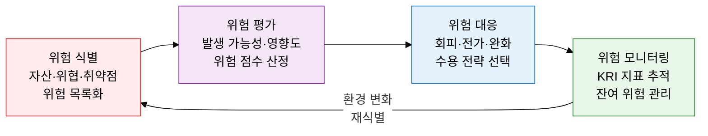

## 1. 불확실성을 기회와 위협으로 균형 관리하는 체계, ERM의 개요


**정의**: 조직 전체의 위험을 체계적으로 식별·평가·대응·모니터링하여 전략 목표 달성을 지원하는 통합 경영 프레임워크.
- ISO 31000(위험 관리 국제 표준)의 원칙·프레임워크·프로세스 체계를 기반으로 운영
- IT 리스크(사이버 공격·시스템 장애·규제 위반 등)를 전사 위험 관리 체계에 통합
- 위험 회피·전가·완화·수용 4대 대응 전략으로 위험별 최적 대처 방식을 선택

**특징**:
- **전사 통합성**: 전략·운영·재무·규제 위험을 단일 프레임워크로 통합 관리
- **정량화 기반**: 발생 가능성 × 영향도 위험 매트릭스로 위험을 수치화하여 우선순위 결정
- **지속적 사이클**: 식별→평가→대응→모니터링의 반복 루프로 환경 변화에 적응

---

## 2. ERM의 핵심 구성 체계

### 가. IT 리스크 통제 프레임워크 4단계 및 ISO 31000 연계



| 단계 | 핵심 활동 | ISO 31000 연계 | 주요 산출물 |
|---|---|---|---|
| **위험 식별** | 자산 목록화, 위협 시나리오 도출, 취약점 분석(CVSS 스코어링) | 5.4 위험 식별 프로세스 | 위험 등록부(Risk Register) |
| **위험 평가** | 발생 가능성·영향도 점수 산정, 위험 매트릭스 작성, 우선순위 결정 | 5.4.3 위험 분석·평가 | 위험 매트릭스, 위험 우선순위 목록 |
| **위험 대응** | 회피·전가·완화·수용 전략 선택, 통제 활동 설계·구현 | 5.5 위험 처리 | 위험 처리 계획(Risk Treatment Plan) |
| **위험 모니터링** | KRI(핵심 위험 지표) 추적, 통제 효과성 검토, 잔여 위험 재평가 | 5.6 모니터링·검토 | KRI 대시보드, 위험 보고서 |

---

### 나. IT 위험 유형 분류 및 위험 대응 전략

```mermaid
%%{init: { 'theme': 'base', 'themeVariables': { 'edgeLabelBackground': '#fff' }}}%%
flowchart TD
    subgraph R1["　"]
        direction LR
        A["전략적 위험<br/>IT 전략 실패<br/>기술 변화 대응 미흡"] B["운영적 위험<br/>시스템 장애<br/>사이버 공격·내부 오류"]
    end
    subgraph R2["　"]
        direction LR
        C["재무적 위험<br/>IT 투자 손실<br/>데이터 유출 배상"] D["규제 준수 위험<br/>GDPR·ISMS 위반<br/>감사 지적·과징금"]
    end
    style R1 fill:none,stroke:none
    style R2 fill:none,stroke:none
    style A fill:#FFEBEE,stroke:#D32F2F,color:#000
    style B fill:#F3E5F5,stroke:#7B1FA2,color:#000
    style C fill:#FFF3E0,stroke:#F57C00,color:#000
    style D fill:#1E3A5F,stroke:#1E3A5F,color:#fff
```

| 위험 유형 | 대표 사례 | 대응 전략 | 실무 통제 수단 |
|---|---|---|---|
| **전략적 위험** | 클라우드 전환 실패, 기술 부채 누적, IT 거버넌스 미흡 | 회피(전략 재수립) 또는 완화(로드맵 조정) | IT 전략 위원회 운영, 기술 로드맵 정기 검토 |
| **운영적 위험** | 랜섬웨어 공격, 서비스 중단, 개인정보 유출, 내부자 오남용 | 완화(기술적 통제 강화) 또는 전가(사이버 보험) | SIEM·EDR 도입, 접근 권한 최소화, 정기 모의훈련 |
| **재무적 위험** | IT 프로젝트 예산 초과, 데이터 침해 소송 비용, SLA 위반 배상 | 전가(보험·계약) 또는 수용(예비 예산 확보) | 프로젝트 EVM 관리, 사이버 배상 책임 보험 가입 |
| **규제 준수 위험** | GDPR·개인정보보호법·ISMS-P 위반, 감사 지적 사항 미조치 | 회피(선제적 준수) 또는 완화(컴플라이언스 체계 구축) | 규제 모니터링 프로그램, 내부 감사 자동화, DPO 지정 |

---

## 3. ERM 도입의 기대효과 및 활용 방안

| 구분 | 주요 기대효과 | 활용 및 실무 적용 방안 |
|---|---|---|
| **전략적** | 위험 기반 의사결정으로 IT 투자 실패율 감소, 기회 위험 선제 포착 | 이사회·경영진 위험 보고 체계 수립, 전략 기획 시 위험 평가 의무화 |
| **운영적** | 사이버 공격·시스템 장애 선제 차단으로 서비스 가용성 향상 | KRI 대시보드 자동화(SIEM·SOAR 연동), 위험 등록부 분기별 갱신 |
| **재무적** | 위험 정량화를 통한 보험료·복구 비용 최적화, 손실 예측 가능성 향상 | 위험 처리 비용 대비 기대 손실 감소액 ROI 분석으로 투자 우선순위 결정 |
| **규제 준수** | ISO 31000·COSO ERM·ISMS-P 연계로 다중 규제 요건 통합 충족 | 규제 변경 자동 모니터링 도구 도입, 컴플라이언스 갭 분석 연간 실시 |
