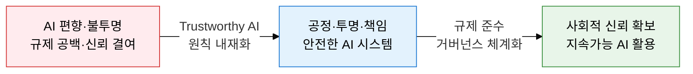
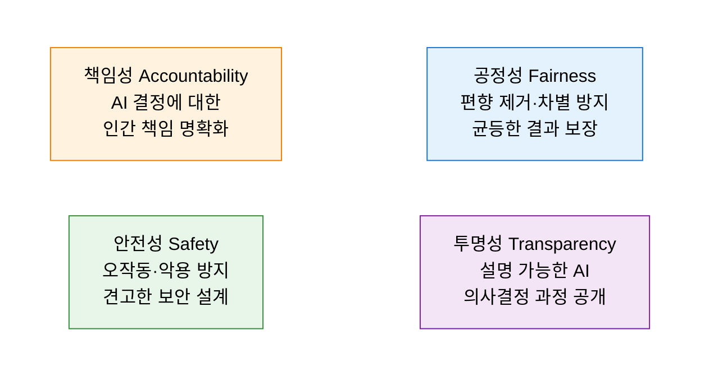
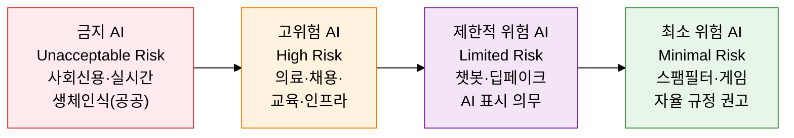

## 1. AI의 윤리적 설계와 규제 준수를 동시에 달성하는, AI 거버넌스의 개요

**정의**: AI 시스템의 설계·개발·운영 전 주기에 걸쳐 공정성·투명성·책임성·안전성을 보장하고 법적·윤리적 요건을 충족하는 관리 체계.
- EU AI Act·국내 AI 기본법 등 법제화로 거버넌스 구축이 기업 필수 의무로 전환
- AI 의사결정의 설명 가능성(XAI)과 감사 추적 체계가 핵심 구성 요소
- 고위험 AI 시스템에는 적합성 평가·등록·모니터링 의무가 부과됨

**특징**:
- **원칙 기반 설계**: 개발 초기 단계부터 윤리 원칙을 내재화하는 AI Ethics by Design 접근
- **위험 비례 규제**: AI 시스템의 위험 수준에 따라 차등화된 규제 요건을 적용하는 비례 원칙
- **다층 거버넌스**: 기업 내부 AI 위원회·정부 감독 기관·국제 표준화(ISO/IEC 42001)의 다층 체계 구성

---

## 2. AI 거버넌스의 핵심 구성 체계

### 가. 신뢰할 수 있는 AI 4대 원칙과 거버넌스 체계

| 원칙 | 핵심 개념 | 구현 기법 | 측정 지표 |
|---|---|---|---|
| **공정성** | 인종·성별·연령 등 민감 속성에 의한 차별적 결과 제거 | 학습 데이터 편향 감사, 재균형 샘플링, Fairness 제약 학습 | 균등 기회(Equal Opportunity), 통계적 동등성 |
| **투명성** | 모델 예측 근거를 이해관계자가 이해할 수 있도록 설명 제공 | XAI(LIME·SHAP), 모델 카드 발행, 설명 로그 보관 | 설명 충실도, 이해관계자 이해도 점수 |
| **책임성** | AI 결정으로 인한 피해 발생 시 책임 주체(개발·운영·사용자) 명확화 | AI 거버넌스 위원회 설치, 감사 추적 로그, 인간 검토 게이트 | 책임 추적 커버리지, 이의제기 처리율 |
| **안전성** | 적대적 공격·오작동·의도치 않은 결과로부터 시스템 및 사용자 보호 | 레드팀 테스트, 이상 탐지, 폴백 메커니즘, 보안 설계 내재화 | MTTR, 오탐율, 시스템 가용성 |

---

### 나. EU AI Act 위험 등급 체계 및 국내 AI 기본법 대응

| 위험 등급 | 대상 AI 시스템 | 규제 요건 | 위반 과태료 |
|---|---|---|---|
| **금지(Unacceptable)** | 사회신용 시스템, 무차별 안면인식, 잠재의식 조작 | 시장 출시 완전 금지 | 최대 3,500만 유로 또는 전세계 매출 7% |
| **고위험(High Risk)** | 의료기기, 채용·신용평가, 교육, 중요 인프라 | 적합성 평가·EU 데이터베이스 등록·사후 모니터링 | 최대 1,500만 유로 또는 매출 3% |
| **제한적 위험(Limited Risk)** | 챗봇, 딥페이크 생성, AI 생성 콘텐츠 | AI임을 명시하는 투명성 의무(AI 표시) | 최대 750만 유로 또는 매출 1.5% |
| **최소 위험(Minimal Risk)** | 스팸 필터, AI 게임, 재고 최적화 | 자율 행동 강령 권고(법적 의무 없음) | 해당 없음 |

**국내 AI 기본법(인공지능 발전과 신뢰 기반 조성 등에 관한 법률) 주요 내용**
- 고영향 AI 시스템에 대한 사전 고지 의무 및 이의제기 권리 보장
- AI 안전연구소 설치, AI 사고 신고·조사 체계 마련
- AI 기업 자율 규제·인증 체계 병행 운영(민관 협력)
- 생성형 AI 서비스의 AI 생성물 표시 의무화

---

## 3. AI 거버넌스 도입의 기대효과 및 활용 방안

| 구분 | 주요 기대효과 | 활용 및 실무 적용 방안 |
|---|---|---|
| **신뢰 구축** | Trustworthy AI 원칙 내재화로 고객·규제기관·투자자의 AI 신뢰도 제고 | AI 모델 카드 발행, 설명 가능성(XAI) 도입, 편향 감사 체계화 |
| **규제 준수** | EU AI Act·AI 기본법 사전 대응으로 과태료 리스크 차단 및 시장 접근성 확보 | 고위험 AI 적합성 평가 절차 수립, AI 거버넌스 위원회 운영 |
| **리스크 관리** | 위험 등급 분류 기반 차등 통제로 AI 오작동·편향·악용 피해 최소화 | 레드팀 테스트, 이상 탐지 모니터링, 인간 검토 게이트 운영 |
| **경쟁 우위** | AI 윤리·거버넌스 선도 이미지로 글로벌 파트너십 및 조달 경쟁력 강화 | ISO/IEC 42001 인증 취득, AI 투명성 보고서 정기 발행 |
