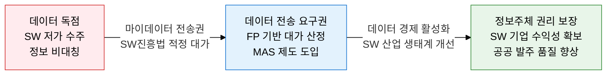
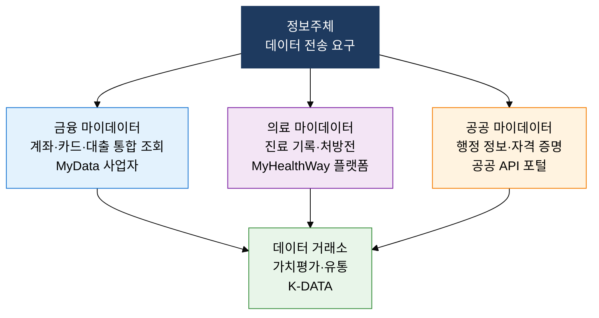

## 1. 데이터 주권과 SW 적정 대가를 실현하는 규제 혁신, 데이터 규제·마이데이터·SW 진흥법의 개요

**정의**: 마이데이터 전송 요구권과 데이터 가치평가 체계를 통해 데이터 경제를 활성화하고, SW진흥법 기반 FP 대가 산정·MAS 제도로 소프트웨어 산업의 적정 대가를 보장하는 법·제도 프레임워크.
- 마이데이터는 금융·의료·공공 분야에서 정보주체가 자신의 데이터를 직접 관리·이동·활용할 수 있는 권리 체계
- 데이터 가치평가는 수익·비용·시장 접근법으로 데이터 자산의 경제적 가치를 측정하여 거래·투자 근거 제공
- SW진흥법 개정으로 분리 발주·적정 대가·상용 SW 활용 의무화를 통해 SW 생태계 건전성 강화

**특징**:
- **데이터 이동권 확대**: 금융(마이데이터)·의료(MyHealthWay)·공공 분야로 순차 확산되며 API 기반 데이터 전송 인프라 구축 가속화
- **적정 대가 법제화**: 기능점수(FP) 기반 SW 사업 대가 산정을 법적으로 의무화하여 저가 수주·덤핑 구조 개선
- **데이터 거래 생성**: 데이터 거래소를 통한 데이터 유통 시장 형성으로 데이터 경제 생태계 활성화

---

## 2. 데이터 규제·마이데이터·SW 진흥법의 핵심 구성 체계

### 가. 마이데이터 생태계 및 데이터 가치평가

| 구분 | 내용 | 적용 분야 | 법적 근거 |
|---|---|---|---|
| **마이데이터 개념** | 정보주체가 자신의 개인 데이터를 제3자에게 전송 요청할 수 있는 권리 | 금융·의료·공공·통신 | 개인정보보호법 35조의2, 신용정보법 |
| **금융 마이데이터** | 계좌·카드·보험·대출 정보를 통합 조회·분석·활용 | 은행·카드·보험·증권 | 신용정보법 22조의9 |
| **수익 접근법** | 데이터 활용으로 창출되는 미래 수익의 현재가치로 평가 | 금융·커머스 데이터 | 데이터산업진흥법 |
| **비용 접근법** | 데이터 수집·정제·구축에 투입된 비용 합산으로 평가 | 공공 데이터, DB | 데이터산업진흥법 |
| **시장 접근법** | 유사 데이터의 시장 거래 가격을 참조하여 평가 | 데이터 거래소 등록 | 데이터산업진흥법 |

---

### 나. 소프트웨어 진흥법 및 FP 기반 대가 산정·MAS 제도

| 제도 | 핵심 내용 | 도입 목적 | 적용 대상 |
|---|---|---|---|
| **SW진흥법 분리 발주** | HW·SW·유지보수를 별도 계약으로 분리 발주 의무화 | 묶음 발주로 인한 SW 대가 잠식 방지 | 공공기관 SW 사업 |
| **기능점수(FP) 대가 산정** | 소프트웨어 기능 규모를 FP로 측정 후 단가 곱셈으로 대가 산정 (SW 개발비 = AFP × FP 단가) | 개발 규모 기반 객관적 대가 산정, 저가 수주 방지 | 공공 SW 개발 사업 |
| **다수공급자계약(MAS)** | 다수 공급자와 단가 계약 체결 후 수요기관이 선택 구매 | 상용 SW 반복 구매 효율화, 협상 여지 확보 | 상용 SW·클라우드 서비스 |
| **상용 SW 활용 의무화** | 직접 개발 가능한 SW도 상용 제품 우선 검토 의무 | 중복 개발 방지, SW 산업 생태계 지원 | 공공기관 SW 도입 |
| **적정 대가 보장** | 유지보수 요율 최저 기준(15%) 및 하도급 대금 지급 기한 규정 | SW 기업 수익성 확보, 품질 유지 | SW 유지보수 계약 |

---

## 3. 데이터 규제·마이데이터·SW 진흥법 적용의 기대효과 및 활용 방안

| 구분 | 주요 기대효과 | 활용 및 실무 적용 방안 |
|---|---|---|
| **데이터 주권** | 정보주체 권리 강화로 데이터 신뢰 생태계 조성 및 데이터 경제 활성화 | 마이데이터 API 연동 인프라 구축, 금융·의료 분야 데이터 전송 요구권 대응 체계 마련 |
| **데이터 수익화** | 데이터 가치평가 체계 도입으로 데이터 자산의 재무적 가치 인식 및 거래 활성화 | K-DATA 데이터 거래소 등록, 데이터 수익 접근법 기반 가치 산정 후 투자 유치 근거 확보 |
| **SW 생태계 개선** | FP 기반 대가 산정으로 저가 수주 구조 개선 및 SW 품질·기업 수익성 동시 향상 | 공공 SW 사업 기능점수 산정 전문화, SW 진흥법 의무 준수 체크리스트 운영 |
| **공공 발주 혁신** | 분리 발주·MAS·상용 SW 우선 활용으로 공공 IT 투자 효율성 및 투명성 제고 | MAS 등록을 통한 공공시장 진입 전략 수립, ISMP 연계 FP 측정 자동화 도구 도입 |
