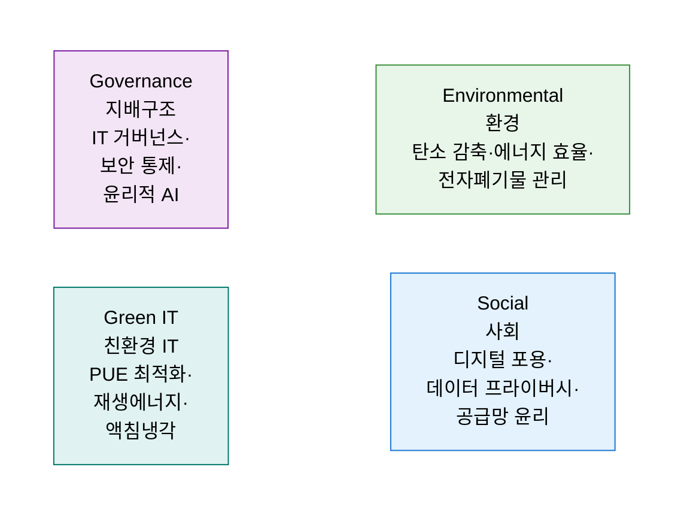
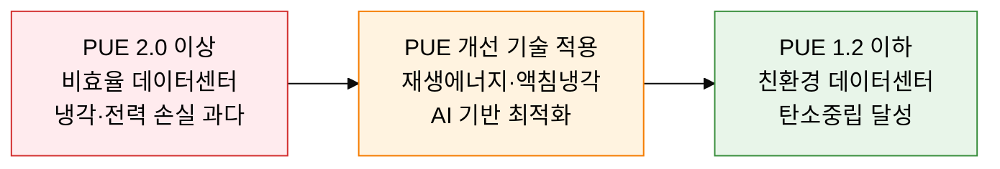

## 1. IT로 환경·사회·지배구조 가치를 실현하는 경영 전략, ESG와 Green IT의 개요

**정의**: 환경(Environmental)·사회(Social)·지배구조(Governance) 기준을 IT 경영에 내재화하여 지속가능한 디지털 운영과 기업 가치를 동시에 달성하는 경영 프레임워크.
- IT 인프라의 전력 소비·탄소 배출·전자폐기물이 E 영역의 핵심 관리 대상
- 데이터 프라이버시·디지털 포용·공급망 윤리가 S·G 영역과 IT를 연결하는 접점
- ESG 공시 의무화(SEC·K-ESG·ISSB)로 IT 기반 데이터 수집·보고 체계 구축이 필수화

**특징**:
- **측정 가능성**: PUE·WUE·CUE 등 정량 지표로 IT 환경 영향을 수치화하여 ESG 보고서에 반영
- **규제 선제 대응**: EU 그린 딜·탄소국경조정제도(CBAM) 등 글로벌 환경 규제를 IT 전략에 선행 통합
- **비즈니스 연계**: 친환경 IT 투자(재생에너지·효율화)가 운영비 절감과 투자자 신뢰 향상으로 이어지는 선순환

---

## 2. ESG와 Green IT의 핵심 구성 체계

### 가. ESG 3대 관점과 IT 역할 및 그린 IT 개념

| ESG 영역 | IT 적용 과제 | 주요 사례 |
|---|---|---|
| **Environmental** | 데이터센터 에너지 효율화, 탄소 배출 측정·저감, 전자폐기물(e-Waste) 재활용 | 재생에너지 100%(RE100) 전환, 액침냉각 도입, PUE 1.2 이하 목표 |
| **Social** | 디지털 접근성 향상, 개인정보 보호, IT 공급망 노동 윤리 준수 | 장애인 웹 접근성(WCAG), GDPR·개인정보보호법 준수, 공급망 실사 |
| **Governance** | IT 거버넌스 강화, 사이버보안 투명성, 이사회 IT 감독 체계 | COBIT 도입, 보안 사고 공시 의무화, CISO 이사회 보고 체계 |
| **Green IT** | 하드웨어 수명 연장, 가상화·클라우드 통합, 탄소 인벤토리 구축 | 서버 가상화율 80% 이상, 클라우드 마이그레이션, GHG Protocol 적용 |

---

### 나. 데이터센터 PUE 지표 및 친환경 기술

**PUE(Power Usage Effectiveness) 산식**

> PUE = 데이터센터 전체 전력 소비량 / IT 장비 전력 소비량
> - PUE = 1.0: 이상적(IT 장비만 전력 소비)
> - PUE = 1.2 이하: 우수(글로벌 하이퍼스케일 수준)
> - PUE = 2.0 이상: 비효율(냉각·배전 손실 과다)

| 친환경 기술 | 개요 | PUE 개선 효과 | 도입 사례 |
|---|---|---|---|
| **재생에너지(RE100)** | 태양광·풍력 전력 구매계약(PPA)으로 화석연료 대체 | 탄소 배출 Zero 기여 | Google·MS·네이버 클라우드 |
| **액침냉각(Immersion Cooling)** | 서버를 냉각 유체에 직접 침지, 공냉 대비 열 전달 효율 수십 배 향상 | PUE 1.03~1.1 수준 달성 가능 | 글로벌 HPC·AI 클러스터 |
| **AI 기반 냉각 최적화** | ML로 냉각 부하를 실시간 예측·조절, DeepMind-Google 협업 사례 | 냉각 에너지 40% 절감 | Google 데이터센터 |
| **탄소중립 설계** | 건물 단열·외기냉방(Free Cooling)·폐열 재활용 통합 설계 | PUE 1.15 이하 목표 | MS 수중 데이터센터(Natick) |

---

## 3. ESG와 Green IT 도입의 기대효과 및 활용 방안

| 구분 | 주요 기대효과 | 활용 및 실무 적용 방안 |
|---|---|---|
| **환경적** | 데이터센터 탄소 배출 감축 및 PUE 개선으로 기후 목표 기여 | RE100 전환 로드맵 수립, 액침냉각·AI 최적화 파일럿 추진 |
| **경제적** | 에너지 효율화로 운영 비용 절감, ESG 투자자 유치 및 조달 우위 확보 | 에너지 소비 절감 ROI 분석, 녹색채권(Green Bond) 발행 연계 |
| **규제 대응** | K-ESG·ISSB 공시 의무화에 선제 대응, 글로벌 공급망 요건 충족 | ESG 데이터 수집·보고 자동화 시스템 구축, GHG Protocol 적용 |
| **신뢰·브랜드** | 친환경 IT 운영 투명성 공개로 고객·투자자·직원 신뢰 강화 | ESG 보고서 IT 챕터 강화, 제3자 검증(DNV·EY) 획득 |
