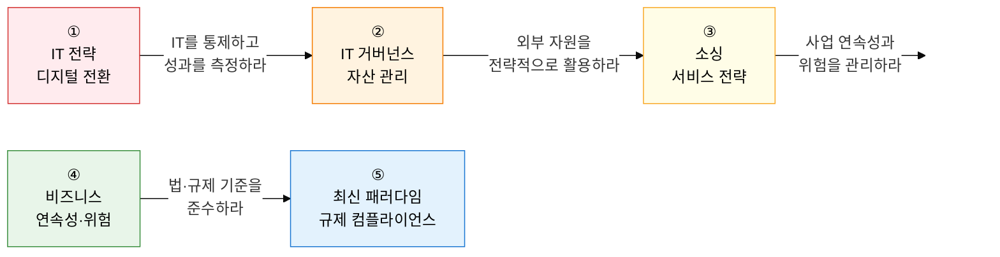

IT 경영은 **"기술을 경영 가치로 전환하는 거시적 관리 체계"** 입니다.  
IT 전략 수립·거버넌스 통제·소싱 최적화·비즈니스 연속성부터 ESG·AI 거버넌스·데이터 규제까지, 기술사가 반드시 갖춰야 할 경영학적 통찰력을 체계적으로 다룹니다.

## 학습 로드맵 — 5단계 흐름

---

## ① IT 전략 및 디지털 전환

> **"비즈니스 목표와 IT를 정렬하고 디지털 비즈니스 모델을 혁신하는 전략 수립 영역"** 입니다.  
> SAM 4대 관점, ISP 4단계 절차, EA 4대 아키텍처, DX 성숙도 5단계는 서술형 빈출 주제입니다.

| 순서 | 토픽 | 핵심 키워드 | 중요도 |
|:---:|---|---|:---:|
| 1 | [IT와 비즈니스 전략 정렬](01-it-strategy/strategic-alignment) | SAM, SWOT, Porter 5-Force, 가치사슬, BCG 매트릭스 | ★★★ |
| 2 | [ISP·ISMP·EA](01-it-strategy/isp-ea) | ISP 4단계, 3C·PEST·7S, EA 4대 아키텍처(BA·DA·TA·AA), 6대 참조모델 | ★★★ |
| 3 | [디지털 전환(DX)](01-it-strategy/digital-transformation) | DX 프레임워크, Servitization·구독 경제, 디지털 성숙도 모델 5단계 | ★★★ |

**→ 핵심 학습법**: ISP와 ISMP의 **목적·산출물·연계 제도** 차이를 표로 정리하고, EA 4대 아키텍처(비즈니스→데이터→기술→애플리케이션)를 **계층 관계**로 그려 참조모델과 연결하세요.

---

## ② IT 거버넌스 및 자산 관리

> **"IT 조직이 기업 가치를 극대화하고 위험을 통제하는 메커니즘"** 입니다.  
> COBIT 5대 도메인, ITIL v4 SVS 구조, IT-BSC 4대 관점, ROI·NPV·IRR 계산은 고빈출 주제입니다.

| 순서 | 토픽 | 핵심 키워드 | 중요도 |
|:---:|---|---|:---:|
| 4 | [IT 거버넌스 및 COBIT](02-it-governance/it-governance-cobit) | 거버넌스 5대 영역, COBIT(EDM·APO·BAI·DSS·MEA), 40개 관리 목표 | ★★★ |
| 5 | [ITSM 및 ITIL v4](02-it-governance/itsm-itil) | ITSM 4P(People·Process·Technology·Partner), SVS·SVC·34 실천법, SLA·SLM | ★★★ |
| 6 | [BSC·IT 투자 평가·TCO·ITAM](02-it-governance/bsc-investment) | IT-BSC 4관점, ROI·NPV·IRR·PP 공식, TCO 구성 요소, ITAM | ★★★ |

**→ 핵심 학습법**: ITIL v4 SVS의 **5대 구성 요소**(지도 원칙·거버넌스·SVC·실천법·지속 개선)를 그리고, ROI·NPV·IRR의 **판단 기준**(ROI %, NPV 양수, IRR vs 할인율)을 숫자 예시로 계산하세요.

---

## ③ 서비스 및 소싱 전략

> **"내부 역량과 외부 자원을 최적 조합하여 IT 서비스를 운영하는 전략"** 입니다.  
> 아웃소싱 유형별 비교, FinOps 3단계 사이클, 멀티·하이브리드 클라우드 선택 기준은 빈출 서술 주제입니다.

| 순서 | 토픽 | 핵심 키워드 | 중요도 |
|:---:|---|---|:---:|
| 7 | [IT 소싱 전략 및 아웃소싱 관리](03-sourcing-strategy/it-sourcing) | 인소싱 vs 아웃소싱, 코소싱·토탈·선택적, 오프쇼어링·리쇼어링, ITO 이행 관리 | ★★★ |
| 8 | [클라우드 소싱 및 FinOps](03-sourcing-strategy/cloud-finops) | Multi-Cloud·Hybrid Cloud, FinOps(Inform→Optimize→Operate), 예약 인스턴스·rightsizing | ★★★ |

**→ 핵심 학습법**: 아웃소싱 유형(코소싱·토탈·선택적)의 **통제 수준·비용·위험 차이**를 표로 비교하고, FinOps의 **Inform(가시성)→Optimize(최적화)→Operate(운영)** 3단계 활동을 구체적 기법과 연결하세요.

---

## ④ 연속성 및 위험 관리

> **"재해·재난 상황에서 비즈니스를 지속하고 IT 위험을 체계적으로 통제하는 전략"** 입니다.  
> RTO·RPO 지표, 4대 DRS 사이트(Mirror→Hot→Warm→Cold) 비교, ERM 위험 매트릭스는 반드시 숙지해야 합니다.

| 순서 | 토픽 | 핵심 키워드 | 중요도 |
|:---:|---|---|:---:|
| 9 | [BCP·BIA 및 재해복구시스템(DRS)](04-business-continuity/bcp-drs) | BCP(ISO 22301), BIA 핵심 업무 식별, RTO·RPO, Mirror·Hot·Warm·Cold Site | ★★★ |
| 10 | [기업 위험 관리(ERM)](04-business-continuity/erm) | ERM 4단계(식별→평가→모니터링→대응), ISO 31000, 위험 매트릭스, 회피·전가·완화·수용 | ★★☆ |

**→ 핵심 학습법**: Mirror·Hot·Warm·Cold Site의 **RTO·RPO·비용·데이터 동기화 방식**을 4행 비교표로 암기하고, BIA 결과가 DRS 사이트 선택에 어떻게 연결되는지 흐름을 설명하세요.

---

## ⑤ 최신 IT 경영 패러다임 및 규제 컴플라이언스

> **"경영 환경 변화에 따른 거시적 IT 경영 과제"** 입니다.  
> ESG PUE 수치, EU AI Act 4단계 위험 등급, 마이데이터 전송 요구권, FP 대가 산정은 최신 빈출 주제입니다.

| 순서 | 토픽 | 핵심 키워드 | 중요도 |
|:---:|---|---|:---:|
| 11 | [ESG와 IT 경영(Green IT)](05-modern-paradigm/esg-green-it) | ESG 3대 관점, PUE(전체전력/IT전력), 액침냉각·재생에너지·탄소 중립 | ★★☆ |
| 12 | [AI 거버넌스 및 신뢰할 수 있는 AI](05-modern-paradigm/ai-governance) | Trustworthy AI(공정성·투명성·책임성·안전성), EU AI Act 4등급, 국내 AI 기본법 | ★★★ |
| 13 | [데이터 규제·마이데이터·SW 진흥법](05-modern-paradigm/data-sw-regulation) | 마이데이터·데이터 거래소·가치평가, SW진흥법·FP 대가 산정·MAS 제도 | ★★★ |

**→ 핵심 학습법**: EU AI Act 위험 등급(금지→고위험→제한적→최소 위험)을 **적용 사례**와 매핑하고, SW진흥법의 **분리 발주·FP 산정·MAS 제도**가 왜 도입되었는지 정책적 배경과 함께 설명하세요.

---

## 기술사 시험 전략

| 출제 패턴 | 핵심 대응 전략 |
|---|---|
| **경영학적 프레임워크 활용** | SWOT·BSC·BCG·Porter 5-Force를 IT 사례에 적용한 분석 표 제시 |
| **재무 지표 계산** | ROI·NPV·IRR·PP 공식과 판단 기준을 숫자 예시로 서술 |
| **비교 문제** | 인소싱 vs 아웃소싱, Hot vs Warm Site, COBIT vs ITIL, ISP vs ISMP |
| **최신 트렌드** | FinOps 클라우드 비용 거버넌스, EU AI Act, 마이데이터 전송 요구권, ESG PUE |
| **법·제도 연계** | SW진흥법 FP 대가 산정 근거, ISMS-P 의무 인증 대상, 개인정보보호법 가명 정보 |
