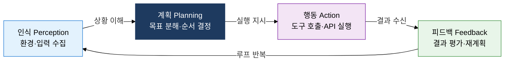
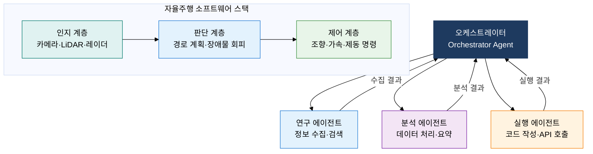

## 1. 인식·계획·행동 사이클로 자율 목표를 달성하는, AI 에이전트의 개요

**정의**: LLM을 핵심 추론 엔진으로 활용하여 인식→계획→행동→피드백 사이클을 자율적으로 반복하고, 외부 도구·메모리·오케스트레이션을 결합해 복잡한 목표를 달성하는 자율형 AI 시스템.
- 단일 프롬프트-응답 패턴을 탈피하여 다단계 목표 분해·실행·자기 수정이 가능
- 도구 사용(Tool Use)으로 웹 검색·코드 실행·API 호출 등 외부 세계와 상호작용
- 멀티에이전트 협업으로 병렬 처리·역할 분담을 통해 단일 에이전트 한계를 극복

**특징**:
- **자율 계획**: 목표를 하위 태스크로 분해하고 실행 순서를 동적으로 조정하는 Planning 역량
- **메모리 관리**: 단기(컨텍스트 창)·장기(벡터 DB) 메모리로 대화 이력·지식을 지속 유지
- **도구 호출**: 함수 호출(Function Calling) API로 코드 실행·검색·DB 조회 등 외부 액션 수행

---

## 2. AI 에이전트 및 자율형 시스템의 핵심 구성 체계

### 가. AI 에이전트 동작 사이클 및 구성 요소

| 구성 요소 | 역할 | 주요 기능 | 구현 예시 |
|---|---|---|---|
| **추론 엔진** | LLM 기반 핵심 의사결정 | 목표 분해, 다음 행동 선택 | GPT-4o, Claude, Gemini |
| **도구 사용** | 외부 세계 상호작용 | 검색·코드 실행·API 호출 | Function Calling, MCP |
| **단기 메모리** | 현재 태스크 컨텍스트 유지 | 대화 이력, 중간 결과 보관 | 컨텍스트 창(128K~1M 토큰) |
| **장기 메모리** | 영속적 지식·경험 저장 | 과거 태스크 결과, 사용자 선호 | 벡터 DB(Pinecone, Weaviate) |
| **오케스트레이터** | 에이전트 실행 흐름 제어 | 태스크 할당, 의존성 관리 | LangGraph, AutoGen |

---

### 나. 멀티에이전트 협업 아키텍처 및 자율주행 소프트웨어 스택

| 구분 | 단일 에이전트 | 멀티에이전트 |
|---|---|---|
| **처리 방식** | 순차적 단일 루프 실행 | 병렬·분산 태스크 처리 |
| **확장성** | 컨텍스트 창 한계로 복잡도 제한 | 역할 분담으로 대규모 태스크 처리 |
| **장애 내성** | 단일 실패점(Single Point of Failure) | 에이전트 격리로 부분 장애 허용 |
| **적합 도메인** | 단순·선형 태스크, 빠른 프로토타입 | 복잡 워크플로, 자율주행·로봇공학 |

---

## 3. AI 에이전트 및 자율형 시스템 도입의 기대효과 및 활용 방안

| 구분 | 주요 기대효과 | 활용 및 실무 적용 방안 |
|---|---|---|
| **업무 자동화** | 반복적 다단계 업무 완전 자동화, 인적 오류 감소 | LangGraph 기반 워크플로 에이전트로 보고서 수집·분석·배포 자동화 |
| **자율주행·로봇** | 인지·판단·제어 통합으로 실시간 자율 의사결정 구현 | ROS2 기반 로봇 미들웨어와 LLM 에이전트 융합, 동적 환경 적응 |
| **멀티에이전트 협업** | 병렬 처리로 대규모 복잡 태스크 처리 시간 단축 | AutoGen·CrewAI로 역할 특화 에이전트 팀 구성, 검증 에이전트 추가 |
| **안전·신뢰성** | Human-in-the-Loop 설계로 치명적 행동 전 인간 승인 확보 | 에이전트 행동 로깅·감사 체계 구축, 비가역 행동 실행 전 확인 단계 삽입 |
