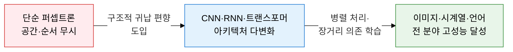
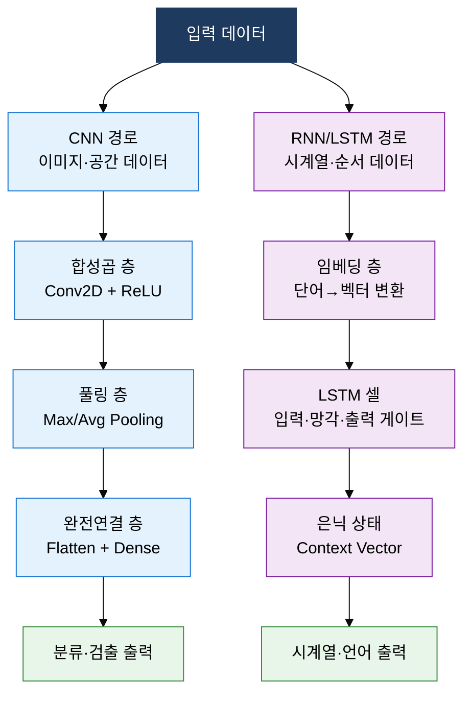
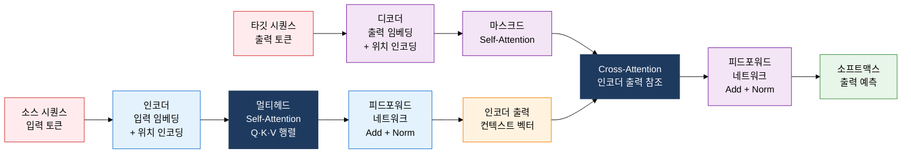

## 1. 데이터 구조에 최적화된 신경망 아키텍처를 선택하는 것이 성능의 핵심, 딥러닝 기초 아키텍처의 개요

**정의**: 데이터의 공간적(CNN)·순서적(RNN/LSTM)·전역적(트랜스포머) 구조를 반영한 귀납 편향(Inductive Bias)으로 학습 효율과 성능을 극대화하는 신경망 아키텍처 체계.
- 이미지·영상 등 격자 구조 데이터는 합성곱 필터의 지역 수용야(Local Receptive Field)로 공간 특징 추출
- 텍스트·음성 등 시계열 데이터는 은닉 상태(Hidden State)로 순서 의존성을 기억하며 처리
- 트랜스포머는 Attention 가중치로 모든 위치 쌍의 관계를 병렬 계산하여 장거리 의존성 학습

**특징**:
- **귀납 편향**: 아키텍처 설계에 데이터 구조 가정을 내재화하여 적은 데이터로 빠른 수렴 달성
- **모듈성**: 합성곱 블록, LSTM 셀, Attention Head 등 재사용 가능한 단위로 네트워크 조합 설계
- **전이 학습**: 대규모 데이터로 사전학습된 가중치를 Fine-tuning하여 소규모 태스크에 즉시 적용

---

## 2. 딥러닝 기초 아키텍처의 핵심 구성 체계

### 가. CNN vs RNN/LSTM 구조 비교

| 항목 | CNN(합성곱 신경망) | RNN/LSTM(순환 신경망) |
|---|---|---|
| **주요 용도** | 이미지 분류·객체 검출·영상 분할 | 자연어 처리·음성 인식·시계열 예측 |
| **핵심 연산** | 합성곱(Convolution) + 풀링(Pooling) | 은닉 상태 순환 + LSTM 게이트(망각·입력·출력) |
| **공간/순서 처리** | 지역 수용야로 2D 공간 특징 추출 | 시간 순서대로 상태를 갱신하며 순서 의존성 기억 |
| **파라미터 공유** | 필터 가중치를 전체 위치에 공유 | 시간 스텝 간 가중치 공유 |
| **병렬 처리** | 합성곱 연산은 공간 병렬화 가능 | 순차 처리로 병렬화 어려움 |
| **한계** | 순서·맥락 정보 자체적으로 모델링 불가 | 장거리 의존성 소실(기울기 소실)·학습 속도 느림 |

---

### 나. 트랜스포머(Transformer) 아키텍처와 RNN 대비 우위

| 비교 항목 | RNN/LSTM | 트랜스포머(Transformer) |
|---|---|---|
| **병렬 처리** | 순차 처리로 학습 속도 느림 | 시퀀스 전체 병렬 처리로 학습 속도 빠름 |
| **장거리 의존성** | 기울기 소실로 먼 토큰 관계 약화 | Self-Attention으로 모든 위치 쌍 직접 연결 |
| **Attention 메커니즘** | 보조 Attention 추가 방식 | Self-Attention이 핵심 연산 (Q·K·V 행렬 내적) |
| **위치 정보** | 순서 자체가 위치 정보 | 위치 인코딩(Positional Encoding) 별도 추가 |
| **확장성** | 모델 크기 증가에 한계 | 스케일링 법칙 따라 파라미터 확대 시 성능 향상 |
| **주요 활용** | 레거시 NLP, 음성 인식 일부 | GPT·BERT·ViT 등 최신 LLM·비전 모델 전반 |

---

## 3. 딥러닝 기초 아키텍처 도입의 기대효과 및 활용 방안

| 구분 | 주요 기대효과 | 활용 및 실무 적용 방안 |
|---|---|---|
| **이미지 처리** | CNN 기반 고정밀 객체 인식으로 자동 검사·분류 정확도 향상 | 제조 불량 검출, 의료 영상 판독, CCTV 이상 탐지 시스템 적용 |
| **시계열 분석** | LSTM 기반 장기 패턴 학습으로 예측 모델 정밀도 제고 | 주가·수요 예측, 설비 이상 탐지, 네트워크 트래픽 분석 |
| **자연어 처리** | 트랜스포머 병렬 학습으로 대규모 언어 이해·생성 모델 구현 | 챗봇·문서 요약·번역·코드 자동 생성 서비스 개발 |
| **전이 학습** | 사전학습 가중치 재사용으로 소규모 데이터 환경에서도 고성능 달성 | Hugging Face 사전학습 모델 Fine-tuning, 도메인 특화 모델 구축 |
