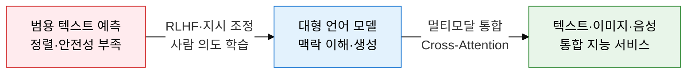
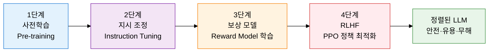
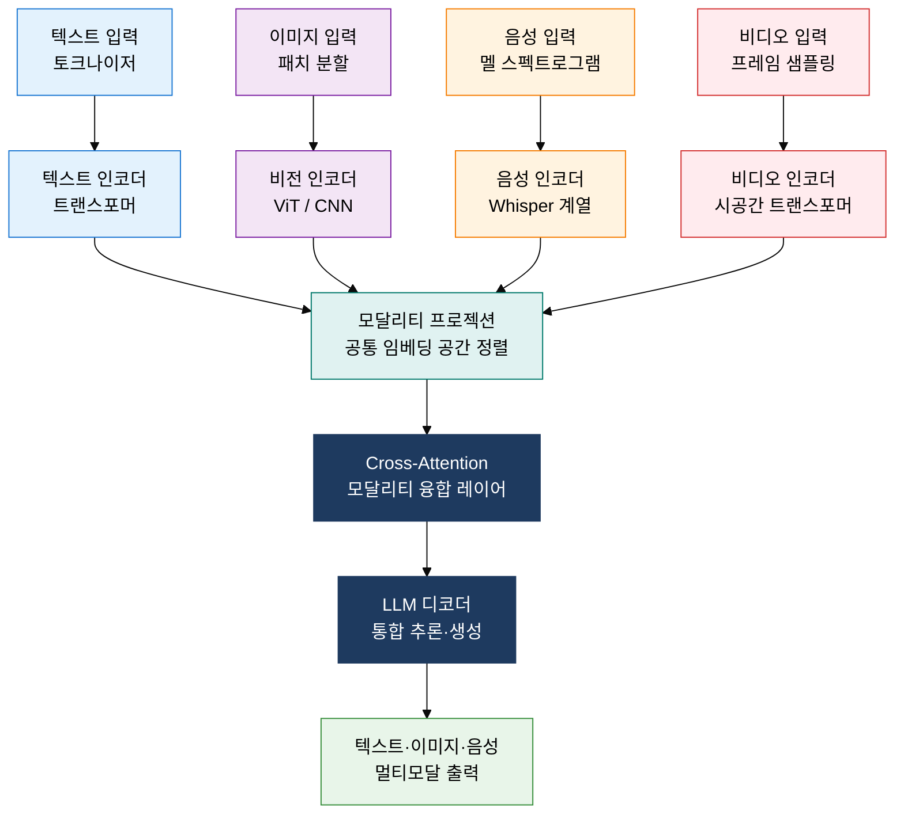

## 1. 인간 피드백으로 모델을 정렬하고 멀티모달로 지각을 통합하는, 생성형 AI 및 LLM의 개요

**정의**: 수천억 파라미터 트랜스포머를 대규모 코퍼스로 사전학습한 뒤 RLHF로 인간 의도에 정렬하고, 텍스트 이외 모달리티를 Cross-Attention으로 통합하는 생성형 AI 시스템.
- GPT·LLaMA·Gemini 등 디코더 전용(또는 인코더-디코더) 트랜스포머 기반으로 다음 토큰 확률 예측
- RLHF는 보상 모델(Reward Model)과 PPO(근위 정책 최적화) 알고리즘으로 유해 출력을 억제하고 유용성을 높임
- 멀티모달 모델은 이미지·음성·비디오 인코더를 텍스트 공간에 융합하여 단일 모델로 복합 입력 처리

**특징**:
- **스케일 법칙**: 파라미터·데이터·연산량이 커질수록 성능이 예측 가능하게 향상되는 창발적 능력 발현
- **맥락 학습**: Few-Shot Prompting으로 파라미터 갱신 없이 새로운 태스크를 즉시 수행하는 In-Context Learning
- **모달 융합**: Encoder Projection과 Cross-Attention으로 이질적 모달리티를 공통 표현 공간에 정렬

---

## 2. 생성형 AI 및 LLM의 핵심 구성 체계

### 가. LLM 학습 파이프라인: 사전학습→지시 조정→RLHF

| 단계 | 목적 | 방법 | 산출물 |
|---|---|---|---|
| **사전학습** | 언어의 통계적 패턴·세계 지식 습득 | 인터넷·책 등 수조 토큰 자기회귀 학습(다음 토큰 예측) | 기반 모델(Base LLM) |
| **지시 조정** | 사용자 지시 형식으로 응답 방식 학습 | 고품질 지시-응답 쌍 데이터로 SFT(지도 미세조정) | 지시 조정 모델(Instruct LLM) |
| **보상 모델 학습** | 인간 선호 기준 수치화 | 동일 프롬프트의 여러 응답을 사람이 순위 지정 후 학습 | 보상 점수 함수(Reward Model) |
| **RLHF(PPO)** | 보상 신호로 응답 품질 최적화 | PPO 알고리즘으로 보상 최대화, KL 발산으로 과최적화 방지 | 정렬된 LLM(Aligned LLM) |

---

### 나. 멀티모달 AI 아키텍처와 단일 모달 LLM 비교

| 비교 항목 | 단일 모달 LLM | 멀티모달 AI |
|---|---|---|
| **입력** | 텍스트(토큰 시퀀스)만 처리 | 텍스트·이미지·음성·비디오 복합 처리 |
| **인코더 구조** | 텍스트 임베딩 단일 경로 | 모달리티별 전용 인코더 + 프로젝션 레이어 |
| **융합 방식** | 해당 없음 | Cross-Attention 또는 Encoder 출력 Concatenation |
| **위치 정보** | 1D 위치 인코딩 | 2D 패치 위치(이미지), 시간축 위치(음성·비디오) 추가 |
| **대표 모델** | GPT-4(텍스트), LLaMA | GPT-4o, Gemini 1.5, Claude 3(이미지+텍스트) |
| **주요 한계** | 시각·청각 정보 직접 이해 불가 | 모달리티 정렬 학습 데이터·연산 비용 증가 |

---

## 3. 생성형 AI 및 LLM 도입의 기대효과 및 활용 방안

| 구분 | 주요 기대효과 | 활용 및 실무 적용 방안 |
|---|---|---|
| **업무 자동화** | 문서 작성·요약·코드 생성 자동화로 지식 노동 생산성 비약적 향상 | 사내 RAG 기반 Q&A 시스템, 코드 리뷰 자동화, 보고서 초안 생성 |
| **멀티모달 서비스** | 텍스트·이미지·음성 통합 처리로 복합 입력 UX 구현 | 이미지 기반 검색·설명, 음성 대화형 AI 에이전트, 비디오 자동 요약 |
| **안전·정렬** | RLHF 적용으로 유해·편향 출력 최소화하여 신뢰 가능한 AI 서비스 운영 | 보상 모델 커스터마이징, 레드팀 테스트, 출력 필터링 파이프라인 구축 |
| **도메인 특화** | 지시 조정 Fine-tuning으로 법률·의료·금융 등 전문 분야 정밀도 향상 | 도메인 코퍼스 SFT, RAG 벡터DB 연계, 규정 준수 출력 검증 체계 수립 |
