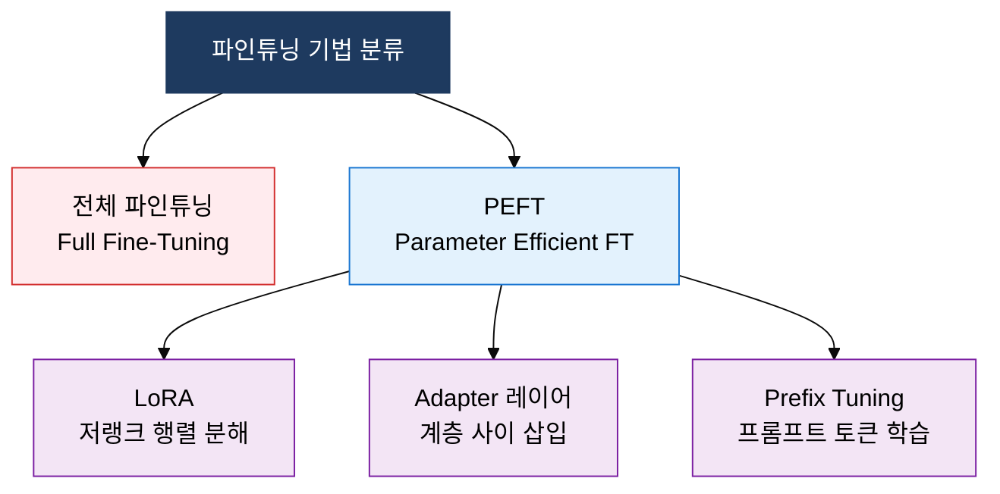

## 1. 환각을 벡터 검색으로 실시간 해소하는, RAG·파인튜닝의 개요

**정의**: 외부 지식베이스 검색(RAG) 또는 파라미터 업데이트(Fine-Tuning)를 통해 LLM의 환각(Hallucination)을 억제하고 도메인 적합 응답을 생성하는 LLM 강화 기법.
- LLM은 사전 학습 데이터 범위 밖 최신·전문 지식에서 환각이 빈번하게 발생
- RAG는 모델 재학습 없이 벡터 DB 검색으로 실시간 컨텍스트를 주입하여 응답 신뢰도 향상
- 파인튜닝은 PEFT·LoRA 등 경량 기법으로 특정 태스크·스타일에 모델을 적응시킴

**특징**:
- **지식 최신성**: RAG는 검색 인덱스만 갱신하면 모델 재학습 없이 최신 정보를 반영 가능
- **파라미터 효율성**: LoRA는 전체 파라미터 1% 이내만 학습하여 GPU 메모리·시간 대폭 절감
- **프롬프트 설계**: Few-Shot·CoT·ReAct 기법으로 모델 수정 없이 추론 품질을 즉시 개선

---

## 2. RAG·파인튜닝·프롬프트 엔지니어링의 핵심 구성 체계

### 가. RAG 아키텍처 — 벡터 검색·컨텍스트 주입·LLM 생성 흐름

| 구분 | RAG | Fine-Tuning |
|---|---|---|
| **지식 최신성** | 검색 인덱스 갱신으로 즉시 반영 | 재학습 필요, 주기적 업데이트 |
| **비용** | 검색 인프라 비용(저·중) | GPU 학습 비용(중·고) |
| **응답 정확도** | 검색 품질에 의존, 출처 추적 용이 | 태스크 특화 높은 정확도 |
| **업데이트 방식** | 문서 추가·삭제로 실시간 갱신 | 모델 재학습·배포 사이클 필요 |

---

### 나. 파인튜닝 기법 및 프롬프트 엔지니어링 3기법

| 기법 | 방식 | 특징 | 적용 상황 |
|---|---|---|---|
| **Few-Shot** | 입력에 예시 2~5개 포함 | 추가 학습 불필요, 즉시 적용 | 분류·번역·형식 통일 태스크 |
| **CoT (Chain of Thought)** | "단계별로 생각해보자" 유도 | 중간 추론 과정 명시화 | 수학·논리·다단계 추론 문제 |
| **ReAct** | 추론(Reason)+행동(Act) 반복 | 도구 호출·검색과 결합 가능 | 에이전트 태스크·복합 질의 응답 |
| **LoRA** | 저랭크 행렬로 가중치 근사 | 파라미터 0.1~1% 학습, GPU 절감 | 도메인 특화·스타일 전이 |

---

## 3. RAG·파인튜닝·프롬프트 엔지니어링 도입의 기대효과 및 활용 방안

| 구분 | 주요 기대효과 | 활용 및 실무 적용 방안 |
|---|---|---|
| **신뢰성 향상** | 환각 발생률 감소, 출처 기반 응답으로 정보 검증 가능 | RAG 파이프라인에 청크 단위 출처 태깅 적용, 응답 신뢰도 점수 표시 |
| **도메인 적응** | 기업 내부 지식·용어·형식에 특화된 응답 품질 확보 | LoRA 파인튜닝으로 사내 문서 스타일·전문 용어 학습, 비용 최소화 |
| **운영 효율** | 모델 재학습 없이 지식 갱신, 배포 사이클 단축 | 벡터 DB(Pinecone·Weaviate) 자동 색인으로 신규 문서 실시간 반영 |
| **추론 품질** | CoT·ReAct 적용으로 복잡한 다단계 문제 해결 정확도 향상 | 프롬프트 템플릿 라이브러리 구축, LangChain·LlamaIndex 체인 설계 표준화 |
