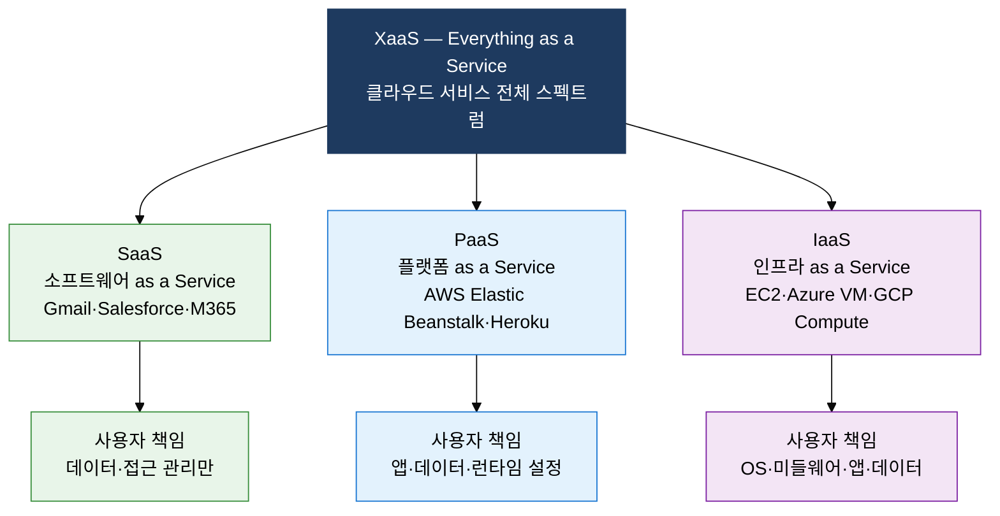
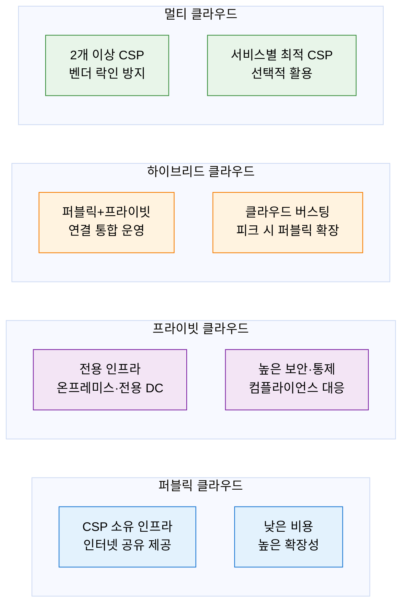

## 1. 필요한 만큼 빌려 쓰고 사용한 만큼 지불하는, 클라우드 컴퓨팅의 개요

**정의**: 인터넷을 통해 컴퓨팅 자원(서버·스토리지·네트워크·소프트웨어)을 온디맨드로 제공하고 사용량 기반으로 과금하는 IT 인프라 패러다임.
- NIST SP 800-145 기준 온디맨드 셀프 서비스·광대역 접근·자원 풀링·신속한 탄력성·측정 서비스 5대 특성 정의
- IaaS·PaaS·SaaS 서비스 모델과 Public·Private·Hybrid·Multi-Cloud 배포 모델로 분류
- 공동 책임 모델(Shared Responsibility Model)로 CSP와 고객 간 보안 책임 영역을 명확히 구분

**특징**:
- **탄력성**: 수요 변화에 따라 자원을 수 분 내 자동 확장·축소하여 과잉 투자 방지
- **종량 과금**: 사용한 CPU·스토리지·네트워크 트래픽 만큼만 비용 지불, CapEx를 OpEx로 전환
- **글로벌 가용성**: 멀티 리전·가용 영역 분산으로 고가용성(HA) 및 재해 복구(DR) 구현

---

## 2. 클라우드 컴퓨팅의 핵심 구성 체계

### 가. 클라우드 서비스 모델 4종 및 공동 책임 모델

| 서비스 모델 | CSP 책임 범위 | 사용자 책임 범위 | 대표 서비스 |
|---|---|---|---|
| **IaaS** | 물리 서버·네트워크·가상화 | OS·미들웨어·런타임·앱·데이터 | AWS EC2, Azure VM, GCP Compute Engine |
| **PaaS** | IaaS 전체 + OS·미들웨어·런타임 | 애플리케이션 코드·데이터 | AWS Beanstalk, Google App Engine, Heroku |
| **SaaS** | IaaS+PaaS 전체 + 애플리케이션 | 데이터 입력·접근 권한 관리 | Gmail, Salesforce, Microsoft 365 |
| **XaaS** | 서비스 유형별 맞춤 제공 | 계약 범위 내 사용자 설정 | DBaaS·FaaS·STaaS·SECaaS 등 |

---

### 나. 클라우드 배포 모델 4종 및 인터클라우드 기술

| 배포 모델 | 비용 | 보안·통제 | 유연성 | 적합 도메인 |
|---|---|---|---|---|
| **퍼블릭** | 낮음(종량 과금) | 낮음(공유 환경) | 높음(즉시 확장) | 스타트업·개발·테스트 환경 |
| **프라이빗** | 높음(전용 인프라) | 높음(완전 통제) | 낮음(자원 한정) | 금융·의료·국방 등 규제 산업 |
| **하이브리드** | 중간(혼합 과금) | 중간(정책 기반 분리) | 중간(버스팅 가능) | 민감 데이터 온프레미스·일반 업무 클라우드 분리 |
| **멀티** | 협상력 확보 | CSP별 독립 통제 | 최고(벤더 다양화) | 글로벌 엔터프라이즈·미션 크리티컬 서비스 |

---

## 3. 클라우드 컴퓨팅 도입의 기대효과 및 활용 방안

| 구분 | 주요 기대효과 | 활용 및 실무 적용 방안 |
|---|---|---|
| **비용 최적화** | CapEx 제거 및 OpEx 전환, 유휴 자원 비용 낭비 최소화 | 예약 인스턴스·스팟 인스턴스 혼합 전략, 클라우드 비용 관리(FinOps) 체계 수립 |
| **보안·컴플라이언스** | 공동 책임 모델로 책임 범위 명확화, CSP 보안 인증 활용 | IAM 최소 권한 정책, 데이터 암호화(저장·전송), CSPM 도구로 설정 오류 탐지 |
| **가용성·복원력** | 멀티 AZ·리전 배포로 SLA 99.99% 이상 고가용성 확보 | 클라우드 버스팅으로 트래픽 피크 자동 대응, 재해 복구 RTO·RPO 목표 단축 |
| **개발 혁신** | PaaS·서버리스 활용으로 인프라 관리 부담 제거, 개발 속도 향상 | 컨테이너·Kubernetes 기반 마이크로서비스 전환, CI/CD 파이프라인 완전 자동화 |
