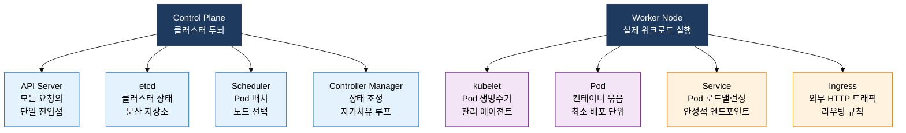
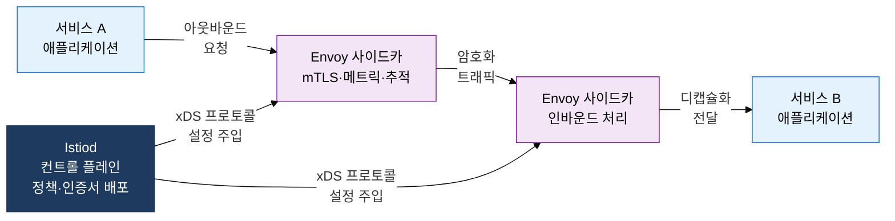

## 1. 격리·오케스트레이션·메시로 마이크로서비스 인프라를 완성하는, 컨테이너·쿠버네티스·서비스 메시의 개요

**정의**: 네임스페이스·cgroup 기반 컨테이너 격리와 Kubernetes 오케스트레이션, Istio 서비스 메시를 결합하여 마이크로서비스 애플리케이션을 선언적으로 배포·운영하는 클라우드 네이티브 인프라 체계.
- Docker 이미지 레이어 캐싱으로 빌드 속도 향상, OCI 표준으로 런타임 이식성 보장
- Kubernetes가 Pod 스케줄링·자가치유·수평 확장을 자동 수행하여 운영 부담 최소화
- 서비스 메시와 서버리스 FaaS를 결합하여 통신 보안·트래픽 제어·비용 최적화를 동시 달성

**특징**:
- **환경 일관성**: 네임스페이스와 cgroup으로 프로세스·네트워크·파일시스템을 격리하여 개발·스테이징·운영 환경 동일성 보장
- **선언적 오케스트레이션**: YAML 매니페스트로 원하는 상태를 선언하면 컨트롤 플레인이 실제 상태를 지속적으로 일치시키는 조정 루프 운영
- **관찰 가능성 내재화**: 서비스 메시 사이드카가 모든 서비스 간 트래픽을 가로채어 메트릭·추적·로그를 코드 변경 없이 자동 수집

---

## 2. 컨테이너·쿠버네티스·서비스 메시의 핵심 구성 체계

### 가. Docker 컨테이너 원리 및 Kubernetes 핵심 아키텍처

| 구분 | VM(가상머신) | 컨테이너 |
|---|---|---|
| **격리 단위** | 하이퍼바이저 기반 전체 OS 가상화 | 커널 공유, 네임스페이스·cgroup 격리 |
| **부팅 시간** | 수십 초~수 분 | 수백 밀리초 이하 |
| **이미지 크기** | 수 GB (전체 OS 포함) | 수십~수백 MB (앱+라이브러리) |
| **자원 오버헤드** | 하이퍼바이저 및 게스트 OS 이중 소비 | 호스트 커널 공유로 오버헤드 최소 |
| **이식성** | 하이퍼바이저 종류에 의존 | OCI 표준으로 런타임 무관 실행 |

---

### 나. Service Mesh(Istio) 아키텍처 및 Serverless/FaaS 동작 원리

| 구분 | 마이크로서비스(컨테이너) | 서버리스(FaaS) |
|---|---|---|
| **실행 단위** | 항상 실행 중인 컨테이너 Pod | 이벤트 트리거 시 함수 단위 실행 |
| **비용 모델** | 예약 자원 기반 시간당 과금 | 실행 시간·호출 횟수 기반 과금 |
| **Cold Start** | 없음(상시 실행) | 초기 인스턴스 생성 지연 수백ms~수초 |
| **상태 관리** | 스테이트풀 가능, 세션 유지 | 무상태 원칙, 외부 스토리지 의존 |
| **적합 워크로드** | 지속적 API 서버, 실시간 처리 | 이벤트 기반 배치, 간헐적 작업 |

---

## 3. 컨테이너·쿠버네티스·서비스 메시 도입의 기대효과 및 활용 방안

| 구분 | 주요 기대효과 | 활용 및 실무 적용 방안 |
|---|---|---|
| **배포 일관성** | 환경 차이로 인한 배포 실패 제거, 개발~운영 동일 이미지 보장 | Docker 멀티스테이지 빌드와 CI/CD 파이프라인 연동으로 이미지 자동 빌드·스캔·푸시 |
| **운영 자동화** | Pod 자가치유·수평 확장으로 장애 대응 인력 부담 대폭 감소 | HPA(Horizontal Pod Autoscaler) 설정으로 CPU·메모리 임계치 기반 자동 스케일 아웃 |
| **보안 강화** | 서비스 간 mTLS 자동 적용, 정책 코드화로 보안 감사 간소화 | Istio AuthorizationPolicy로 서비스별 최소 권한 통신 정책 선언적 관리 |
| **비용 최적화** | 서버리스 FaaS로 유휴 자원 비용 제거, 자원 사용률 극대화 | 간헐적 이벤트 처리 워크로드를 Knative·AWS Lambda 전환으로 인프라 비용 절감 |
