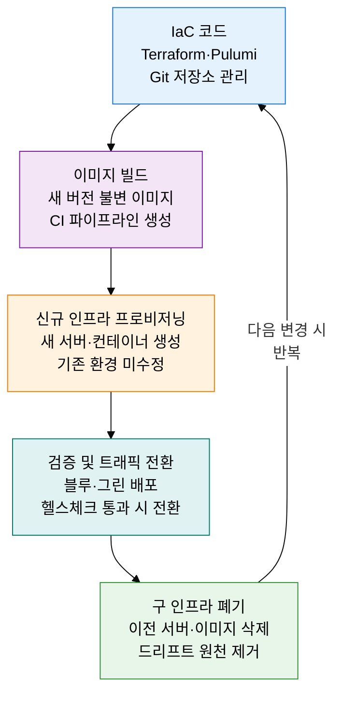

## 1. Git을 단일 진실 공급원으로 인프라·배포를 코드로 자동화하는, GitOps 및 불변 인프라의 개요

**정의**: Git 저장소를 단일 진실 공급원(SSOT)으로 삼아 인프라와 애플리케이션의 원하는 상태를 선언적으로 관리하고, 자동화된 조정 에이전트가 실제 환경을 Git 상태에 지속적으로 일치시키는 운영 방법론.
- ArgoCD·Flux 등 GitOps 컨트롤러가 클러스터 내부에서 Git 저장소를 감시하며 Pull 방식으로 배포 수행
- 불변 인프라는 배포된 서버를 수정하지 않고 새 이미지로 교체하여 드리프트(Configuration Drift)를 근본 차단
- IaC(Terraform·Pulumi)와 결합하여 인프라 프로비저닝부터 애플리케이션 배포까지 전 과정을 코드로 관리

**특징**:
- **SSOT 기반 감사**: 모든 변경이 Git 커밋으로 기록되어 누가 언제 무엇을 변경했는지 완전한 감사 추적 제공
- **자동 조정(Reconciliation)**: 실제 클러스터 상태가 Git 선언과 다를 경우 컨트롤러가 자동으로 원상 복구하여 드리프트 제거
- **교체 기반 신뢰성**: 서버를 수정(Repair)하는 대신 새로운 불변 이미지로 교체(Replace)하여 환경 간 일관성 항상 보장

---

## 2. GitOps 및 불변 인프라의 핵심 구성 체계

### 가. GitOps 워크플로우 및 Push vs Pull 배포 방식 비교

| 구분 | 기존 CI/CD (Push 방식) | GitOps (Pull 방식) |
|---|---|---|
| **배포 주체** | CI 서버(Jenkins·GitHub Actions)가 직접 클러스터에 Push | 클러스터 내 에이전트(ArgoCD·Flux)가 Git에서 Pull |
| **클러스터 접근** | CI 서버에 kubeconfig·시크릿 필요 | 클러스터 외부에 자격증명 불필요, 보안 강화 |
| **드리프트 감지** | 배포 후 상태 추적 불가 | 에이전트가 지속 감시, 불일치 시 자동 복구 |
| **롤백** | 이전 파이프라인 재실행 필요 | Git revert 한 번으로 즉시 이전 상태 복원 |
| **감사 추적** | CI 로그에 산재 | Git 커밋 히스토리가 완전한 변경 이력 |

---

### 나. 불변 인프라(Immutable Infrastructure) 원리 및 IaC 연계

| 구분 | 기존 가변 인프라 (Mutable) | 불변 인프라 (Immutable) |
|---|---|---|
| **변경 방식** | 운영 중인 서버에 직접 패치·설정 변경 | 새 이미지 빌드 후 교체, 기존 서버 폐기 |
| **드리프트** | 수동 변경 누적으로 환경 불일치 발생 | 교체 방식으로 드리프트 원천 차단 |
| **장애 복구** | 서버 수리·패치 시간 소요, MTTR 증가 | 검증된 이전 이미지로 즉시 교체, MTTR 최소화 |
| **일관성** | 서버마다 상태 상이, 재현 불가 문제 | 동일 이미지에서 생성, 완전한 환경 일관성 |
| **보안** | 누적 패치 이력·취약점 잔존 가능 | 매 배포마다 클린 이미지, 취약점 누적 방지 |

---

## 3. GitOps 및 불변 인프라 도입의 기대효과 및 활용 방안

| 구분 | 주요 기대효과 | 활용 및 실무 적용 방안 |
|---|---|---|
| **운영 안정성** | 드리프트 제거로 운영 환경 일관성 확보, 장애 원인 추적 용이 | ArgoCD 자동 동기화 활성화, Git 상태 불일치 발생 시 Slack 알림 연동 |
| **보안·컴플라이언스** | 모든 변경의 Git 감사 추적, 클러스터 외부 자격증명 노출 제거 | GitHub Actions OIDC 토큰으로 클라우드 접근, ArgoCD RBAC으로 배포 권한 최소화 |
| **배포 속도** | 선언적 매니페스트 변경만으로 수 분 내 자동 배포 완료 | Flux Image Automation으로 새 이미지 태그 감지 시 자동 PR 생성·머지·배포 |
| **장애 복구** | Git revert 한 번으로 전 환경 즉시 롤백, MTTR 대폭 단축 | 블루·그린 배포와 불변 이미지 결합으로 무중단 롤백 체계 구축 |
