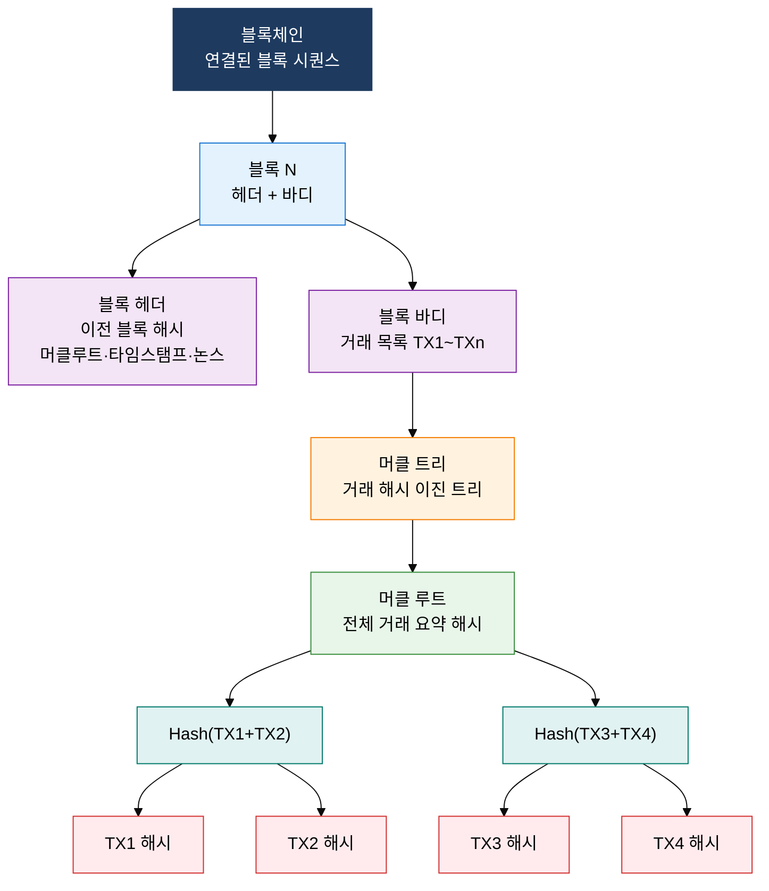
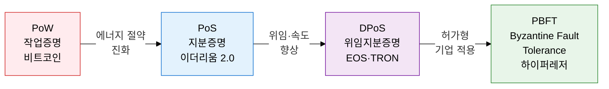

## 1. 머클 트리 해시 체인으로 위·변조 없는 분산 신뢰를 구현하는, 블록체인 메커니즘 및 합의 알고리즘의 개요

**정의**: 암호학적 해시 함수와 머클 트리로 연결된 블록 체인 구조에 분산 합의 알고리즘을 결합하여 중앙 기관 없이 참여 노드 전체가 거래 기록의 무결성과 순서에 합의하는 분산 원장 기술(DLT).
- 각 블록은 이전 블록의 해시값을 포함하여 체인 형성, 하나의 블록 변조 시 이후 전체 체인 무효화
- 머클 트리는 거래 데이터를 이진 해시 트리로 요약하여 특정 거래의 포함 여부를 O(log n) 복잡도로 검증
- 합의 알고리즘은 탈중앙화 수준·에너지 효율·처리 속도 간 트릴레마를 각기 다른 방식으로 절충

**특징**:
- **불변성(Immutability)**: SHA-256 등 해시 함수로 블록을 연결하여 과거 거래 수정 시 이후 모든 블록의 재계산이 필요해 사실상 변조 불가
- **탈중앙화 합의**: 네트워크 참여 노드들이 PoW·PoS 등 규칙에 따라 새 블록 추가 권한을 분산 결정하여 단일 신뢰 기관 불필요
- **투명성과 프라이버시 균형**: 퍼블릭 블록체인은 거래 내역 전체 공개, 프라이빗·컨소시엄 체인은 허가된 노드만 참여하여 기업 요건 충족

---

## 2. 블록체인 메커니즘 및 합의 알고리즘의 핵심 구성 체계

### 가. 분산 원장 기술(DLT) 및 블록·머클 트리 구조

| 구성 요소 | 내용 | 역할 |
|---|---|---|
| **블록 헤더** | 이전 블록 해시, 머클 루트, 타임스탬프, 논스, 난이도 목표 | 블록 간 체인 연결, 무결성 앵커 |
| **블록 바디** | 이 블록에 포함된 거래(Transaction) 목록 전체 | 실제 거래 데이터 저장 |
| **머클 루트** | 블록 내 모든 거래를 이진 해시 트리로 요약한 단일 해시값 | 특정 거래 포함 여부 경량 검증(SPV) |
| **이전 블록 해시** | 직전 블록 헤더 전체의 SHA-256 해시 | 블록 체인 연결, 변조 시 이후 체인 전체 무효화 |
| **논스(Nonce)** | PoW에서 목표 해시값 이하를 만족시키기 위해 채굴자가 변경하는 임의 숫자 | 작업증명 난이도 조절 핵심 필드 |

---

### 나. 합의 알고리즘 4종 비교 및 블록체인 트릴레마

| 구분 | PoW (작업증명) | PoS (지분증명) | DPoS (위임지분증명) | PBFT |
|---|---|---|---|---|
| **선출 방식** | 해시 연산 경쟁, 가장 먼저 목표 달성한 노드 | 보유 지분 비례 검증자 선출 | 토큰 보유자 투표로 대표 노드 선출 | 사전 허가된 노드 간 3단계 메시지 교환 |
| **에너지 효율** | 매우 낮음, 대규모 전력 소비 | 높음, 연산 경쟁 불필요 | 높음, 소수 대표 노드만 연산 | 매우 높음, 불필요한 연산 없음 |
| **처리 속도** | 낮음, 비트코인 7 TPS 수준 | 중간~높음, 수천 TPS | 높음, EOS 수천 TPS | 매우 높음, 수만 TPS 가능 |
| **탈중앙화** | 높음, 채굴 풀 집중 우려 | 중간, 대형 스테이킹 집중 가능 | 낮음, 소수 대표 노드 과두 위험 | 낮음, 허가된 노드만 참여 |
| **적용 사례** | 비트코인, 이더리움 1.0 | 이더리움 2.0, Cardano | EOS, TRON, Steem | 하이퍼레저 패브릭, R3 Corda |

---

## 3. 블록체인 메커니즘 및 합의 알고리즘 도입의 기대효과 및 활용 방안

| 구분 | 주요 기대효과 | 활용 및 실무 적용 방안 |
|---|---|---|
| **데이터 무결성** | 머클 트리 해시 체인으로 거래 위·변조 원천 차단, 감사 신뢰성 극대화 | 공급망 이력 관리·의료 기록·전자문서 원본 증명에 블록체인 타임스탬핑 적용 |
| **탈중앙 신뢰** | 중앙 기관 없이 네트워크 참여자 간 합의로 신뢰 형성, 단일 장애점 제거 | 금융 기관 간 결제·청산 인프라에 컨소시엄 블록체인 도입으로 중개 비용 절감 |
| **에너지·성능 균형** | 합의 알고리즘 선택으로 에너지 효율·처리 속도·탈중앙화 요건 충족 | 공개 서비스에 PoS, 기업 내부 프로세스에 PBFT 기반 하이퍼레저로 목적별 최적화 |
| **컴플라이언스** | 불변 거래 기록과 스마트 컨트랙트 자동 실행으로 규정 준수 증적 자동화 | 금융 감독 규정 충족을 위한 KYC·AML 데이터를 프라이빗 블록체인에 암호화 보관 |
