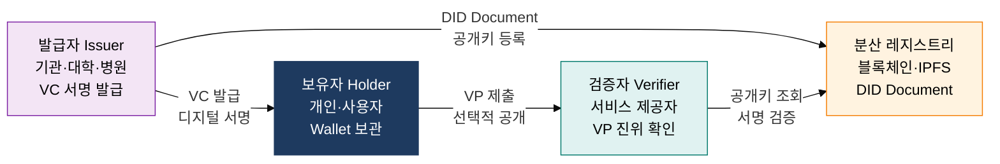
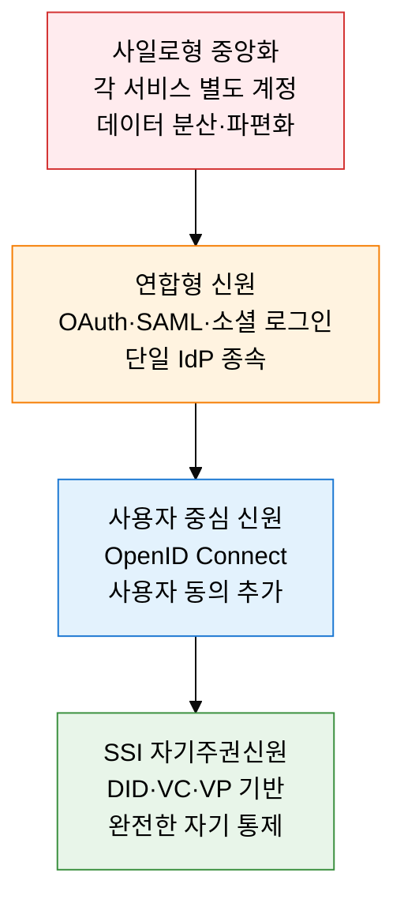

## 1. 내 신원 정보를 내가 직접 통제하는 분산 신원체계, DID·SSI의 개요

**정의**: W3C DID 표준 기반으로 중앙 기관 없이 개인이 자신의 식별자와 신원 크레덴셜을 스스로 생성·보관·제어하는 분산 신원인증 체계.
- DID Document는 블록체인 또는 분산 레지스트리에 등록되며, 공개키·인증 메서드·서비스 엔드포인트를 포함
- VC(Verifiable Credential)는 발급자가 서명한 신원 주장, VP(Verifiable Presentation)는 보유자가 선택적으로 구성한 증명 묶음
- SSI(Self-Sovereign Identity)는 DID·VC·VP 생태계를 통해 개인이 신원 주권을 완전히 회복하는 패러다임

**특징**:
- **탈중앙화**: 특정 기업·정부 플랫폼에 종속되지 않고, 블록체인 레지스트리에 식별자를 직접 등록·관리
- **선택적 공개**: ZKP(영지식증명) 기반 선택적 속성 공개로 필요한 최소 정보만 검증자에게 제시
- **상호 운용성**: W3C·DIF 표준 준수로 서로 다른 DID 메서드·플랫폼 간 크레덴셜 교환 가능

---

## 2. DID·SSI의 핵심 구성 체계

### 가. DID 3자 신뢰 모델과 VC·VP 구조

| DID Document 구성 요소 | 설명 | 역할 |
|---|---|---|
| **@context** | W3C DID 표준 컨텍스트 URI(https://www.w3.org/ns/did/v1) | 문서 해석 규칙 정의 |
| **id** | DID 식별자(did:method:identifier 형식) | 전 세계 고유 식별 |
| **verificationMethod** | 공개키 타입·값·컨트롤러 정보 | 인증·서명 검증 수단 |
| **authentication** | DID 주체 인증에 사용할 verificationMethod 참조 | 로그인·접근 제어 |
| **service** | 연관 서비스 엔드포인트(DIDComm·Hub 등) | 상호작용 채널 제공 |
| **assertionMethod** | VC 발급 서명에 사용할 verificationMethod | 크레덴셜 발급 증명 |

---

### 나. SSI 개념과 신원 모델 진화

| 비교 항목 | 중앙화 신원 | 연합형 신원 | SSI(DID 기반) |
|---|---|---|---|
| **신원 통제권** | 서비스 제공자 소유 | IdP(구글·카카오 등) | 개인 완전 소유 |
| **데이터 저장** | 중앙 서버 집중 | IdP 서버 집중 | 개인 지갑(로컬·클라우드) |
| **단일 실패점** | 서비스 서버 장애 | IdP 서버 장애 | 분산 레지스트리(장애 내성) |
| **개인정보 노출** | 서비스별 전체 공개 | IdP 전체 정보 공유 | 선택적 최소 속성 공개 |
| **상호 운용** | 서비스 간 단절 | IdP 생태계 내 한정 | W3C 표준 기반 범용 |
| **국내 적용 사례** | 공공 아이핀 | 카카오·네이버 로그인 | 이니셜 DID·모바일 신분증 |

---

## 3. DID·SSI 도입의 기대효과 및 활용 방안

| 구분 | 주요 기대효과 | 활용 및 실무 적용 방안 |
|---|---|---|
| **프라이버시 보호** | 선택적 공개·ZKP로 최소 정보 원칙 실현, 개인정보 과잉 수집 방지 | 모바일 운전면허증(mDL) 연령 인증 시 생년월일 대신 성인 여부만 ZKP 증명 |
| **보안 강화** | 중앙 데이터베이스 제거로 대규모 개인정보 유출 표적 소멸 | 분산 지갑 기반 의료 기록 접근 제어, 공공기관 DID 통합 인증 시스템 구축 |
| **행정 효율화** | VC 기반 자동 검증으로 서류 제출·수동 심사 절차 90% 이상 단축 | 이니셜 DID 기반 채용 자격 증명 즉시 검증, 대학 졸업증명 디지털 VC 발급 |
| **상호 운용성** | W3C·DIF 표준 기반 국경 간 크레덴셜 교환, 글로벌 디지털 신원 생태계 참여 | EU eIDAS 2.0 EUDI Wallet 연동, 국내 이니셜·패스 DID 앱 해외 서비스 상호 인증 |
