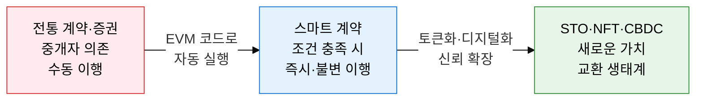
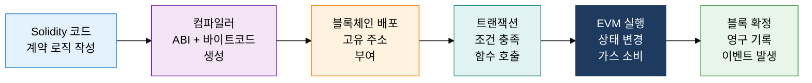
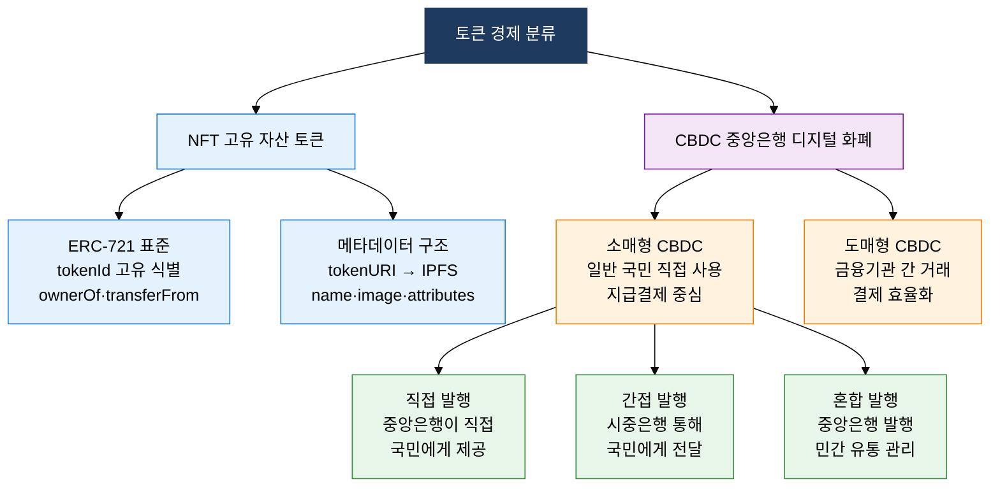

## 1. 코드가 곧 계약, 블록체인 위의 자동 실행 규칙, 스마트 계약·토큰 경제의 개요

**정의**: 블록체인 위에 배포된 자기 실행(self-executing) 프로그램으로, 사전 정의된 조건이 충족되면 중개자 없이 자동으로 계약 조항을 이행하는 분산 코드.
- EVM(Ethereum Virtual Machine)이 Solidity 코드를 바이트코드로 실행하며, 상태 변경은 블록에 영구 기록됨
- STO·NFT·CBDC는 스마트 계약 위에 구현되는 대표적 토큰 경제 응용으로, 각각 증권·고유 자산·법정화폐를 디지털화
- 계약 코드가 일단 배포되면 변경 불가(Immutable)하므로 배포 전 보안 감사(Audit)가 필수

**특징**:
- **신뢰 최소화**: 제3자 중개 없이 코드 논리만으로 계약 이행, 인적 오류와 도덕적 해이 제거
- **투명성·추적성**: 모든 트랜잭션이 공개 블록체인에 기록되어 실시간 감사 가능
- **프로그래머블 화폐**: 조건부 지급·만기 설정·자동 분배 등 화폐에 비즈니스 로직 내재화 가능

---

## 2. 스마트 계약·토큰 경제의 핵심 구성 체계

### 가. 스마트 계약 실행 원리와 STO

| 비교 항목 | STO(토큰 증권) | 기존 증권 |
|---|---|---|
| **발행 방식** | 스마트 계약 자동 발행, 블록체인 기록 | 증권사·거래소 중개, 중앙 레지스트리 등록 |
| **거래 결제** | T+0 즉시 결제(원자적 스왑) | T+2 결제 주기, 청산소 개입 |
| **규제 준수** | 코드에 KYC/AML·투자자 제한 내재화(ERC-1400) | 서류·중개기관 통한 규제 이행 |
| **부분 소유** | 소수점 단위 토큰 분할 소유 가능 | 1주 미만 소수점 거래 제한적 |
| **비용** | 스마트 계약 가스비만 발생 | 인수·청산·수탁 수수료 다단계 발생 |
| **투명성** | 모든 보유·이전 내역 온체인 공개 | 장외거래 불투명, 공시 지연 가능 |

---

### 나. NFT 표준과 CBDC 아키텍처

| 비교 항목 | NFT (ERC-721) | CBDC |
|---|---|---|
| **발행 주체** | 누구나(프로젝트·개인) | 중앙은행 독점 발행 |
| **대체 가능성** | 비대체(각 토큰 고유 tokenId) | 대체 가능(1원=1원, 균질) |
| **주요 용도** | 디지털 예술·게임 아이템·부동산 지분 증명 | 법정화폐 대체, 지급결제, 금융 포용 |
| **기술 표준** | ERC-721(소유권), ERC-1155(다중 토큰) | 퍼미션드 블록체인 또는 CBDC 전용 원장 |
| **개인정보** | 지갑 주소 공개, 익명성 가능 | 실명 연동 가능, 거래 추적 설계 반영 |
| **규제 지위** | 국가별 상이, 증권성 논란 | 법적 화폐(Legal Tender) 지위 |

---

## 3. 스마트 계약·토큰 경제 도입의 기대효과 및 활용 방안

| 구분 | 주요 기대효과 | 활용 및 실무 적용 방안 |
|---|---|---|
| **금융 효율화** | STO·CBDC 도입으로 결제 주기 T+0 단축, 청산 비용 절감 | 증권형 토큰 플랫폼(KODA·KST) 구축, 한국은행 CBDC 파일럿 테스트 연계 |
| **자산 유동성** | 부동산·미술품 등 비유동 자산의 NFT·STO 분할 소유로 투자 접근성 확대 | 리얼에스테이트 STO 플랫폼, NFT 기반 디지털 저작권 거래 시장 운영 |
| **계약 자동화** | 스마트 계약으로 배당·이자 지급·만기 처리 자동화, 운영 비용 90% 이상 절감 | DeFi 프로토콜(Aave·Uniswap) 설계 패턴 적용, 기업 내부 결제 자동화 |
| **보안·신뢰** | 코드 감사(Audit)·형식 검증으로 취약점 선제 제거, 이용자 자산 보호 | Certik·OpenZeppelin 감사 도구 적용, 멀티시그(Multi-sig) 거버넌스 구현 |
