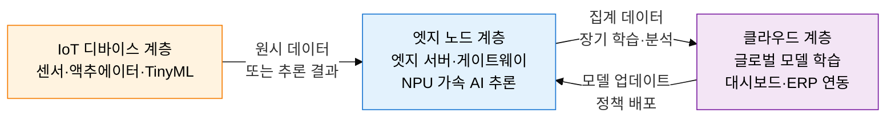
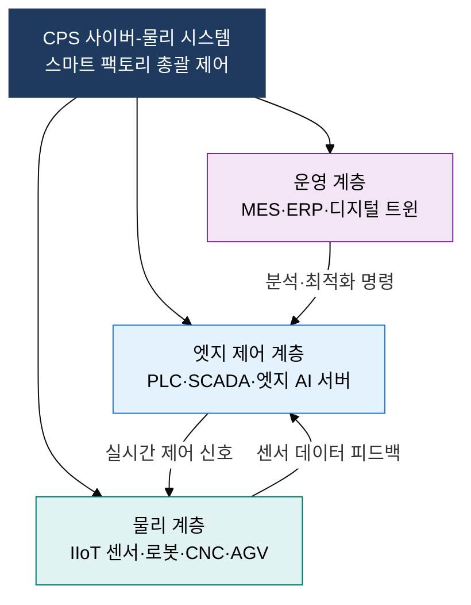

## 1. 디바이스 지능화와 실시간 연결로 산업을 재정의하는, AIoT·엣지 컴퓨팅의 개요

**정의**: IoT 센서·액추에이터에 AI 추론 능력을 내재화하고 데이터 발생 지점 근방의 엣지 노드에서 실시간 처리를 수행하여 지연·대역폭·프라이버시 한계를 극복하는 분산 지능 아키텍처.
- 클라우드 왕복 없이 현장에서 ms 단위 추론 결과를 도출하여 안전·제어 루프에 즉시 반영
- 엣지 AI 칩(NPU·TPU 내장 MCU)이 TinyML 모델을 디바이스 수준에서 실행
- 스마트 팩토리·자율주행·의료 IoT 등 실시간성·데이터 주권이 중요한 분야에 적합

**특징**:
- **초저지연 처리**: 클라우드 왕복 지연 제거로 1 ms 수준 현장 응답 실현
- **분산 지능**: 개별 디바이스에 AI 모델을 내재화하여 네트워크 장애 시에도 자율 동작
- **데이터 주권**: 민감 데이터를 현장에서 처리·폐기하여 프라이버시 및 규제 준수 강화

---

## 2. AIoT·엣지 컴퓨팅의 핵심 구성 체계

### 가. AIoT 데이터 흐름 및 엣지 vs 클라우드 비교

| 비교 항목 | 클라우드 컴퓨팅 | 엣지 컴퓨팅 |
|---|---|---|
| **처리 지연** | 100 ms ~ 수백 ms (왕복 필요) | 1 ms ~ 10 ms (현장 처리) |
| **대역폭 소비** | 원시 데이터 전량 전송, 고비용 | 현장 필터링 후 집계 데이터만 전송 |
| **프라이버시** | 개인·산업 데이터 외부 전송 위험 | 민감 데이터 현장 처리·폐기 가능 |
| **가용성** | 네트워크 단절 시 서비스 중단 | 오프라인에서도 자율 동작 유지 |
| **AI 추론** | 대규모 모델 학습·배치 추론 | TinyML·경량 모델 실시간 추론 |

---

### 나. V2X 통신 유형 및 스마트 팩토리 CPS 계층 구조

| V2X 유형 | 통신 대상 | 주요 목적 | 사용 기술 |
|---|---|---|---|
| **V2V** | 차량 대 차량 | 충돌 경고·군집 주행 | DSRC, C-V2X PC5 |
| **V2I** | 차량 대 인프라 | 신호등 최적화·도로 상황 수신 | WAVE, 5G NR-V2X |
| **V2P** | 차량 대 보행자 | 취약 도로 사용자 보호 | C-V2X 단말 간 통신 |
| **V2N** | 차량 대 네트워크 | 실시간 교통정보·OTA 업데이트 | LTE/5G 셀룰러 |

---

## 3. AIoT·엣지 컴퓨팅 도입의 기대효과 및 활용 방안

| 구분 | 주요 기대효과 | 활용 및 실무 적용 방안 |
|---|---|---|
| **운영 효율** | 현장 AI 분석으로 설비 예지보전 및 불량률 90% 이상 감소 | IIoT 센서 + 엣지 AI 서버로 실시간 품질 검사 라인 구축, 디지털 트윈 연계 |
| **안전·교통** | V2X 기반 충돌 경고로 교통사고 40% 이상 감소 효과 | C-V2X 단말 차량 탑재, 교차로 RSU 설치로 스마트 교통 인프라 단계적 구현 |
| **데이터 주권** | GDPR·마이데이터 규제 대응, 산업 기밀 데이터 현장 보호 | 엣지 처리 후 익명화·집계 데이터만 클라우드 전송하는 Privacy-by-Design 설계 |
| **비용 절감** | 클라우드 트래픽 70% 이상 감소로 통신·스토리지 비용 절약 | 엣지-클라우드 하이브리드 아키텍처 설계, 우선순위 기반 데이터 티어링 정책 적용 |
