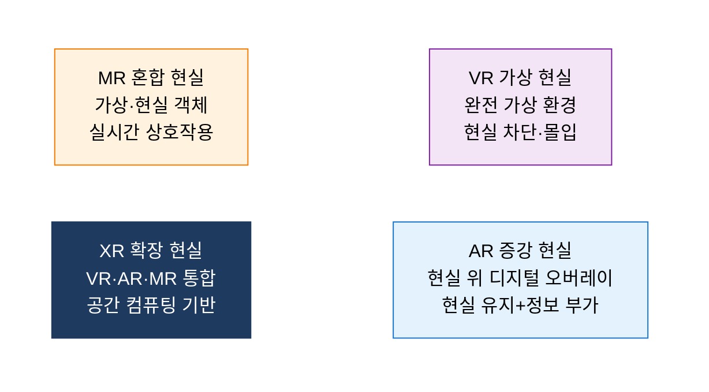
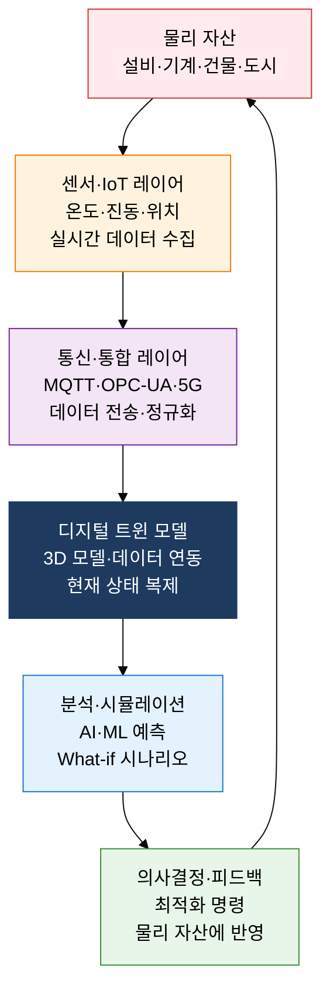

## 1. 현실과 가상을 융합하는 공간 컴퓨팅 패러다임, 메타버스·XR·디지털 트윈의 개요

**정의**: VR·AR·MR 기술을 융합한 XR 환경 위에서 물리 세계의 자산과 활동을 실시간으로 디지털 복제·연동하여 새로운 경험과 최적화를 제공하는 공간 컴퓨팅 패러다임.
- 메타버스는 영속성(Persistence)·상호작용성·경제 시스템을 갖춘 3차원 가상 세계이며, XR 기술이 몰입 인터페이스를 담당
- 디지털 트윈은 물리 자산의 실시간 센서 데이터를 디지털 모델에 반영하여 예측·시뮬레이션·최적화를 수행
- 스마트 팩토리·스마트 시티·의료·교육 등 다양한 산업에서 운영 효율화와 새로운 비즈니스 모델 창출에 적용

**특징**:
- **물리-디지털 융합**: 현실 데이터를 실시간으로 가상 공간에 반영하고, 가상 공간의 의사결정을 물리 세계에 피드백
- **몰입적 공간성**: 3DoF/6DoF 트래킹·공간 오디오·햅틱 피드백으로 사용자가 실재감(Presence)을 체험
- **예측·최적화**: 디지털 트윈 기반 시뮬레이션으로 실제 가동 전 결함 탐지, 운영 비용 절감

---

## 2. 메타버스·XR·디지털 트윈의 핵심 구성 체계

### 가. XR 기술 체계와 메타버스 핵심 요소

| 비교 항목 | VR(가상 현실) | AR(증강 현실) | MR(혼합 현실) |
|---|---|---|---|
| **몰입도** | 최고(현실 완전 차단) | 낮음(현실 유지) | 높음(현실-가상 융합) |
| **하드웨어** | HMD 전용(Meta Quest·PSVR) | 스마트폰·투명 글래스 | 공간 인식 HMD(HoloLens·Vision Pro) |
| **현실 인식** | 없음(완전 가상) | 현실 배경에 2D/3D 오버레이 | 현실 공간 3D 앵커링·물리 상호작용 |
| **주요 적용** | 게임·교육·훈련 시뮬레이션 | 네비게이션·AR 광고·제조 가이드 | 의료 수술 지원·산업 유지보수 |
| **대표 기술** | 룸스케일 트래킹·아이트래킹 | ARCore·ARKit·WebAR | 공간 앵커·홀로그램 렌더링 |

---

### 나. 디지털 트윈 구조와 스마트 팩토리 적용

| 적용 분야 | 디지털 트윈 활용 방식 | 주요 기대 효과 |
|---|---|---|
| **스마트 팩토리** | 생산 라인 3D 트윈, 설비 이상 징후 실시간 감지, 예지 보전(PdM) | 비계획 다운타임 40% 이상 감소, 유지보수 비용 절감 |
| **스마트 시티** | 교통·에너지·수도 인프라 트윈, 도시 시뮬레이션·재난 대응 | 에너지 소비 15~20% 최적화, 긴급 대응 시간 단축 |
| **의료·헬스케어** | 환자 신체 디지털 트윈, 수술 전 시뮬레이션, 맞춤형 치료 계획 | 수술 오류율 감소, 의료 훈련 현실성 향상 |
| **건설·부동산** | BIM 기반 건물 수명 주기 트윈, 에너지 효율 시뮬레이션 | 설계 오류 사전 제거, 건물 운영비 최적화 |

---

## 3. 메타버스·XR·디지털 트윈 도입의 기대효과 및 활용 방안

| 구분 | 주요 기대효과 | 활용 및 실무 적용 방안 |
|---|---|---|
| **운영 효율화** | 디지털 트윈 기반 예지 보전으로 설비 가동률 향상, 현장 이동 없는 원격 모니터링 실현 | Siemens Industrial Metaverse·GE Predix 플랫폼 벤치마크, 제조 현장 OPC-UA 기반 트윈 구축 |
| **훈련·교육** | VR·MR 시뮬레이션으로 위험 환경 안전 훈련, 반복 학습 비용 90% 이상 절감 | 원전·화학 플랜트 VR 안전 교육, 의료 수술 시뮬레이터, 군 전술 훈련 시스템 구축 |
| **혁신 경험** | AR 기반 현장 작업 가이드로 숙련도 격차 해소, MR 원격 협업으로 전문가 현장 파견 비용 절감 | Microsoft HoloLens 기반 설비 유지보수 AR 가이드, XR 원격 협업 플랫폼(Spatial·Teamflow) 도입 |
| **의사결정 고도화** | 도시·공장 시뮬레이션으로 투자 전 결과 예측, What-if 분석으로 리스크 최소화 | 국토부 스마트시티 디지털 트윈 플랫폼(Virtual Seoul) 연계, AWS IoT TwinMaker 기반 클라우드 트윈 구현 |
