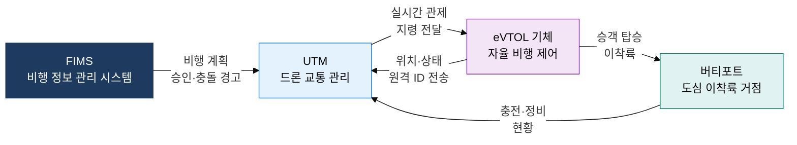
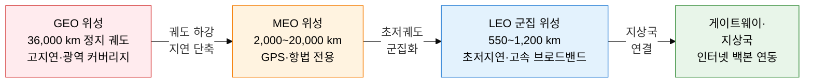

## 1. 도심 하늘길을 열고 궤도 위성으로 전 지구를 연결하는, UAM·LEO 위성 통신의 개요

**정의**: 전동 수직 이착륙기(eVTOL)를 이용한 도심 항공 교통(UAM)과 저궤도 소형 위성 군집(LEO Constellation)을 결합하여 지상·항공·우주를 아우르는 초연결 모빌리티 인프라를 실현하는 차세대 교통·통신 기술 체계.
- UAM은 UTM(드론 교통 관리 시스템)과 5G C2 링크로 안전한 저고도 비행 경로를 관리
- LEO 위성은 GEO 대비 극적으로 낮은 고도에서 저지연·고속 브로드밴드를 전 지구에 제공
- 도시 혼잡 해소, 오지·해상 통신 음영 해소, 재난 대응 통신 백업 등 다양한 가치를 창출

**특징**:
- **자율 비행 관제**: UTM-FIMS 연동으로 수천 대 드론·eVTOL을 동시에 충돌 없이 관리
- **초저지연 위성**: LEO 550 km 궤도에서 GEO 대비 지연을 1/40 수준으로 단축
- **이중 연결성**: 지상 5G와 LEO 위성을 결합한 Non-Terrestrial Network(NTN)로 단절 없는 커버리지 확보

---

## 2. UAM·LEO 위성 통신의 핵심 구성 체계

### 가. UAM 생태계 및 UTM 시스템 구성

| UAM 핵심 구성 요소 | 역할 | 주요 기술 |
|---|---|---|
| **eVTOL 기체** | 전동 수직 이착륙 자율·유인 항공기 | 분산 전기 추진, 자율 비행 SW, 이중화 제어 |
| **UTM 시스템** | 저고도 비행 경로 분리·충돌 예방·감시 | U-Space, FAA UTM, 원격 ID (RID) |
| **FIMS** | UTM 간 정보 공유 및 공역 승인 허브 | REST API, 실시간 비행 계획 조율 |
| **C2 링크** | 지상 관제와 기체 간 명령·제어 통신 | 5G NR, LDACS, 위성 백업 링크 |
| **버티포트** | 도심 내 이착륙·충전·정비 거점 | 자동 충전 패드, 승객 체크인 시스템 |

---

### 나. 저궤도(LEO) 위성 통신 원리 및 궤도 비교

| 구분 | GEO | MEO | LEO |
|---|---|---|---|
| **고도** | 약 36,000 km | 2,000~20,000 km | 340~1,200 km |
| **통신 지연** | 약 600 ms 왕복 | 약 100~200 ms | 20~40 ms (Starlink 기준) |
| **커버리지** | 위성 3기로 전 지구 | 글로벌 항법 서비스 | 군집(수백~수천 기) 필요 |
| **주요 서비스** | 방송·기상·VSAT | GPS, Galileo, O3b | Starlink, OneWeb, KT SAT |
| **발사 비용** | 1기당 수억 달러 | 중간 수준 | 팔콘9·뉴셰퍼드로 저비용 대량 발사 |
| **국내 동향** | 무궁화위성 7호 | GNSS 수신 인프라 | KT·한화시스템 LEO 투자 확대 |

---

## 3. UAM·LEO 위성 통신 도입의 기대효과 및 활용 방안

| 구분 | 주요 기대효과 | 활용 및 실무 적용 방안 |
|---|---|---|
| **도시 모빌리티** | 도심 항공 노선으로 지상 통행 시간 70% 이상 단축 가능 | 수도권 버티포트 거점 선정, UTM-교통관제 통합 시스템 구축, eVTOL 시범 노선 운영 |
| **통신 격차 해소** | LEO 위성으로 도서·산간·해상 등 음영 지역 브로드밴드 제공 | NTN 기반 5G 비위성 단말 위성 직접 연결(3GPP Release 17 NTN) 표준 적용 |
| **재난 대응** | 지상 기지국 파괴 시 LEO 위성·UAM이 이동 통신 중계 역할 | 재난 상황 UAM 물류·구호 드론 운영, 위성 긴급 브로드밴드 팝업 서비스 체계 구축 |
| **항공 안전** | FIMS·UTM 자동화로 저고도 공역 충돌 제로(Zero) 목표 달성 지원 | 원격 ID 의무화, UTM-ATM 연동 표준(U-space) 조기 도입, 사이버보안 C2 링크 암호화 적용 |
