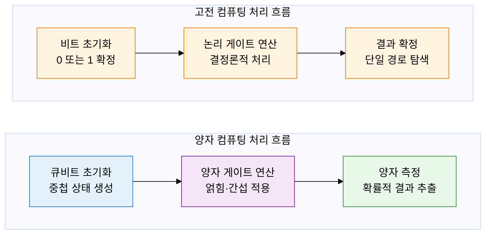
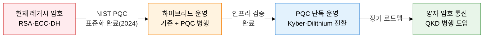

## 1. 기존 암호 체계를 무력화하는 양자 위협과 격자 암호로의 전환, 양자 정보 기술·PQC의 개요

**정의**: 양자역학의 중첩·얽힘·간섭 원리로 지수적 병렬 연산을 수행하는 양자 컴퓨팅과, 양자 컴퓨터로도 풀 수 없는 수학 문제 기반의 PQC(Post-Quantum Cryptography)를 결합하여 미래 암호 생태계를 재정립하는 기술 체계.
- 쇼어 알고리즘은 대규모 양자 컴퓨터에서 RSA·ECC 기반 공개키 암호를 다항시간에 해독 가능
- NIST는 2024년 CRYSTALS-Kyber·Dilithium·FALCON을 PQC 표준으로 최종 확정
- 국가 기반 인프라·금융·의료 등 장기 비밀 유지가 필요한 분야에서 즉각 전환 전략 수립 필요

**특징**:
- **지수적 병렬성**: N 큐비트가 2의 N제곱 상태를 동시 탐색하여 고전 컴퓨터 대비 지수적 속도 우위
- **양자 내성**: 격자·해시·코드 기반 수학 문제는 양자 알고리즘으로도 다항시간 해결 불가
- **암호 민첩성**: 기존 PKI 인프라를 유지하면서 PQC 알고리즘으로 점진적 마이그레이션 가능

---

## 2. 양자 정보 기술·PQC의 핵심 구성 체계

### 가. 양자 컴퓨팅 기초 원리 및 쇼어 알고리즘 위협

| 양자 원리 | 정의 | 컴퓨팅 활용 |
|---|---|---|
| **중첩(Superposition)** | 큐비트가 0과 1을 동시에 존재하는 상태 | N 큐비트가 2의 N제곱 경우의 수를 동시 탐색 |
| **얽힘(Entanglement)** | 두 큐비트의 상태가 비국소적으로 상관되는 현상 | 큐비트 간 즉각 상태 동기화로 병렬 연산 가속 |
| **간섭(Interference)** | 확률 진폭의 보강·소멸 간섭으로 정답 경로 강조 | 오답 경로 소거, 정답 확률 증폭으로 올바른 결과 추출 |
| **쇼어 알고리즘** | 정수 인수분해를 양자 푸리에 변환으로 다항시간 해결 | 2048비트 RSA를 수천 큐비트 양자 컴퓨터로 수시간 내 해독 |

---

### 나. NIST PQC 표준 알고리즘 및 암호 전환 로드맵

| 구분 | RSA-2048 | ECC-256 | CRYSTALS-Kyber | CRYSTALS-Dilithium |
|---|---|---|---|---|
| **기반 문제** | 정수 인수분해 | 타원 곡선 이산 로그 | 격자 LWE 문제 | 격자 MLWE·MSIS 문제 |
| **양자 내성** | 쇼어 알고리즘으로 취약 | 쇼어 알고리즘으로 취약 | 양자 내성 확보 | 양자 내성 확보 |
| **용도** | 키 교환·전자서명 | 키 교환·전자서명 | 키 캡슐화(KEM) | 전자서명(DSA) |
| **키 크기** | 2048 bit | 256 bit | 800~1568 byte | 1312~2592 byte |
| **NIST 표준** | FIPS 186(레거시) | FIPS 186(레거시) | FIPS 203 (2024) | FIPS 204 (2024) |

---

## 3. 양자 정보 기술·PQC 도입의 기대효과 및 활용 방안

| 구분 | 주요 기대효과 | 활용 및 실무 적용 방안 |
|---|---|---|
| **국가 보안** | 국가 기밀·군사 통신의 장기 비밀 유지, 양자 위협 선제 차단 | 정부 PKI에 CRYSTALS-Kyber 기반 TLS 1.3 KEM 우선 도입, 암호 민첩성 정책 수립 |
| **금융·핀테크** | 전자서명·인증서 체계의 양자 내성 확보로 금융 거래 안전성 유지 | 뱅킹 앱·전자서명 시스템에 Dilithium 기반 인증서 발급 파일럿, 하이브리드 인증 운영 |
| **산업·IoT** | 장수명 산업 설비의 장기 데이터 보호 및 펌웨어 무결성 검증 | 경량 PQC 라이브러리(liboqs)를 IoT 펌웨어 OTA 서명에 적용, 디바이스 수명 주기 보호 |
| **기술 전환** | 하이브리드 PQC 도입으로 레거시 호환성 유지 및 점진적 마이그레이션 리스크 최소화 | NIST 표준 기반 오픈소스 도구(OpenSSL 3.x PQC 브랜치) 활용, 암호 전환 영향 평가 수행 |
