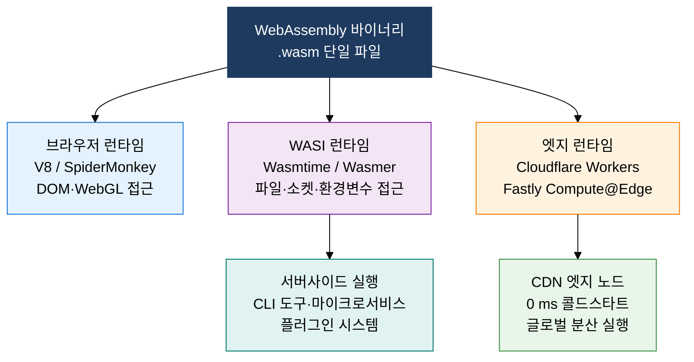

## 1. 브라우저·서버·엣지 어디서나 네이티브 속도로 실행되는 범용 바이너리, WebAssembly의 개요

**정의**: C/C++·Rust 등 시스템 언어로 작성한 코드를 컴파일 타임에 최적화된 바이트코드로 변환하여 브라우저·서버·엣지 환경에서 샌드박스 방식으로 네이티브에 근접한 속도로 실행하는 개방형 바이너리 명령어 포맷.
- W3C 표준으로 채택되어 Chrome·Firefox·Safari·Edge 모든 주요 브라우저에서 동일하게 동작
- WASI(WebAssembly System Interface)를 통해 OS 시스템 콜 추상화로 브라우저 밖 서버·엣지까지 확장
- 게임 엔진·영상 처리·AI 추론·암호화 등 CPU 집약 작업의 브라우저 내 실행을 가능하게 함

**특징**:
- **이식성**: 단일 .wasm 바이너리를 CPU 아키텍처·OS에 무관하게 어디서나 실행 가능
- **샌드박스 보안**: 메모리·파일·네트워크 접근을 캡처블리티 기반으로 명시적 허가 후 허용
- **언어 다양성**: C/C++·Rust·Go·Python·AssemblyScript 등 수십 개 언어를 Wasm으로 컴파일 가능

---

## 2. WebAssembly의 핵심 구성 체계

### 가. Wasm 컴파일 파이프라인 및 JavaScript 비교

```mermaid
%%{init: { 'theme': 'base', 'themeVariables': { 'edgeLabelBackground': '#fff' }}}%%
flowchart LR
    SRC["소스 코드<br/>C / C++ / Rust"] --"LLVM<br/>컴파일러"--> WAT["WAT 텍스트 포맷<br/>사람이 읽는 Wasm"]
    WAT --"wasm-opt<br/>바이너리 변환"--> WASM["Wasm 바이트코드<br/>.wasm 바이너리"]
    WASM --"브라우저<br/>JIT 컴파일"--> NATIVE["네이티브 기계어<br/>V8·SpiderMonkey 실행"]
    NATIVE --"DOM·JS API<br/>상호 호출"--> WEB["웹 앱 기능<br/>Canvas·WebGL·WebGPU"]
    style SRC fill:#FFF3E0,stroke:#F57C00,color:#000
    style WAT fill:#E0F2F1,stroke:#00796B,color:#000
    style WASM fill:#1E3A5F,stroke:#1E3A5F,color:#fff
    style NATIVE fill:#E3F2FD,stroke:#1976D2,color:#000
    style WEB fill:#E8F5E9,stroke:#388E3C,color:#000
```

| 비교 항목 | JavaScript | WebAssembly |
|---|---|---|
| **실행 성능** | JIT 최적화, 타입 추론 불확실성 | 사전 컴파일 최적화로 네이티브 대비 10~20% 수준 |
| **보안 모델** | 동일 출처 정책, 프로토타입 오염 위험 | 선형 메모리 샌드박스, 캡처블리티 기반 접근 제어 |
| **지원 언어** | JavaScript / TypeScript 전용 | C·C++·Rust·Go·Python 등 다수 언어 |
| **파일 크기** | 텍스트 기반 소스 전송, 파싱 비용 | 바이너리 형식으로 파싱 속도 빠름 |
| **주요 적용** | UI 로직·DOM 조작·경량 연산 | 게임 엔진·영상 처리·AI 추론·암호화 |

---

### 나. WASI 서버사이드 확장 및 Edge Runtime 실행 환경

| 구분 | 컨테이너(Docker) | WebAssembly + WASI |
|---|---|---|
| **시작 시간** | 수백 ms ~ 수 초 콜드스타트 | 수 ms 이하 (Cloudflare Workers 0 ms 목표) |
| **이미지 크기** | 수십~수백 MB OS 레이어 포함 | 수 KB ~ 수 MB 바이너리만 포함 |
| **보안 격리** | Linux 네임스페이스·cgroup 기반 | 캡처블리티 기반 샌드박스, OS 커널 미포함 |
| **이식성** | OS·아키텍처별 이미지 빌드 필요 | 단일 .wasm으로 모든 환경 실행 |
| **표준화** | OCI 컨테이너 표준 | W3C Wasm + WASI 표준 진행 중 |
| **창립자 언급** | Docker 창립자: "If WASM+WASI existed in 2008, we would not have needed Docker" | 컨테이너를 대체할 차세대 실행 단위로 주목 |

---

## 3. WebAssembly 도입의 기대효과 및 활용 방안

| 구분 | 주요 기대효과 | 활용 및 실무 적용 방안 |
|---|---|---|
| **웹 성능** | JavaScript 대비 CPU 집약 작업 10배 이상 가속으로 사용자 경험 혁신 | Figma·AutoCAD Web 방식으로 C++ 렌더링 엔진을 Wasm으로 포팅, WebGPU 연동 |
| **서버리스 효율** | 콜드스타트 제거·경량 바이너리로 엣지 함수 비용 90% 이상 절감 가능 | Cloudflare Workers·Fastly Compute@Edge에 Rust 컴파일 Wasm 마이크로서비스 배포 |
| **보안 격리** | 캡처블리티 샌드박스로 플러그인·써드파티 코드의 호스트 시스템 침해 차단 | 멀티테넌트 SaaS 플러그인 아키텍처에 Wasm 샌드박스 적용, extism·wasmtime 프레임워크 활용 |
| **기술 다양성** | Rust·Go·Python 개발자가 웹·서버·엣지를 단일 바이너리로 공략 가능 | 기존 C/C++ 라이브러리를 Emscripten으로 Wasm 포팅, 프론트엔드 빌드 파이프라인 통합 |
