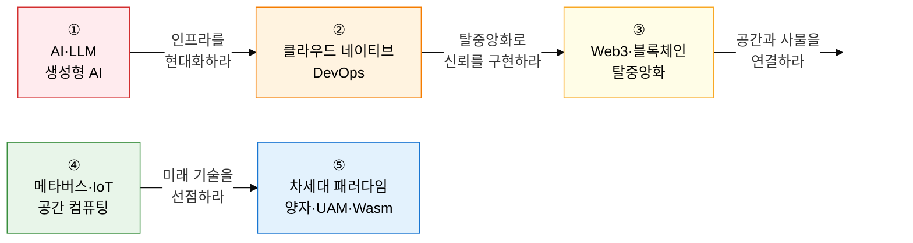

최신기술 트렌드는 **"AI·클라우드·Web3·공간 컴퓨팅·차세대 패러다임이 산업을 재편하는 기술 혁신의 최전선"** 입니다.  
생성형 AI·클라우드 네이티브·블록체인·메타버스·양자 컴퓨팅까지, 기술사가 반드시 파악해야 할 최신 기술 동향과 실무 적용 방안을 체계적으로 다룹니다.

## 학습 로드맵 — 5단계 흐름

---

## ① AI·LLM 및 생성형 AI

> **"딥러닝 기반 대규모 언어 모델과 생성형 AI가 모든 산업을 재편하는 AI 혁신 영역"** 입니다.  
> 트랜스포머 Self-Attention 원리, RLHF 정렬 기법, RAG vs 파인튜닝 선택 기준, AI Agent ReAct 패턴은 최고 빈출 주제입니다.

| 순서 | 토픽 | 핵심 키워드 | 중요도 |
|:---:|---|---|:---:|
| 1 | [딥러닝 아키텍처 및 트랜스포머](01-ai-llm/deep-learning-architecture) | CNN·RNN·LSTM, Attention·Self-Attention, 인코더-디코더, 전이 학습 | ★★★ |
| 2 | [생성형 AI 및 LLM](01-ai-llm/generative-ai-llm) | 사전학습·지시 조정, RLHF·PPO·DPO, 멀티모달·Vision-Language | ★★★ |
| 3 | [RAG·파인튜닝·프롬프트 엔지니어링](01-ai-llm/rag-finetuning) | RAG 파이프라인, PEFT·LoRA·Adapter, CoT·Few-Shot·프롬프트 최적화 | ★★★ |
| 4 | [AI 에이전트 및 자율 시스템](01-ai-llm/ai-agent) | ReAct 패턴, 멀티에이전트·오케스트레이터, 자율주행 인식·계획·제어 | ★★★ |

**→ 핵심 학습법**: 트랜스포머의 **Self-Attention 행렬 연산(Q·K·V)**을 수식 없이 "쿼리-키 유사도 가중 합산" 흐름으로 설명하고, RAG(검색 증강)와 파인튜닝(가중치 갱신)의 **적용 조건·비용·장단점**을 표로 비교하세요.

---

## ② 클라우드 네이티브 및 DevOps

> **"컨테이너·오케스트레이션·GitOps로 구현하는 현대적 IT 인프라와 개발-운영 통합 전략"** 입니다.  
> IaaS/PaaS/SaaS 공동 책임 경계, Kubernetes Control Plane 구성, GitOps Pull 방식 원리는 서술형 빈출 주제입니다.

| 순서 | 토픽 | 핵심 키워드 | 중요도 |
|:---:|---|---|:---:|
| 5 | [클라우드 컴퓨팅 심화](02-cloud-native/cloud-computing) | IaaS·PaaS·SaaS·XaaS 서비스 모델, Public·Private·Hybrid·Multi 배포 모델 | ★★★ |
| 6 | [컨테이너·쿠버네티스·서비스 메시](02-cloud-native/container-kubernetes) | Docker 네임스페이스·cgroup, K8s Control Plane·Pod·Service, Istio·Envoy, Serverless·Cold Start | ★★★ |
| 7 | [GitOps 및 불변 인프라](02-cloud-native/gitops-immutable) | Git SSOT, ArgoCD·Flux Pull 방식, 불변 인프라(Replace not Repair), IaC | ★★☆ |

**→ 핵심 학습법**: Kubernetes의 **Control Plane(etcd·API서버·스케줄러·컨트롤러) vs Worker Node(kubelet·kube-proxy·Pod)** 역할 분리를 그리고, GitOps의 **Push vs Pull 방식** 보안·감사 차이를 설명하세요.

---

## ③ Web3·블록체인 및 탈중앙화

> **"분산원장·스마트 계약·자기주권신원으로 구현하는 신뢰 기반 디지털 경제"** 입니다.  
> 합의 알고리즘(PoW·PoS·PBFT) 비교, EVM 스마트 계약 실행 원리, DID·VC·VP 3자 신뢰 모델은 빈출 주제입니다.

| 순서 | 토픽 | 핵심 키워드 | 중요도 |
|:---:|---|---|:---:|
| 8 | [블록체인 메커니즘](03-web3-blockchain/blockchain-mechanism) | DLT·머클트리·해시 체인, PoW·PoS·PBFT 합의 알고리즘, 공개·허가형 블록체인 | ★★★ |
| 9 | [스마트 계약·STO·NFT·CBDC](03-web3-blockchain/smart-contract-tokens) | EVM 스마트 계약, STO 토큰 증권, NFT ERC-721, CBDC 소매·도매형 | ★★★ |
| 10 | [DID·SSI 분산 신원인증](03-web3-blockchain/did-ssi) | W3C DID, VC·VP·Holder·Issuer·Verifier, SSI 자기주권신원, 모바일 신분증 | ★★☆ |

**→ 핵심 학습법**: PoW(에너지 소모·51% 공격)·PoS(지분 기반·경제적 패널티)·PBFT(허가형·메시지 복잡도 O(n²))의 **에너지·확장성·보안 트레이드오프**를 표로 정리하고, DID Document의 **DID Subject·DID Method·검증 메서드** 3요소 구조를 그려보세요.

---

## ④ 메타버스·IoT 및 공간 컴퓨팅

> **"가상·현실 경계를 허물고 물리-디지털 융합 환경을 구현하는 공간 컴퓨팅 기술"** 입니다.  
> XR 4종(VR·AR·MR·XR) 비교, 디지털 트윈 5단계 성숙도, AIoT 엣지-클라우드 계층 구조는 빈출 서술 주제입니다.

| 순서 | 토픽 | 핵심 키워드 | 중요도 |
|:---:|---|---|:---:|
| 11 | [메타버스 및 디지털 트윈](04-metaverse-iot/metaverse-digital-twin) | XR(VR·AR·MR), 디지털 트윈 5단계 성숙도, 공간 컴퓨팅·메타버스 플랫폼 | ★★☆ |
| 12 | [AIoT·엣지 컴퓨팅·V2X·스마트 팩토리](04-metaverse-iot/aiot-edge) | AIoT 센서 네트워크, 엣지 vs 클라우드 지연·대역폭, V2X 통신, IIoT·CPS | ★★★ |

**→ 핵심 학습법**: 디지털 트윈의 **5단계(기술재현→원격→시뮬레이션→자율→예측) 성숙도**를 실제 스마트 팩토리 사례와 연결하고, 엣지 컴퓨팅이 **클라우드 대비 지연·대역폭·프라이버시**를 어떻게 개선하는지 수치 예시로 설명하세요.

---

## ⑤ 차세대 패러다임 및 신성장 기술

> **"양자 컴퓨팅·UAM·WebAssembly 등 미래 기술 생태계를 형성하는 신성장 동력"** 입니다.  
> NIST PQC 4대 알고리즘(CRYSTALS-Kyber·Dilithium), Wasm 샌드박스 실행 원리, UAM UTM 시스템 구조는 최신 빈출 주제입니다.

| 순서 | 토픽 | 핵심 키워드 | 중요도 |
|:---:|---|---|:---:|
| 13 | [양자 정보 기술 및 PQC](05-nextgen/quantum-computing) | 큐비트·양자 중첩·얽힘·간섭, 쇼어 알고리즘 RSA 위협, CRYSTALS-Kyber·Dilithium·FALCON | ★★★ |
| 14 | [UAM 및 저궤도 위성 통신](05-nextgen/mobility-uam) | UAM eVTOL·UTM, LEO 위성 광대역(Starlink·OneWeb), 위성-지상 통합 네트워크 | ★★☆ |
| 15 | [WebAssembly 및 WASI](05-nextgen/webassembly) | Wasm 바이트코드·샌드박스, WASI 시스템 인터페이스, 서버사이드·엣지 Wasm | ★★☆ |

**→ 핵심 학습법**: 양자 컴퓨팅이 **RSA/ECC를 쇼어 알고리즘으로 파괴**하는 원리와 NIST PQC 표준이 **격자 기반(Lattice) 수학 구조**로 내성을 갖추는 이유를 연결하고, WebAssembly가 **JVM·Native 코드 대비 보안·이식성·성능**에서 갖는 차별점을 설명하세요.

---

## 기술사 시험 전략

| 출제 패턴 | 핵심 대응 전략 |
|---|---|
| **원리 설명** | 트랜스포머 Self-Attention, 블록체인 머클트리, 큐비트 중첩·얽힘을 수식 없이 한국어 메커니즘으로 서술 |
| **비교 문제** | RAG vs 파인튜닝, PoW vs PoS vs PBFT, 엣지 vs 클라우드, VM vs 컨테이너 vs Serverless |
| **아키텍처 설명** | K8s Control Plane, DID 3자 신뢰 모델, AI Agent ReAct 사이클, CBDC 발행 모델을 다이어그램으로 |
| **최신 트렌드** | NIST PQC CRYSTALS 알고리즘, GitOps Pull 기반 배포, NFT ERC-721 메타데이터, UAM UTM 체계 |
| **법·제도 연계** | EU AI Act 고위험 AI 시스템, W3C DID 표준, NIST PQC 표준화 일정, 블록체인 규제 샌드박스 |
