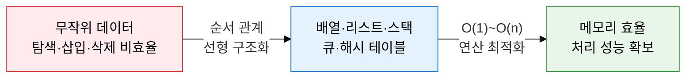
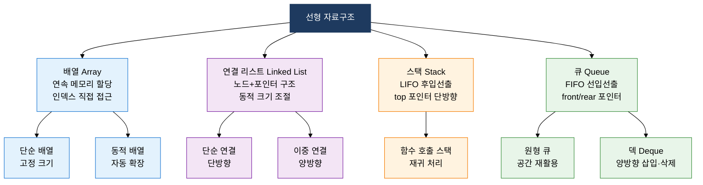
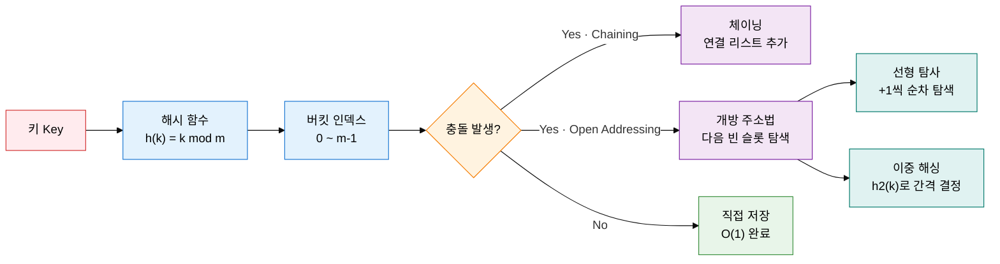

## 1. 순서 있는 데이터를 연속·연결·후입선출·선입선출로 관리하는 선형 자료구조의 개요

**정의**: 데이터를 일렬로 나열하여 인덱스·포인터·접근 정책으로 순서 관계를 표현하는 기본 자료구조 분류.
- 배열(고정 인덱스)·연결 리스트(포인터 연결)·스택(LIFO)·큐(FIFO)·해시 테이블(키-값 매핑) 포함
- 각 자료구조는 탐색·삽입·삭제 연산의 시간복잡도 특성이 상이하여 사용 목적에 따라 선택
- 알고리즘 구현의 가장 기초적인 구성 요소로, 운영체제·컴파일러·DB 내부에 광범위하게 활용

**특징**:
- **접근 방식 다양성**: 인덱스 직접 접근(배열)부터 LIFO·FIFO 정책 접근(스택·큐)까지 다양한 접근 패턴 지원
- **메모리 구조 차이**: 배열은 연속 메모리로 캐시 친화적이고, 연결 리스트는 분산 메모리로 동적 크기 조절 가능
- **해시 기반 O(1)**: 해시 테이블은 평균 O(1) 탐색·삽입으로 대용량 데이터 처리에 최적화된 핵심 구조

---

## 2. 선형 자료구조의 핵심 구성 체계

### 가. 배열·연결 리스트·스택·큐의 구조와 시간 복잡도

| 자료구조 | 탐색 | 삽입(앞) | 삽입(뒤) | 삭제 | 메모리 |
|---|---|---|---|---|---|
| **배열** | O(1) | O(n) | O(1) amortized | O(n) | 연속 할당, 캐시 효율 높음 |
| **연결 리스트** | O(n) | O(1) | O(n) 또는 O(1)* | O(1)** | 분산 할당, 포인터 오버헤드 |
| **스택** | O(n) | — | O(1) push | O(1) pop | 배열 또는 리스트 기반 |
| **큐** | O(n) | O(1) enqueue | — | O(1) dequeue | 원형 배열로 공간 재활용 |
| **덱** | O(n) | O(1) | O(1) | O(1) 양방향 | 이중 연결 리스트 기반 |

*tail 포인터 보유 시 O(1), **해당 노드 포인터 보유 전제

---

### 나. 해시 테이블: 해시 함수 원리와 충돌 해결

| 구분 | Chaining (체이닝) | Open Addressing (개방 주소법) |
|---|---|---|
| **충돌 해결** | 동일 버킷에 연결 리스트 연결 | 빈 슬롯을 탐사하여 재배치 |
| **공간 효율** | 적재율 1 초과 가능 | 적재율 1 미만 유지 필수 |
| **탐색 성능** | 평균 O(1 + α), α = 적재율 | 적재율 높을수록 성능 급감 |
| **구현 복잡도** | 단순, 삭제 용이 | 삭제 시 tombstone 마킹 필요 |
| **캐시 효율** | 낮음 (포인터 참조) | 높음 (연속 메모리 탐사) |
| **적재율 권장** | 0.7 이하 | 0.5~0.7 이하 |
| **대표 탐사법** | — | 선형 탐사·이차 탐사·이중 해싱 |

---

## 3. 선형 자료구조 적용의 기대효과 및 활용 방안

| 구분 | 주요 기대효과 | 활용 및 실무 적용 방안 |
|---|---|---|
| **성능 최적화** | 연산 목적에 맞는 자료구조 선택으로 시간복잡도 최소화 | 빈번한 탐색에는 해시 테이블, 순서 처리에는 큐, 재귀에는 스택 적용 |
| **메모리 효율** | 배열·연결 리스트 혼용으로 정적·동적 메모리 요구 충족 | 고정 크기 데이터에 배열, 빈번한 삽입·삭제에 연결 리스트 선택 |
| **시스템 구현** | 스택·큐 기반으로 OS 스케줄러·컴파일러 핵심 기능 구현 | 함수 호출 스택 관리, 프로세스 대기 큐, BFS/DFS 탐색 엔진 활용 |
| **데이터 접근** | 해시 테이블 O(1) 평균 성능으로 대규모 키-값 조회 고속화 | DB 인덱스, 캐시 구현(Redis), 언어 런타임 심볼 테이블 적용 |
