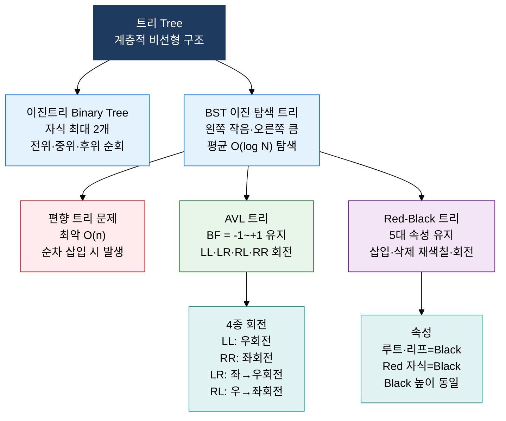

## 1. 계층·연결 관계를 트리와 그래프로 표현하는 비선형 자료구조의 개요


**정의**: 노드 간 부모-자식 계층(트리) 또는 임의 연결(그래프) 관계로 데이터를 표현하는 비선형 자료구조.
- 트리는 사이클 없는 계층 구조로 탐색·정렬·우선순위 관리에 활용되며, 그래프는 임의 연결 관계 표현
- BST O(log N) 탐색, 힙 O(log N) 삽입·삭제로 우선순위 큐 구현, 그래프로 최단경로 알고리즘 지원
- 파일 시스템·DB 인덱스(B-Tree)·네트워크 라우팅·소셜 그래프 등 다양한 실무 시스템의 핵심 기반

**특징**:
- **자가 균형 보장**: AVL·Red-Black 트리는 회전 연산으로 편향 트리 방지, O(log N) 보장
- **우선순위 처리**: 힙 구조는 최대·최소값 O(1) 접근과 O(log N) 삽입·삭제로 스케줄러·이벤트 큐 구현
- **표현 유연성**: 그래프는 인접 행렬·인접 리스트로 희소·밀집 그래프를 메모리·성능 균형 있게 표현

---

## 2. 비선형 자료구조의 핵심 구성 체계

### 가. 트리 구조: 이진트리·BST·AVL·Red-Black 트리



| 구분 | BST | AVL 트리 | Red-Black 트리 |
|---|---|---|---|
| **탐색 평균** | O(log N) | O(log N) | O(log N) |
| **탐색 최악** | O(n) 편향 | O(log N) 보장 | O(log N) 보장 |
| **삽입 비용** | O(log N) | O(log N) + 회전 | O(log N) + 재색칠 |
| **삭제 비용** | O(log N) | O(log N) + 회전 | O(log N) + 재색칠 |
| **균형 조건** | 없음 | BF = -1~+1 엄격 | Black 높이 동일 |
| **회전 빈도** | 없음 | 삽입·삭제 마다 빈번 | 삽입·삭제 마다 상대적으로 적음 |
| **주요 활용** | 기본 탐색 | 조회 집중 시스템 | Linux 커널·Java TreeMap |

---

### 나. 힙과 그래프 표현 구조

```mermaid
%%{init: { 'theme': 'base', 'themeVariables': { 'edgeLabelBackground': '#fff' }}}%%
flowchart TD
    subgraph HEAP["　"]
        direction LR
        MH["최대 힙 Max-Heap<br/>루트=최댓값<br/>부모 >= 자식"] MIH["최소 힙 Min-Heap<br/>루트=최솟값<br/>부모 <= 자식"]
    end
    subgraph GRAPH["　"]
        direction LR
        AM["인접 행렬<br/>Adjacency Matrix<br/>V x V 2차원 배열"] AL["인접 리스트<br/>Adjacency List<br/>각 노드 연결 리스트"]
    end
    style HEAP fill:none,stroke:none
    style GRAPH fill:none,stroke:none
    style MH fill:#FFF3E0,stroke:#F57C00,color:#000
    style MIH fill:#E3F2FD,stroke:#1976D2,color:#000
    style AM fill:#F3E5F5,stroke:#7B1FA2,color:#000
    style AL fill:#E8F5E9,stroke:#388E3C,color:#000
```

| 구분 | 최대 힙 | 최소 힙 |
|---|---|---|
| **루트값** | 전체 최댓값 | 전체 최솟값 |
| **삽입** | O(log N) Sift-Up | O(log N) Sift-Up |
| **삭제(루트)** | O(log N) Sift-Down | O(log N) Sift-Down |
| **최대·최소 접근** | O(1) | O(1) |
| **주요 활용** | 최대 우선순위 큐, 힙 정렬 | 다익스트라 최단경로, 작업 스케줄러 |

| 구분 | 인접 행렬 | 인접 리스트 |
|---|---|---|
| **공간 복잡도** | O(V²) | O(V + E) |
| **간선 확인** | O(1) | O(degree) |
| **전체 간선 탐색** | O(V²) | O(V + E) |
| **적합한 그래프** | 밀집 그래프 (E가 V²에 근접) | 희소 그래프 (E가 V에 근접) |
| **메모리 효율** | 희소 그래프에서 낭비 심함 | 희소 그래프에서 효율적 |
| **구현 난이도** | 단순 (2차원 배열) | 중간 (연결 리스트 배열) |

---

## 3. 비선형 자료구조 적용의 기대효과 및 활용 방안

| 구분 | 주요 기대효과 | 활용 및 실무 적용 방안 |
|---|---|---|
| **탐색 성능** | AVL·Red-Black 트리로 O(log N) 보장, 편향 트리 성능 저하 방지 | DB 인덱스(B-Tree), Java TreeMap·TreeSet, Linux 커널 프로세스 스케줄러 |
| **우선순위 관리** | 힙 기반 O(1) 최솟값 접근으로 우선순위 큐 실시간 처리 | OS 프로세스 스케줄링, 다익스트라 최단경로, 이벤트 드리븐 시스템 |
| **네트워크 모델링** | 그래프 구조로 복잡한 연결 관계·경로 탐색 효율적 표현 | 라우팅 프로토콜 최단경로, 소셜 네트워크 관계 분석, 의존성 그래프 빌드 |
| **공간 최적화** | 희소·밀집 그래프 특성에 맞는 인접 리스트·행렬 선택 | 대규모 그래프 메모리 절감, 희소 행렬 연산 최적화, 캐시 지역성 개선 |
