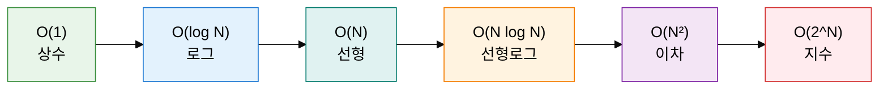
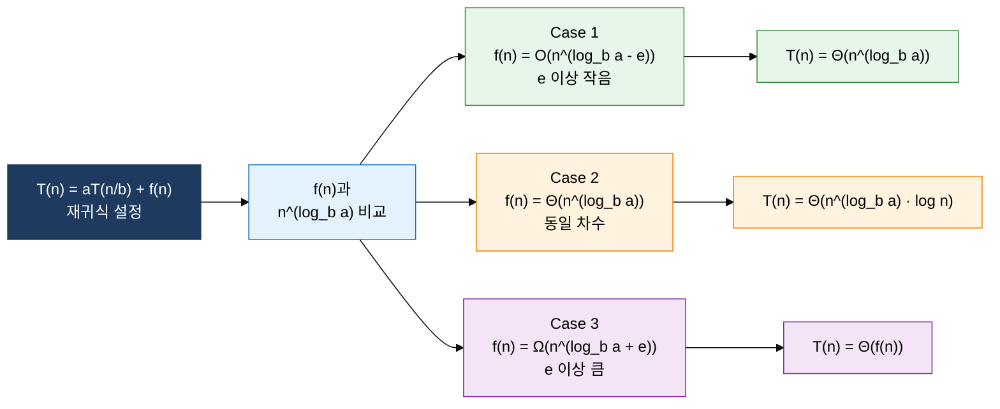

## 1. 입력 크기 증가에 따른 자원 소비 증가율을 수학적으로 표현하는 복잡도 분석의 개요

**정의**: 알고리즘의 입력 크기 n에 대한 실행 시간·메모리 사용량의 증가율을 점근 표기법으로 수학적으로 표현하는 분석 방법론.
- 시간 복잡도(Time Complexity): 연산 횟수를 입력 크기 n의 함수로 표현
- 공간 복잡도(Space Complexity): 알고리즘 실행에 필요한 메모리 사용량을 n의 함수로 표현
- 하드웨어·환경에 독립적인 알고리즘 고유 성능을 추상적으로 비교

**특징**:
- **점근적 분석**: 상수 계수와 하위 차수 항을 무시하고 입력이 충분히 클 때의 증가 추세에 집중
- **3종 표기법**: Big-O(최악), Ω(최선), Θ(평균·정확한 점근) 각각 상이한 성능 보장 의미
- **재귀식 분석**: 마스터 정리를 통해 분할 정복 알고리즘의 복잡도를 closed-form으로 유도

---

## 2. 복잡도 분석의 핵심 구성 체계

### 가. 시간·공간 복잡도와 점근 표기법 3종

| 표기법 | 의미 | 설명 | 예시 |
|---|---|---|---|
| **Big-O (O)** | 점근 상한 (최악) | f(n) ≤ c·g(n)을 만족하는 양의 상수 c, n₀ 존재 | 버블 정렬 O(N²) |
| **Omega (Ω)** | 점근 하한 (최선) | f(n) ≥ c·g(n)을 만족하는 양의 상수 c, n₀ 존재 | 선형 탐색 Ω(1) |
| **Theta (Θ)** | 점근 정확 (평균) | c₁·g(n) ≤ f(n) ≤ c₂·g(n) 동시 만족 | 병합 정렬 Θ(N log N) |
| **O(1)** | 상수 시간 | 입력 크기에 무관, 단일 연산 | 배열 인덱스 접근, 해시 탐색 |
| **O(log N)** | 로그 시간 | 매 단계마다 탐색 범위가 절반으로 감소 | 이진 탐색, 균형 이진 탐색 트리 |
| **O(N)** | 선형 시간 | 입력 크기에 비례하여 연산 증가 | 선형 탐색, 배열 순회 |
| **O(N log N)** | 선형로그 시간 | 분할 정복 기반 정렬의 최적 복잡도 | 병합 정렬, 퀵 정렬(평균) |
| **O(N²)** | 이차 시간 | 중첩 반복문, 비효율 정렬 | 버블·선택·삽입 정렬 |
| **O(2^N)** | 지수 시간 | 모든 부분집합 탐색, 지수적 폭발 | 피보나치(단순 재귀), 부분집합 열거 |

---

### 나. 마스터 정리와 재귀식 복잡도 유도

| 케이스 | 조건 | 결과 | 유도 예시 |
|---|---|---|---|
| **Case 1** | f(n)이 n^(log_b a)보다 다항식 차수 e 이상 작음 | T(n) = Θ(n^(log_b a)) | T(n)=8T(n/2)+n² → log₂8=3, f(n)=n²=O(n^(3-1)) → Θ(n³) |
| **Case 2** | f(n)이 n^(log_b a)와 점근적으로 동일 차수 | T(n) = Θ(n^(log_b a) · log n) | 병합 정렬 T(n)=2T(n/2)+n → log₂2=1, f(n)=n=Θ(n¹) → Θ(N log N) |
| **Case 3** | f(n)이 n^(log_b a)보다 다항식 차수 e 이상 큼 (정규성 조건 충족) | T(n) = Θ(f(n)) | T(n)=T(n/2)+n → log₂1=0, f(n)=n=Ω(n^(0+1)) → Θ(N) |
| **병합 정렬 유도** | T(n)=2T(n/2)+n, a=2, b=2, f(n)=n | n^(log₂2)=n¹ = f(n) → Case 2 | T(n) = Θ(N log N) — 분할 O(1) + 병합 O(N) × log N 단계 |

---

## 3. 복잡도 분석 적용의 기대효과 및 활용 방안

| 구분 | 주요 기대효과 | 활용 및 실무 적용 방안 |
|---|---|---|
| **설계** | 구현 전 알고리즘 후보의 성능을 수학적으로 비교·선택하여 재작업 최소화 | 요구사항 분석 단계에서 입력 크기 범위 추정 후 허용 복잡도 상한 설정 |
| **최적화** | 병목 구간의 복잡도 클래스를 파악하여 O(N²) → O(N log N) 개선 방향 도출 | 프로파일링으로 핫스팟 식별 후 정렬·탐색 알고리즘 교체, 해시 자료구조 도입 |
| **재귀 분석** | 마스터 정리로 분할 정복 알고리즘의 복잡도를 신속하게 closed-form 유도 | 재귀 트리 전개법·치환법과 병행하여 마스터 정리 적용 불가 케이스 검증 |
| **시험·검증** | 알고리즘 정확성과 효율성을 이론·실험 양면으로 검증하여 신뢰성 확보 | 입력 크기별 실행 시간 측정 후 log-log 그래프로 실제 복잡도 클래스 확인 |
