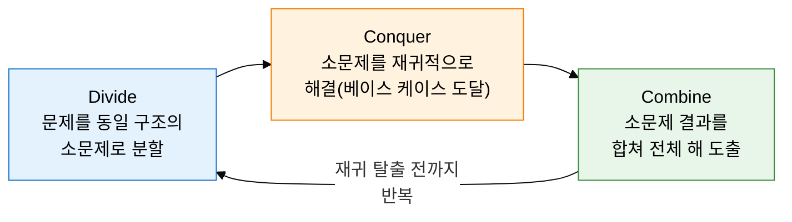
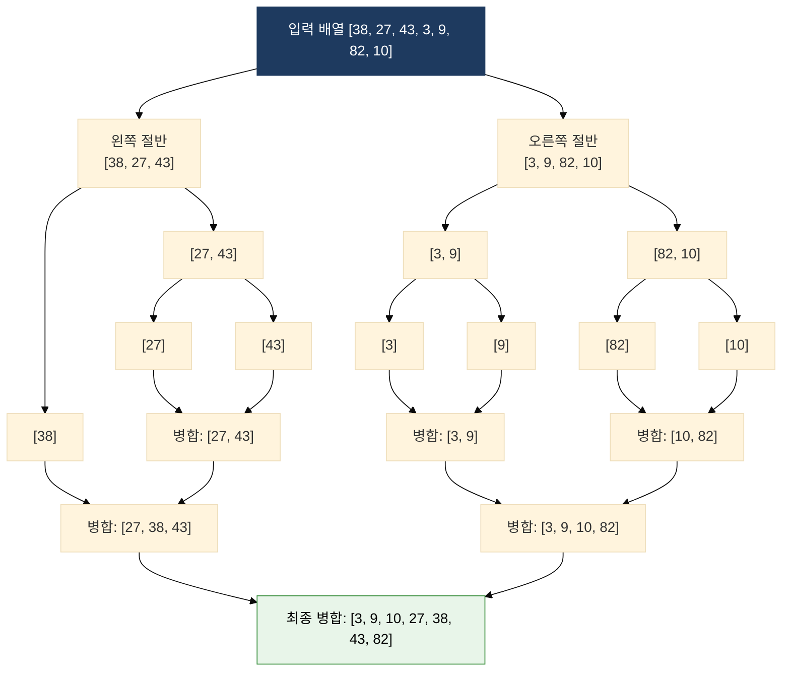

## 1. 큰 문제를 독립적인 소문제로 분할하여 재귀적으로 해결하고 결합하는, 분할 정복의 개요

**정의**: 문제를 동일한 유형의 독립적인 소문제로 분할(Divide)하고, 각 소문제를 재귀적으로 정복(Conquer)한 후, 결과를 결합(Combine)하여 전체 해를 구하는 알고리즘 설계 패러다임.
- 적용 조건: 소문제가 원래 문제와 동일한 구조를 가지며(재귀성), 소문제 간 독립적(중복 계산 없음)
- 베이스 케이스(Base Case) 정의 필수: 재귀 탈출 조건 없을 경우 무한 재귀 발생
- 재귀식 T(n) = aT(n/b) + f(n)으로 복잡도를 마스터 정리로 분석

**특징**:
- **문제 독립성**: 분할된 소문제들이 서로 독립적으로 해결되어 중복 계산이 없음 — DP와의 핵심 차이
- **재귀 구조**: 동일 알고리즘을 작은 입력에 반복 적용하여 코드 간결성과 논리적 명확성 확보
- **병렬 확장성**: 독립적인 소문제를 병렬로 처리 가능하여 멀티코어·분산 환경에서 높은 확장성

---

## 2. 분할 정복의 핵심 구성 체계

### 가. 분할 정복 3단계 패러다임과 DP와의 차이

| 비교 항목 | 분할 정복 (Divide & Conquer) | 동적 계획법 (Dynamic Programming) |
|---|---|---|
| **소문제 관계** | 독립적 — 중복 계산 없음 | 중복 부분 문제 — 결과 재사용 |
| **접근 방식** | 하향식(Top-Down) 재귀 | 하향식(메모이제이션) + 상향식(타뷸레이션) |
| **결과 저장** | 저장하지 않음 | 메모이제이션 테이블에 저장 |
| **적합 문제** | 정렬, 탐색, 행렬 곱셈 | 배낭 문제, 최장 공통 부분 수열, 최단 경로 |
| **복잡도 분석** | 마스터 정리 적용 | 상태 수 × 전이 비용으로 분석 |
| **대표 알고리즘** | 병합 정렬, 퀵 정렬, 이진 탐색 | 피보나치(메모), 플로이드-워셜, DP 배낭 |

---

### 나. 병합 정렬·퀵 정렬·이진 탐색 알고리즘 분석

| 알고리즘 | 분할 방식 | 시간 복잡도 (최선·평균·최악) | 공간 복잡도 | 안정성 | 핵심 특성 및 주의 사항 |
|---|---|---|---|---|---|
| **병합 정렬** | 중간 인덱스 기준 균등 분할 | O(N log N) · Θ(N log N) · O(N log N) | O(N) 추가 공간 | 안정(Stable) | 항상 O(N log N) 보장, 추가 배열 필요, 연결 리스트 정렬에 최적 |
| **퀵 정렬** | 피벗 기준 좌·우 분할 | O(N log N) · Θ(N log N) · O(N²) | O(log N) 스택 | 불안정(Unstable) | 최악은 이미 정렬된 배열 + 첫 원소 피벗 선택 시 발생, 캐시 효율 우수 |
| **퀵 정렬 최악 원인** | 피벗이 항상 최솟값·최댓값 선택 시 분할이 1:(n-1)로 극단적 편향 | - | - | - | 해결: 랜덤 피벗 선택, 중앙값(Median-of-3) 피벗 전략 |
| **이진 탐색** | 중간 원소와 비교 후 절반 탐색 범위 제거 | O(log N) · O(log N) · O(log N) | O(1) | - | 정렬된 배열 전제 필수, 반복문 구현으로 스택 오버플로 방지 |

---

## 3. 분할 정복 적용의 기대효과 및 활용 방안

| 구분 | 주요 기대효과 | 활용 및 실무 적용 방안 |
|---|---|---|
| **성능** | 병합 정렬·퀵 정렬의 O(N log N) 보장으로 O(N²) 단순 정렬 대비 대용량 데이터 처리 속도 획기적 향상 | 데이터베이스 ORDER BY, 외부 정렬(External Sort) 구현 시 병합 정렬 채택, 캐시 효율이 중요한 내부 정렬에는 퀵 정렬 적용 |
| **확장성** | 소문제 독립성 덕분에 분산·병렬 환경에서 수평 확장이 용이하여 멀티코어 활용도 극대화 | MapReduce의 분할 처리 단계에 분할 정복 패턴 적용, 병렬 병합 정렬로 대용량 로그 정렬 가속 |
| **재사용성** | 동일 분할 정복 템플릿으로 정렬·탐색·행렬 곱셈·FFT 등 다양한 문제를 일관된 구조로 해결 | 이진 탐색을 활용한 파라메트릭 서치(Parametric Search)로 최적화 문제 변환 처리 |
| **안정성** | 병합 정렬의 O(N log N) 최악 복잡도 보장으로 예측 가능한 응답 시간 제공 | 랜덤 피벗 퀵 정렬로 평균 O(N log N) 유지, Java Arrays.sort는 TimSort(병합+삽입 혼합)로 안정성과 성능 동시 확보 |
