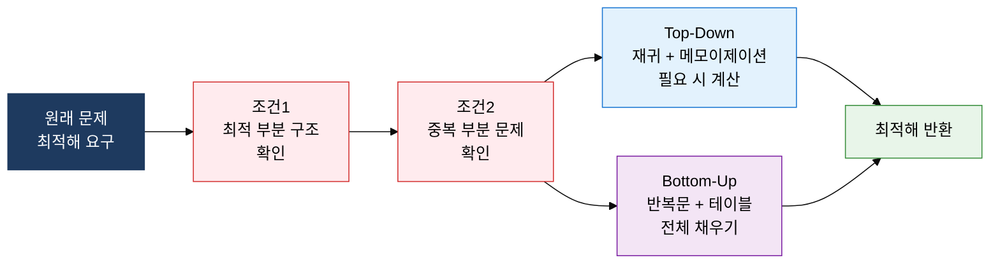
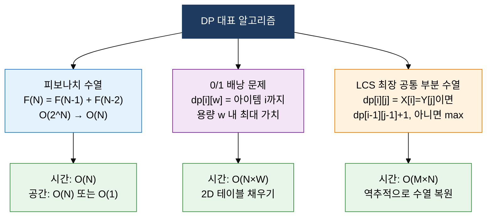

## 1. 중복 계산을 제거해 최적해를 도출하는 알고리즘 기법, 동적 계획법의 개요

**정의**: 최적 부분 구조와 중복 부분 문제 2대 조건을 만족하는 문제에서 부분 해를 저장·재사용해 최적해를 효율적으로 구하는 알고리즘 설계 기법.
- 동일한 부분 문제가 반복 등장할 때 계산 결과를 캐시(메모)에 저장해 중복 연산을 제거
- Top-Down(메모이제이션)과 Bottom-Up(타뷸레이션) 두 가지 구현 방식으로 적용
- 탐욕 알고리즘과 달리 전체 탐색 기반의 수학적 최적 보장이 강점

**특징**:
- **최적 부분 구조**: 전체 문제의 최적해가 부분 문제의 최적해들로 구성되는 분해 가능성
- **중복 부분 문제**: 재귀 트리에서 동일한 부분 문제가 반복 등장해 캐싱 효과가 발생하는 특성
- **다항 시간 보장**: 지수 시간의 단순 재귀를 O(N) ~ O(N²) 수준으로 단축해 실용적 최적화 달성

---

## 2. 동적 계획법의 핵심 구성 체계

### 가. DP 2대 적용 조건 및 Top-Down vs Bottom-Up 구현 방식

| 비교 항목 | Top-Down (메모이제이션) | Bottom-Up (타뷸레이션) |
|---|---|---|
| **접근 방식** | 큰 문제 → 작은 부분 문제 재귀 호출 | 작은 부분 문제부터 순차적으로 테이블 채움 |
| **구현 방법** | 재귀 함수 + 캐시 배열(딕셔너리) | 반복문 + DP 테이블(배열) |
| **계산 범위** | 실제 필요한 부분 문제만 계산(Lazy) | 모든 부분 문제를 미리 계산(Eager) |
| **공간 활용** | 재귀 스택 + 캐시(스택 오버플로 위험) | 테이블만 사용(스택 오버플로 없음) |
| **코드 가독성** | 문제 정의에 가까워 직관적 | 순서 파악이 필요해 초기 설계 복잡 |
| **적합 상황** | 부분 문제 중 일부만 필요한 경우 | 대부분의 부분 문제가 필요한 경우 |

---

### 나. 피보나치·0/1 배낭 문제·LCS 대표 알고리즘

| 알고리즘 | 문제 유형 | 상태 정의 | 점화식 | 시간복잡도 |
|---|---|---|---|---|
| **피보나치 수열** | 수열 최적화 | dp[n]: n번째 피보나치 수 | dp[n] = dp[n-1] + dp[n-2] | O(N) |
| **0/1 배낭 문제** | 조합 최적화 | dp[i][w]: i번째 아이템·용량 w의 최대 가치 | max(dp[i-1][w], dp[i-1][w-wi]+vi) | O(N×W) |
| **LCS** | 문자열 비교 | dp[i][j]: X[1..i], Y[1..j]의 LCS 길이 | X[i]=Y[j]: dp[i-1][j-1]+1 / 아닐 때: max(dp[i-1][j], dp[i][j-1]) | O(M×N) |

---

## 3. 동적 계획법 적용의 기대효과 및 활용 방안

| 구분 | 주요 기대효과 | 활용 및 실무 적용 방안 |
|---|---|---|
| **성능 최적화** | 지수 시간 재귀를 다항 시간으로 단축해 실용적 계산 범위 확보 | 피보나치·배낭 문제에 메모이제이션 적용, 재귀 깊이 제한 환경에서는 Bottom-Up 우선 선택 |
| **최적해 보장** | 탐욕 알고리즘이 실패하는 문제에서도 전역 최적해를 수학적으로 보장 | 편집 거리(Levenshtein), 최장 증가 수열(LIS) 등 문자열·수열 최적화 문제에 적용 |
| **문제 모델링** | 복잡한 결합 최적화 문제를 명확한 점화식과 DP 테이블로 구조화 | 경로 최단화(Floyd-Warshall), 행렬 체인 곱셈, 구간 DP 등 다양한 알고리즘 설계에 활용 |
| **알고리즘 설계** | 분할정복·탐욕과의 명확한 적용 기준으로 문제 유형별 최적 기법 선택 가능 | 코딩 테스트·알고리즘 대회에서 DP 패턴 인식 훈련, 실무 최적화 로직 설계 기준으로 활용 |
