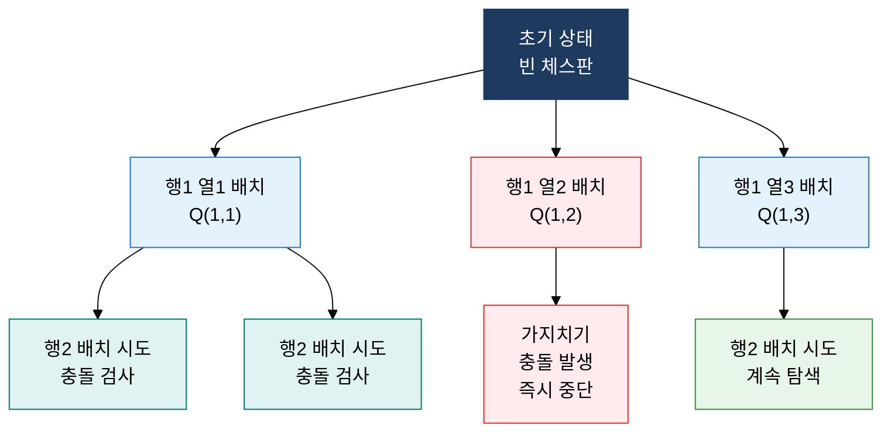

## 1. 현재 최선 선택으로 전역 최적을 노리거나 탐색 공간을 가지치기하는 알고리즘, 탐욕·백트래킹의 개요

**정의**: 탐욕 알고리즘은 매 단계 국소 최적 선택으로 전역 최적을 도달하는 기법이고, 백트래킹은 상태 공간 트리에서 해가 없는 경로를 조기 가지치기해 완전 탐색 비용을 줄이는 기법.
- 탐욕 알고리즘은 탐욕 선택 속성과 최적 부분 구조 2대 조건이 증명될 때만 최적해를 보장
- 백트래킹은 제약 조건 위반 시 되돌아가는 DFS 기반 탐색으로 N-Queens·순열·조합 문제에 적용
- 두 기법 모두 DP보다 구현이 간결하나 적용 가능 문제 범위와 최적 보장 조건이 다름

**특징**:
- **탐욕 선택 속성**: 이전 선택과 무관하게 현재 단계의 최선 선택이 전체 최적해의 일부임을 보장
- **Pruning(가지치기)**: 백트래킹에서 현재 경로가 해를 포함할 수 없음이 확인되면 즉시 탐색 중단
- **보완 관계**: 탐욕은 O(N log N) 수준의 속도를, 백트래킹은 지수 시간 탐색의 실질적 단축을 각각 제공

---

## 2. 탐욕 알고리즘·백트래킹의 핵심 구성 체계

### 가. 탐욕 알고리즘 2대 조건 및 허프만 코딩

| 비교 항목 | 탐욕 알고리즘 | 동적 계획법(DP) |
|---|---|---|
| **선택 방식** | 현재 단계 국소 최적 선택(되돌리기 없음) | 모든 부분 해를 고려 후 전역 최적 선택 |
| **최적 보장** | 탐욕 선택 속성·최적 부분 구조 증명 필요 | 최적 부분 구조·중복 부분 문제 충족 시 보장 |
| **시간복잡도** | 일반적으로 O(N log N) 이하 | 문제에 따라 O(N²) ~ O(N×W) |
| **구현 복잡도** | 단순(한 방향 진행) | 테이블 설계·점화식 도출 필요 |
| **적용 예시** | 허프만 코딩, 크루스칼 MST, 활동 선택 문제 | 배낭 문제, LCS, 편집 거리 |
| **실패 사례** | 동전 거스름돈(일반 동전 집합) | 탐욕이 통하는 문제에서는 과도한 비용 |

---

### 나. 백트래킹 및 분기 한정(Branch and Bound), N-Queens 풀이

| 비교 항목 | 백트래킹 (Backtracking) | 분기 한정 (Branch and Bound) |
|---|---|---|
| **탐색 전략** | DFS 기반 상태 공간 트리 탐색 | BFS 또는 Best-First 탐색 |
| **가지치기 기준** | 제약 조건 위반 시 중단(Feasibility) | 하한선(Lower Bound) 초과 시 중단(Optimality) |
| **목적** | 조건을 만족하는 해 탐색(존재 여부·모든 해) | 최소화·최대화 최적해 탐색 |
| **활용 문제** | N-Queens, 순열·조합, 스도쿠 | 외판원 문제(TSP), 0/1 배낭 문제 최적화 |
| **메모리 사용** | 재귀 스택(경로 저장) | 탐색 큐·우선순위 큐(상태 저장) |
| **성능 특성** | 최악 지수 시간, 가지치기로 실용적 단축 | 하한선 정밀도에 따라 탐색 공간 대폭 축소 |

---

## 3. 탐욕·백트래킹 적용의 기대효과 및 활용 방안

| 구분 | 주요 기대효과 | 활용 및 실무 적용 방안 |
|---|---|---|
| **데이터 압축** | 허프만 코딩으로 문자 빈도 기반 최적 접두어 코드 생성, 평균 코드 길이 최소화 | ZIP·DEFLATE·JPEG 등 실무 압축 알고리즘의 핵심 엔트로피 부호화 단계에 적용 |
| **조합 탐색** | 백트래킹의 Pruning으로 지수 공간 탐색을 현실적 수준으로 단축 | N-Queens, 스도쿠 풀이, 조합 최적화 문제에서 제약 조건 기반 탐색 엔진 구현 |
| **스케줄링·최적화** | 탐욕 알고리즘으로 활동 선택·작업 스케줄링 문제를 O(N log N)에 최적 해결 | CPU 스케줄링, 그래프 MST(크루스칼·프림), 네트워크 라우팅 경로 최적화에 활용 |
| **알고리즘 선택** | 문제 조건에 따라 탐욕·백트래킹·DP·분기 한정 중 최적 기법을 근거 있게 선택 | 코딩 테스트에서 증명 가능 여부로 탐욕 vs DP 판단, 실무 NP-완전 근사 해법 설계에 활용 |
