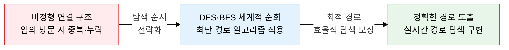
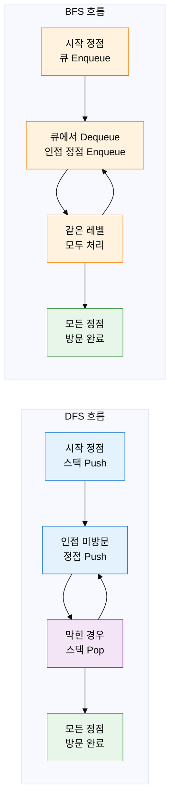
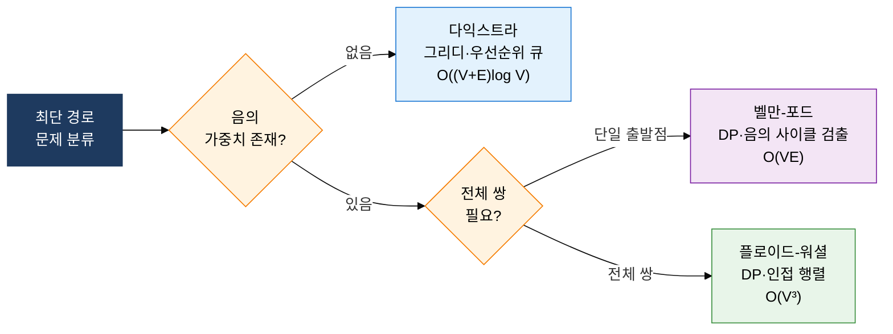

## 1. 정점과 간선을 체계적으로 방문·최적 경로 탐색, 그래프 알고리즘의 개요

**정의**: 그래프의 정점(Vertex)과 간선(Edge)을 체계적으로 순회하거나 정점 간 최단 경로를 구하는 알고리즘 집합.
- 탐색 알고리즘(DFS·BFS)은 방문 여부를 기록하여 모든 정점을 누락 없이 방문
- 최단 경로 알고리즘은 간선 가중치 조건(음수 여부, 전체 쌍 여부)에 따라 적합한 기법을 선택
- 소셜 네트워크 분석, 지도 경로 탐색, 컴파일러 의존성 분석 등 광범위한 실무에 활용

**특징**:
- **시간복잡도 O(V+E)**: DFS·BFS 모두 각 정점·간선을 한 번씩 방문하므로 선형 시간에 순회 완료
- **조건별 최단 경로 선택**: 음의 가중치 유무, 단일 출발점·전체 쌍 여부에 따라 알고리즘을 달리 적용
- **다양한 부가 활용**: DFS는 위상 정렬·사이클 검출, BFS는 최단 홉(hop) 수·레벨 탐색에 응용

---

## 2. 그래프 알고리즘의 핵심 구성 체계

### 가. DFS vs BFS 탐색 전략 비교

| 비교 항목 | DFS (깊이 우선 탐색) | BFS (너비 우선 탐색) |
|---|---|---|
| **자료구조** | 스택(Stack) 또는 재귀 호출 스택 | 큐(Queue) |
| **탐색 방향** | 한 방향으로 끝까지 탐색 후 백트래킹 | 출발점에서 거리 순으로 레벨별 탐색 |
| **시간복잡도** | O(V+E) | O(V+E) |
| **공간복잡도** | O(V) — 재귀 깊이 또는 스택 크기 | O(V) — 큐에 저장되는 최대 정점 수 |
| **최단 경로** | 보장 안 됨(가중치 없는 경우도 비보장) | 가중치 없는 그래프에서 최단 홉 수 보장 |
| **주요 활용** | 위상 정렬, 사이클 검출, 강연결 요소, 미로 풀기 | 최단 경로(비가중치), 레벨 탐색, 이분 그래프 판별 |
| **구현 방식** | 재귀 함수 또는 명시적 스택 | 반복문 + 큐(deque) |

---

### 나. 최단 경로 알고리즘 선택 및 비교

| 비교 항목 | 다익스트라 | 벨만-포드 | 플로이드-워셜 |
|---|---|---|---|
| **적용 조건** | 음의 가중치 간선 없음 | 음의 가중치 허용, 단일 출발점 | 음의 가중치 허용, 전체 쌍 최단 경로 |
| **알고리즘 패러다임** | 그리디(Greedy) | 동적 프로그래밍(DP) | 동적 프로그래밍(DP) |
| **시간복잡도** | O((V+E) log V) — 우선순위 큐 사용 시 | O(VE) | O(V³) |
| **공간복잡도** | O(V) | O(V) | O(V²) |
| **음의 사이클 검출** | 불가 | 가능 — V번째 반복에서 갱신 시 검출 | 가능 — 대각선 원소 음수 여부로 검출 |
| **자료구조** | 우선순위 큐(Min-Heap) | 간선 목록 배열 | 2차원 거리 행렬 |
| **대표 활용** | GPS 경로 탐색, 라우팅 프로토콜(OSPF) | 통화 중재(음의 환율 사이클 검출), Bellman-Ford 기반 BGP | 전체 노드 간 거리 계산, 경유지 포함 경로 |

---

## 3. 그래프 탐색 및 최단 경로 알고리즘의 기대효과 및 활용 방안

| 구분 | 주요 기대효과 | 활용 및 실무 적용 방안 |
|---|---|---|
| **탐색 효율** | DFS·BFS 선형 시간 O(V+E)으로 대규모 그래프도 완전 탐색 보장 | 소셜 네트워크 친구 추천(BFS 레벨 탐색), 웹 크롤러 URL 수집(BFS·DFS 혼용) |
| **경로 최적화** | 다익스트라·벨만-포드·플로이드-워셜로 조건별 최적 경로 정확 도출 | 네비게이션 최단 경로(다익스트라), 네트워크 라우팅 프로토콜(OSPF·BGP) 경로 계산 |
| **이상 탐지** | 음의 사이클 검출(벨만-포드)로 비정상 순환 구조 자동 식별 | 금융 통화 재정 거래 사이클 검출, 분산 시스템 데드락 순환 대기 탐지 |
| **설계 품질** | 문제 조건(음의 가중치·전체 쌍 여부)에 맞는 알고리즘 선택으로 성능 극대화 | 게임 AI 경로 탐색(A* 기반 다익스트라 확장), 컴파일러 의존성 위상 정렬(DFS 활용) |
