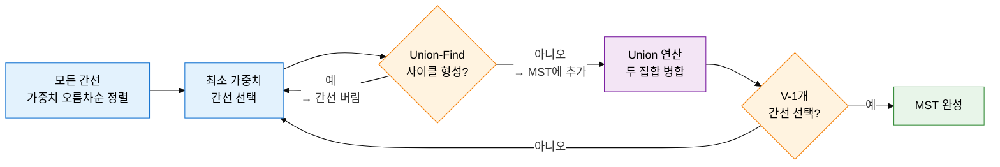
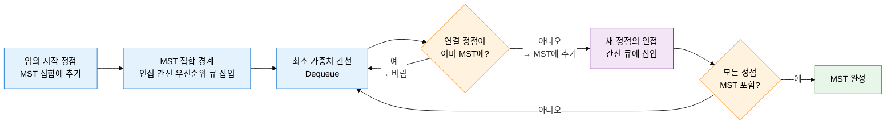

## 1. 최소 비용으로 모든 정점을 연결하는 신장 트리, MST의 개요

**정의**: 가중 연결 무방향 그래프에서 모든 정점을 사이클 없이 연결하되 간선 가중치 합이 최소인 신장 트리(Spanning Tree).
- 정점 V개를 연결하는 정확히 V-1개의 간선으로 구성되며 사이클이 존재하지 않음
- 컷 속성(Cut Property): 임의의 컷을 가로지르는 최소 가중치 간선은 반드시 MST에 포함
- 사이클 속성(Cycle Property): 사이클 내 가장 가중치가 큰 간선은 MST에 포함되지 않음

**특징**:
- **유일성 조건**: 모든 간선 가중치가 서로 다르면 MST는 유일하게 결정됨
- **그리디 정당성**: 컷 속성에 의해 매 단계 최소 가중치 간선을 탐욕적으로 선택해도 전역 최적 보장
- **두 가지 접근**: 크루스칼(간선 중심·희소 그래프)과 프림(정점 중심·밀집 그래프)으로 상황에 맞게 선택

---

## 2. 최소 신장 트리의 핵심 구성 체계

### 가. 크루스칼 알고리즘과 Union-Find 자료구조

| Union-Find 연산 | 설명 | 최적화 기법 | 시간복잡도 |
|---|---|---|---|
| **MakeSet(x)** | 원소 x를 단일 원소 집합으로 초기화 | — | O(1) |
| **Find(x)** | x가 속한 집합의 대표(루트) 반환 | 경로 압축(Path Compression): Find 시 루트까지 경로를 직결 | O(α(N)) — 실질적 상수 |
| **Union(x, y)** | x, y가 속한 두 집합을 하나로 합침 | 랭크 기반 합치기(Union by Rank): 작은 트리를 큰 트리 아래로 붙임 | O(α(N)) — 실질적 상수 |
| **크루스칼 전체** | 간선 정렬 + V-1회 Union-Find | 경로 압축 + 랭크 합치기 동시 적용 | O(E log E) |

---

### 나. 프림 알고리즘과 MST 정확성 근거

| 비교 항목 | 크루스칼 알고리즘 | 프림 알고리즘 |
|---|---|---|
| **접근 방식** | 간선 중심 — 전체 간선을 정렬 후 사이클 없이 선택 | 정점 중심 — MST 집합을 점진적으로 확장 |
| **핵심 자료구조** | Union-Find (서로소 집합) | 우선순위 큐 (Min-Heap) |
| **시간복잡도** | O(E log E) — 간선 정렬 지배 | O((V+E) log V) — 우선순위 큐 연산 지배 |
| **적합 그래프** | 희소 그래프(E가 작은 경우) | 밀집 그래프(E가 V²에 가까운 경우) |
| **MST 정확성 근거** | 사이클 속성: 사이클 내 최대 가중치 간선 제외 보장 | 컷 속성: MST 집합 경계를 가로지르는 최소 간선 선택 |
| **구현 복잡도** | 간단 — 간선 목록 정렬 후 Union-Find 적용 | 중간 — 키 감소 연산(decrease-key) 필요 |

---

## 3. 최소 신장 트리 적용의 기대효과 및 활용 방안

| 구분 | 주요 기대효과 | 활용 및 실무 적용 방안 |
|---|---|---|
| **비용 최적화** | 네트워크 연결 비용을 수학적으로 최소화하여 자원 낭비 제거 | 통신망 케이블 포설 최소 비용 설계, 전력망·수도망 최소 배선 계획 |
| **알고리즘 선택** | 그래프 밀도에 따라 크루스칼·프림을 선택하여 최적 성능 달성 | 희소 네트워크(라우터 연결)에 크루스칼, 밀집 네트워크(클러스터 내부)에 프림 적용 |
| **클러스터링 기반** | MST 기반 클러스터링으로 데이터 군집 구조 효율적 탐색 | 데이터 마이닝 클러스터 분석(MST에서 최대 가중치 간선 제거), 이미지 분할 알고리즘 |
| **확장성** | Union-Find 경로 압축·랭크 합치기로 대규모 그래프도 거의 선형 시간 처리 | 대규모 소셜 그래프 커뮤니티 탐지, 분산 네트워크 토폴로지 최적화 자동화 |
