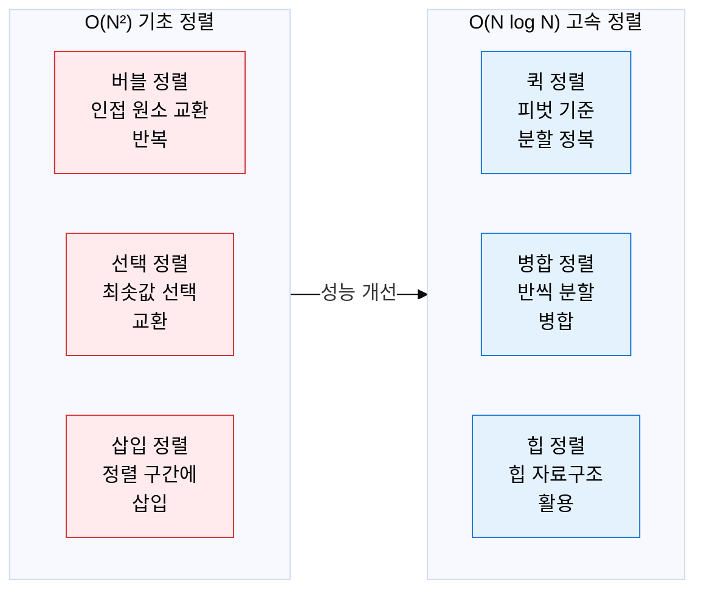
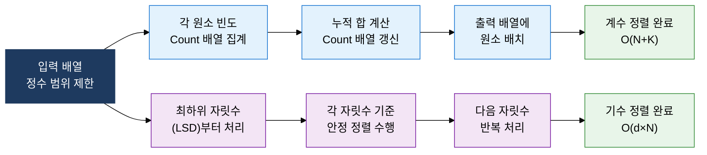

## 1. 데이터 특성에 맞는 최적 정렬 전략 선택, 정렬 알고리즘의 개요

**정의**: 데이터를 특정 순서(오름차순·내림차순)로 재배열하는 알고리즘으로, 비교 기반 정렬과 비비교 정렬로 분류되며 시간복잡도·공간복잡도·안정성 기준으로 선택.
- 비교 기반 정렬은 이론적 하한이 O(N log N)이며, 기초·고속 정렬로 세분화
- 비비교 정렬(계수·기수)은 데이터 범위 제한 조건에서 O(N) 달성 가능
- 실무에서는 데이터 크기·분포·안정성 요구에 따라 알고리즘을 선택하거나 하이브리드 적용

**특징**:
- **비교 기반 하한**: 임의 입력에 대한 비교 정렬의 이론적 최적 하한은 Ω(N log N)으로 수학적으로 증명
- **안정성(Stability)**: 동일한 키를 가진 원소들의 원래 순서를 유지하는 성질, 다중 기준 정렬 시 중요
- **인플레이스(In-place)**: 추가 메모리 O(1) 사용으로 공간 효율적 정렬, 캐시 지역성과 함께 실무 선택 기준

---

## 2. 정렬 알고리즘의 핵심 구성 체계

### 가. 기초 정렬(O(N²)) 및 고속 정렬(O(N log N)) 동작 원리

| 알고리즘 | 최선 시간 | 평균 시간 | 최악 시간 | 공간복잡도 | 안정성 |
|---|---|---|---|---|---|
| **버블 정렬** | O(N) | O(N²) | O(N²) | O(1) | 안정 |
| **선택 정렬** | O(N²) | O(N²) | O(N²) | O(1) | 불안정 |
| **삽입 정렬** | O(N) | O(N²) | O(N²) | O(1) | 안정 |
| **퀵 정렬** | O(N log N) | O(N log N) | O(N²) | O(log N) | 불안정 |
| **병합 정렬** | O(N log N) | O(N log N) | O(N log N) | O(N) | 안정 |
| **힙 정렬** | O(N log N) | O(N log N) | O(N log N) | O(1) | 불안정 |

---

### 나. 계수·기수 정렬(비비교 정렬) 및 알고리즘 선택 기준

| 비교 항목 | 비교 기반 정렬 | 비비교 정렬(계수·기수) |
|---|---|---|
| **시간복잡도 하한** | Ω(N log N) 이론적 하한 | O(N+K) 또는 O(d×N), 선형 시간 가능 |
| **적용 조건** | 임의 데이터 타입·순서 관계 정의 시 | 정수 또는 유한 범위 데이터, 범위 K가 작을 때 |
| **공간복잡도** | O(1) ~ O(N) | O(N+K): K가 크면 공간 낭비 발생 |
| **안정성** | 알고리즘별 상이(병합: 안정, 퀵: 불안정) | 계수·기수 정렬 모두 안정 |
| **실무 선택 기준** | 범용 데이터 정렬, Java의 TimSort, C++ std::sort | 정수 점수 정렬, 자릿수 고정 식별자(우편번호·전화번호) |

---

## 3. 정렬 알고리즘 적용의 기대효과 및 활용 방안

| 구분 | 주요 기대효과 | 활용 및 실무 적용 방안 |
|---|---|---|
| **성능 최적화** | O(N²) 대비 O(N log N) 고속 정렬로 대용량 데이터 처리 시간 수십 배 단축 | 수백만 건 이상 데이터셋에 퀵 정렬(평균) 또는 병합 정렬(안정성 필요) 선택 적용 |
| **안정성 보장** | 안정 정렬로 다중 기준 정렬 시 기존 순서 보존, 데이터 무결성 유지 | DB 다중 컬럼 ORDER BY, 거래 이력 정렬 등 순서 보존이 필요한 연산에 병합 정렬·TimSort 적용 |
| **특수 데이터 처리** | 정수 범위 제한 데이터에서 계수·기수 정렬로 O(N) 선형 시간 달성 | 성적 처리(0~100점), 통신사 가입자 번호 정렬 등 범위 제한 정수 데이터에 계수 정렬 활용 |
| **알고리즘 설계** | 데이터 특성(크기·분포·안정성·범위)에 따른 근거 있는 정렬 알고리즘 선택 능력 확보 | Timsort(Python·Java), Introsort(C++) 등 하이브리드 정렬 설계 원리 이해 및 커스텀 비교자 구현 |
