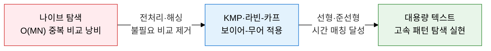
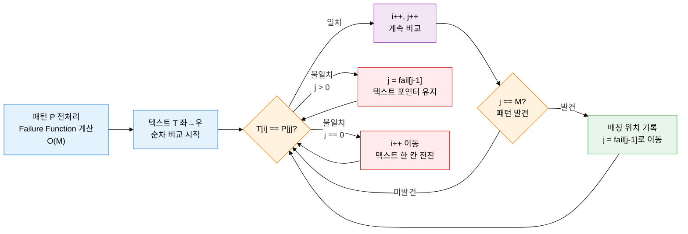
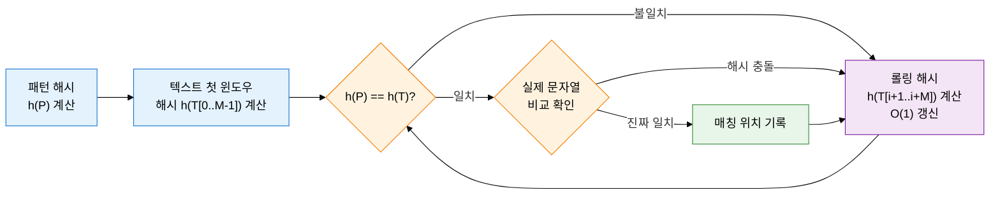

## 1. 텍스트에서 패턴을 빠르게 찾는 문자열 탐색, 문자열 매칭 알고리즘의 개요

**정의**: 길이 N의 텍스트(Text)에서 길이 M의 패턴(Pattern)이 출현하는 위치를 찾는 알고리즘 집합.
- 나이브 알고리즘은 O(MN) 최악 시간으로, 패턴과 텍스트가 길어질수록 비효율이 심화됨
- KMP는 Failure Function 전처리로 이미 비교한 정보를 재활용하여 O(M+N) 선형 시간 달성
- 라빈-카프는 롤링 해시로 O(N) 평균 시간, 보이어-무어는 역방향 비교 휴리스틱으로 준선형 달성

**특징**:
- **전처리 vs 런타임 트레이드오프**: KMP·보이어-무어는 패턴 전처리 비용을 지불하고 탐색 시간을 단축
- **해시 기반 병렬 탐색**: 라빈-카프는 롤링 해시로 여러 패턴을 동시에 탐색하는 다중 패턴 매칭 확장 용이
- **실용적 최고 성능**: 보이어-무어는 평균적으로 O(N/M)에 근접하여 실무 텍스트 편집기에서 가장 널리 사용

---

## 2. 문자열 매칭 알고리즘의 핵심 구성 체계

### 가. 나이브 알고리즘과 KMP 알고리즘

**KMP Failure Function 예시 — 패턴 "ABABC"**

| 인덱스 j | 0 | 1 | 2 | 3 | 4 |
|---|---|---|---|---|---|
| **패턴 P[j]** | A | B | A | B | C |
| **fail[j]** | 0 | 0 | 1 | 2 | 0 |
| **의미** | 접두·접미 불일치 | 접두·접미 불일치 | "A" 접두=접미 | "AB" 접두=접미 | 접두·접미 불일치 |

> fail[j]: P[0..j]에서 접두사(prefix)와 접미사(suffix)가 동시에 일치하는 최장 길이 (자기 자신 제외). 불일치 시 이 값만큼 패턴 포인터를 되돌려 텍스트 포인터 이동 없이 재비교.

---

### 나. 라빈-카프와 보이어-무어 알고리즘

| 비교 항목 | 나이브 | KMP | 라빈-카프 | 보이어-무어 |
|---|---|---|---|---|
| **전처리** | 없음 | Failure Function O(M) | 패턴 해시 O(M) | Bad Character + Good Suffix 테이블 O(M+Σ) |
| **탐색 시간복잡도** | O(MN) 최악 | O(M+N) — 항상 선형 | O(N) 평균, O(MN) 최악(해시 충돌 다수) | O(N/M) 평균, O(MN) 최악 |
| **공간복잡도** | O(1) | O(M) | O(1) | O(M+Σ) — Σ: 알파벳 크기 |
| **음의 이동** | 항상 1칸 전진 | 불일치 시 fail 값만큼 점프 | 윈도우를 항상 1칸씩 슬라이딩 | Bad Character: 불일치 문자 기준 오른쪽 점프 |
| **핵심 아이디어** | 모든 위치 순차 비교 | 접두·접미 공통 정보 재사용 | 슬라이딩 윈도우 해시 O(1) 갱신 | 패턴 끝에서부터 역방향 비교, 최대 점프 |
| **다중 패턴** | 불편 | 확장 어려움 | 쉽게 확장(Aho-Corasick과 조합) | 단일 패턴 최적화 |
| **실무 활용** | 교육·소규모 탐색 | 스트림 처리, DNA 서열 검색 | 표절 검사, 다중 패턴 탐색 | 텍스트 편집기 Ctrl+F, grep, 바이러스 시그니처 |

---

## 3. 문자열 매칭 알고리즘 적용의 기대효과 및 활용 방안

| 구분 | 주요 기대효과 | 활용 및 실무 적용 방안 |
|---|---|---|
| **탐색 성능** | KMP·보이어-무어로 나이브 대비 최대 O(N) 수준으로 탐색 시간 단축 | 대용량 로그 파일 패턴 검색(grep), 텍스트 편집기 고속 찾기·바꾸기 기능 구현 |
| **생물정보 분석** | O(M+N) 선형 시간으로 수백만 bp DNA·단백질 서열에서 모티프 고속 탐색 | BLAST 유사 서열 검색 전처리, 유전체 어셈블리 정렬 알고리즘 기반 적용 |
| **보안 탐지** | 라빈-카프 다중 패턴 확장으로 수천 개 악성 시그니처를 동시에 탐색 | IDS/IPS 침입 탐지 시스템 패턴 매칭 엔진(Snort·Suricata), 안티바이러스 시그니처 스캔 |
| **자연어 처리** | 알고리즘 선택·조합으로 다양한 텍스트 분석 작업의 전처리 성능 최적화 | 표절 검사 시스템(라빈-카프 해시 비교), 검색 엔진 인덱싱 역색인 구축 가속화 |
