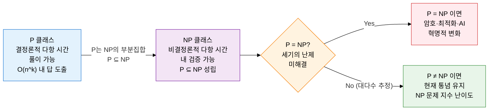
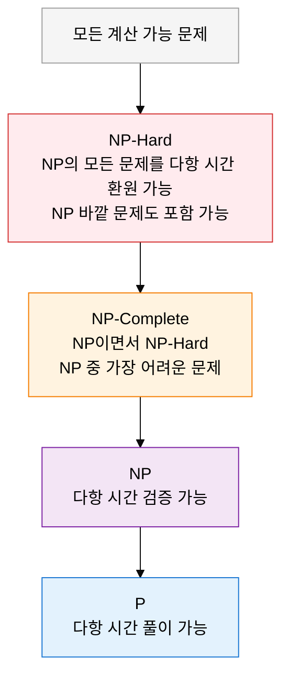

## 1. 세기의 미해결 난제, P vs NP 계산 복잡도 이론의 개요

**정의**: 결정 문제를 해결하는 데 필요한 시간·공간 자원의 한계를 수학적으로 분류하여 알고리즘의 근본적 난이도를 규명하는 이론 체계.
- 대상 범위: 판정(Yes/No) 형태의 결정 문제(Decision Problem)를 기준으로 복잡도 클래스를 정의
- 핵심 미해결 문제: P = NP 여부는 클레이 수학 연구소가 선정한 밀레니엄 7대 난제 중 하나
- 실용적 함의: NP-Complete 문제 식별 시 정확한 다항 시간 풀이를 포기하고 근사·휴리스틱으로 전환

**특징**:
- **계층적 포함 관계**: P ⊆ NP ⊆ NP-Hard 계층으로 문제 난이도를 엄밀히 서열화
- **환원 가능성**: 어떤 NP 문제든 다항 시간 환원(Polynomial Reduction)으로 NP-Complete 문제로 변환 가능
- **실무 설계 기준**: 문제가 NP-Complete임을 증명하면 지수 알고리즘 대신 근사·분기한정·메타휴리스틱 전략으로 전환하는 설계 판단의 근거가 됨

---

## 2. P vs NP 계산 복잡도 이론의 핵심 구성 체계

### 가. P 클래스·NP 클래스 정의 및 P vs NP 미해결 문제

| 클래스 | 정의 | 핵심 조건 | 대표 예시 |
|---|---|---|---|
| **P** | 결정론적 튜링 머신으로 다항 시간 O(n^k) 내에 풀이 가능한 결정 문제 집합 | 풀이 알고리즘 존재, 다항 시간 보장 | 정렬, 최단 경로(Dijkstra), 소수 판별(AKS), 최소 신장 트리 |
| **NP** | 비결정론적 튜링 머신으로 다항 시간 내 검증 가능한 결정 문제 집합 | 해답 후보가 주어지면 다항 시간 내 맞는지 확인 가능 | 해밀턴 경로, 부분집합 합, 그래프 색칠, SAT |
| **P ⊆ NP** | P의 모든 문제는 NP에 속함 (P에서 풀면 검증도 가능) | P에서 풀린 문제는 자동으로 NP 조건 만족 | P의 모든 예시가 NP에도 해당 |
| **P vs NP** | P = NP인지 P ≠ NP인지 수학적으로 미증명된 세기의 난제 | 2025년 현재 미해결, 대다수 연구자는 P ≠ NP 추정 | 클레이 수학 연구소 밀레니엄 문제, 100만 달러 상금 |

---

### 나. NP-Hard·NP-Complete 정의, 포함 관계 및 대표 문제

| 클래스·개념 | 정의 | 핵심 특성 | 대표 문제 |
|---|---|---|---|
| **NP-Hard** | NP의 모든 문제를 다항 시간 환원할 수 있는 문제 집합 | NP에 속하지 않아도 됨, NP보다 어렵거나 같음 | 정지 문제(Halting Problem), 일반 TSP 최적화 |
| **NP-Complete** | NP에 속하면서 NP-Hard이기도 한 문제 집합 | NP 중 가장 어려운 문제군, 상호 다항 시간 환원 가능 | SAT, 3-SAT, TSP(결정판), 해밀턴 경로, 그래프 색칠, 클리크, 부분집합 합 |
| **다항 시간 환원** | 문제 A를 다항 시간 변환 함수 f로 문제 B의 입력으로 바꿔, B가 풀리면 A도 풀리도록 하는 기법 | A ≤p B: B가 쉬우면 A도 쉬움, B가 어려우면 A도 어려움 | Cook-Levin 정리: SAT는 NP-Complete의 원조 증명 |
| **3-SAT** | 각 절이 정확히 3개의 리터럴로 구성된 논리식의 충족 가능성 판정 문제 | SAT에서 환원 가능, 대부분의 NP-Complete 증명의 출발점 | 변수 할당으로 전체 논리식을 참으로 만들 수 있는가 |
| **TSP(결정판)** | n개 도시를 모두 방문하고 출발지로 돌아오는 경로 비용이 k 이하인가 | 최적화 판은 NP-Hard, 결정판은 NP-Complete | 물류·회로 배선·유전자 서열 분석 응용 |
| **그래프 색칠** | 인접한 두 정점이 같은 색이 되지 않도록 k개 이하 색으로 정점을 칠할 수 있는가 | k=3 이상에서 NP-Complete, 시험 일정·주파수 할당 응용 | 지도 색칠 4색 문제, 무선 채널 할당 |
| **클리크(Clique)** | 그래프에서 모든 정점이 서로 연결된 크기 k 이상의 완전 부분 그래프가 존재하는가 | NP-Complete, 소셜 네트워크·단백질 상호작용 분석 응용 | 바이럴 마케팅 핵심 그룹 탐지 |
| **부분집합 합** | 정수 집합에서 합이 정확히 T인 부분집합이 존재하는가 | NP-Complete, 배낭 문제(Knapsack)의 특수 사례 | 암호화 프리미티브(subset sum 암호), 자원 할당 |

---

## 3. P vs NP 계산 복잡도 이론 이해의 기대효과 및 활용 방안

| 구분 | 주요 기대효과 | 활용 및 실무 적용 방안 |
|---|---|---|
| **알고리즘 설계** | 문제 난이도를 사전 진단하여 불필요한 정확 알고리즘 탐색 시간 낭비 방지 | NP-Complete 판별 후 근사 알고리즘(PTAS·FPTAS)·분기한정·메타휴리스틱(GA·SA)으로 전략 전환 |
| **보안·암호** | P ≠ NP 가정 위에 설계된 RSA·이산 대수 기반 암호의 안전성 근거 이해 | 양자 컴퓨팅 시대 대비 격자 기반(NP-Hard 문제 활용) 양자 내성 암호 설계 전략 수립 |
| **최적화·AI** | TSP·스케줄링·배낭 문제 등 NP-Complete 조합 최적화를 현실적 시간 내 처리 | 강화학습·딥러닝 기반 휴리스틱, LKH 알고리즘, 정수 선형 계획(ILP) 솔버 결합 활용 |
| **시험·연구** | 새로운 문제의 NP-Complete 증명 능력 확보, 환원 기법 체계적 이해 | Cook-Levin 정리 및 Karp의 21개 NP-Complete 문제를 기준점으로 삼아 신규 문제 환원 증명 수행 |
