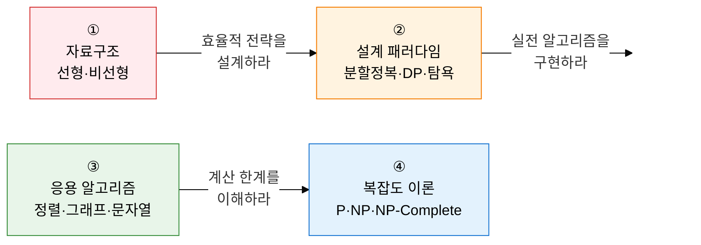

알고리즘·자료구조는 **"최적의 구조와 전략으로 주어진 자원에서 최선의 해를 찾는 컴퓨터 과학의 핵심 역량"** 입니다.  
단순 코딩 능력이 아닌 시간·공간 복잡도의 정량적 분석, 알고리즘 메커니즘의 시각적 설명, 설계 패러다임 간 비교 논증 능력을 체계적으로 다룹니다.

## 학습 로드맵 — 4단계 흐름

---

## ① 자료구조 (Data Structures)

> **"데이터를 효율적으로 저장·관리하기 위한 논리적·물리적 구조"** 입니다.  
> 배열 vs 연결 리스트 메모리 비교, 해시 충돌 해결, AVL·Red-Black 트리 리밸런싱, 힙의 우선순위 큐 구현은 핵심 출제 주제입니다.

| 순서 | 토픽 | 핵심 키워드 | 중요도 |
|:---:|---|---|:---:|
| 1 | [선형 자료구조](01-data-structures/linear-structures) | 배열 vs 연결 리스트, 스택(LIFO), 큐(FIFO)·원형 큐·덱, 해시 테이블·충돌 해결(Chaining·Open Addressing) | ★★★ |
| 2 | [비선형 자료구조](01-data-structures/nonlinear-structures) | 이진트리·순회(전위·중위·후위), BST 편향 한계, AVL·Red-Black 리밸런싱, 최대/최소 힙, 그래프 인접 행렬 vs 리스트 | ★★★ |

**→ 핵심 학습법**: 배열(O(1) 접근, O(N) 삽입)과 연결 리스트(O(N) 접근, O(1) 삽입)의 **연산별 시간 복잡도 표**를 외우고, AVL 트리의 **4가지 회전(LL·LR·RL·RR) 케이스**를 그림으로 그릴 수 있어야 합니다.

---

## ② 알고리즘 설계 패러다임 (Design Paradigms)

> **"거시적 문제 해결 전략 — 가장 출제 빈도가 높은 영역"** 입니다.  
> Big-O 표기법 해석, 마스터 정리 재귀식 계산, 분할 정복 vs DP 비교, DP Top-Down·Bottom-Up 차이는 반드시 숙지해야 합니다.

| 순서 | 토픽 | 핵심 키워드 | 중요도 |
|:---:|---|---|:---:|
| 3 | [알고리즘 복잡도 분석](02-design-paradigms/complexity-analysis) | 시간·공간 복잡도, Big-O·Ω·Θ 점근 표기법, 마스터 정리(T(n)=aT(n/b)+f(n)) | ★★★ |
| 4 | [분할 정복 (Divide and Conquer)](02-design-paradigms/divide-conquer) | 분할·정복·결합 3단계, 병합 정렬 O(N log N), 퀵 정렬 최악 O(N²) 원인·해결, 이진 탐색 | ★★★ |
| 5 | [동적 계획법 (Dynamic Programming)](02-design-paradigms/dynamic-programming) | 최적 부분 구조·중복 부분 문제, Top-Down 메모이제이션 vs Bottom-Up 타뷸레이션, LCS·배낭 문제 | ★★★ |
| 6 | [탐욕 알고리즘·백트래킹](02-design-paradigms/greedy-backtracking) | 탐욕 선택 속성·최적 부분 구조, 허프만 코딩, 백트래킹 가지치기, N-Queens | ★★☆ |

**→ 핵심 학습법**: 분할 정복(독립 소문제)과 DP(중복 소문제)의 **본질적 차이**를 피보나치 예시로 설명하고, 퀵 정렬 최악 케이스(이미 정렬된 배열+피벗=첫 원소)와 해결책(랜덤 피벗·중앙값)을 서술할 수 있어야 합니다.

---

## ③ 주요 응용 알고리즘 (Application Algorithms)

> **"실제 문제에 적용되는 정형화된 알고리즘 군"** 입니다.  
> 정렬 알고리즘 전체 비교표, 다익스트라·벨만-포드 차이, 크루스칼·프림 MST 비교, KMP Failure Function은 고빈출 서술 주제입니다.

| 순서 | 토픽 | 핵심 키워드 | 중요도 |
|:---:|---|---|:---:|
| 7 | [정렬 알고리즘](03-application-algorithms/sorting-algorithms) | 버블·선택·삽입(O(N²)), 퀵·병합·힙(O(N log N)), 계수·기수 정렬, 안정성(Stable) 비교표 | ★★★ |
| 8 | [그래프 탐색 및 최단 경로](03-application-algorithms/graph-traversal-shortest) | DFS(스택·재귀) vs BFS(큐), 다익스트라(음의 가중치 불가), 벨만-포드(음의 사이클 검출), 플로이드-워셜(DP 전체 쌍) | ★★★ |
| 9 | [최소 신장 트리 (MST)](03-application-algorithms/minimum-spanning-tree) | 크루스칼(간선 중심·Union-Find), 프림(정점 중심·우선순위 큐), 컷 속성·사이클 속성 | ★★★ |
| 10 | [문자열 매칭 알고리즘](03-application-algorithms/string-matching) | KMP Failure Function 전처리 O(M+N), 라빈-카프 롤링 해시 O(N), 나이브 O(MN) 비교 | ★★☆ |

**→ 핵심 학습법**: 정렬 8종의 **시간 복잡도(최선/평균/최악)·공간 복잡도·안정성** 비교표를 외우고, 다익스트라(음의 가중치 불가·O((V+E)logV))와 벨만-포드(음의 가중치 허용·O(VE))의 차이를 **적용 조건**과 함께 설명하세요.

---

## ④ 계산 복잡도 이론 (Computational Complexity Theory)

> **"컴퓨터 과학의 한계를 수학적으로 정의하는 이론"** 입니다.  
> P vs NP 정의·차이, NP-Hard vs NP-Complete 관계도, 환원(Reduction) 개념, TSP·그래프 색칠 NP-Complete 예시는 간혹 출제됩니다.

| 순서 | 토픽 | 핵심 키워드 | 중요도 |
|:---:|---|---|:---:|
| 11 | [P vs NP 및 계산 복잡도](04-complexity-theory/p-np-complexity) | P(다항 시간 풀이), NP(다항 시간 검증), NP-Hard·NP-Complete 정의, 환원(Reduction), TSP·그래프 색칠·SAT | ★★☆ |

**→ 핵심 학습법**: P⊆NP가 참임은 자명하지만 **P=NP인지 여부는 미증명**이라는 핵심을 기억하고, NP-Complete(NP이면서 NP-Hard)와 NP-Hard(NP보다 어렵거나 같음, NP에 속하지 않을 수 있음)의 **포함 관계**를 벤 다이어그램으로 그릴 수 있어야 합니다.

---

## 기술사 시험 전략

| 출제 패턴 | 핵심 대응 전략 |
|---|---|
| **복잡도 분석** | Big-O 표기법으로 연산별 복잡도를 표로 제시하고, 마스터 정리로 재귀 알고리즘 복잡도를 유도 |
| **비교 문제** | 분할정복 vs DP, 다익스트라 vs 벨만-포드, 크루스칼 vs 프림, 정렬 알고리즘 8종 비교표 |
| **메커니즘 서술** | 단계별 배열/트리 변화 모식도 + 핵심 의사코드(Pseudo-code) + 시간 복잡도 증명 |
| **최악 케이스** | 퀵 정렬 O(N²) 발생 조건, BST 편향 트리, 해시 충돌 최악 O(N) — 원인과 해결책 쌍으로 서술 |
| **알고리즘 선택** | 주어진 조건(음의 가중치 유무, 전체 쌍 vs 단일 출발)에 따른 최적 알고리즘 선택 근거 제시 |
