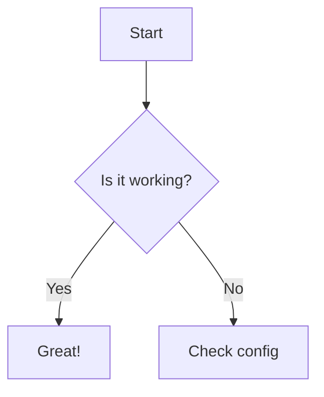

## Mermaid Test

## LaTeX Test

### Inline Math
이것은 인라인 수식입니다: $a^2 + b^2 = c^2$

### Block Math
이것은 블록 수식입니다:
$$
x = \frac{-b \pm \sqrt{b^2 - 4ac}}{2a}
$$

### standard LaTeX delimiters
Inline: \( E = mc^2 \)
Block:
\[
\int_{a}^{b} f(x) dx
\]
