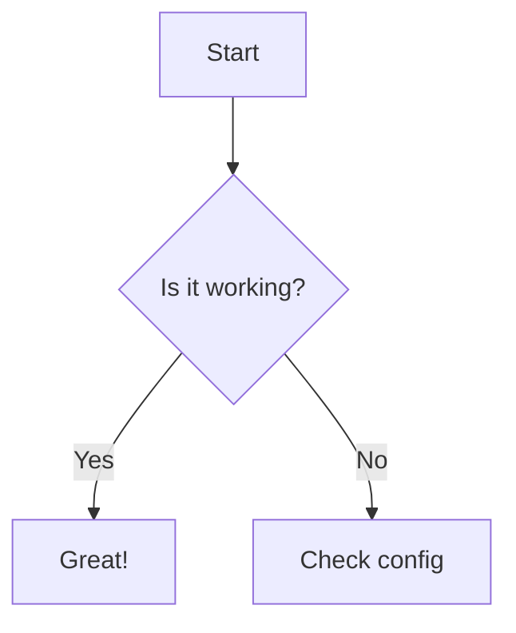

## Mermaid Test

```mermaid
graph TD
    A[Start] --> B{Is it working?}
    B -- Yes --> C[Great!]
    B -- No --> D[Check config]
```

## LaTeX Test

When $a \ne 0$, there are two solutions to $(ax^2 + bx + c = 0)$ and they are
$$x = {-b \pm \sqrt{b^2-4ac} \over 2a}.$$
